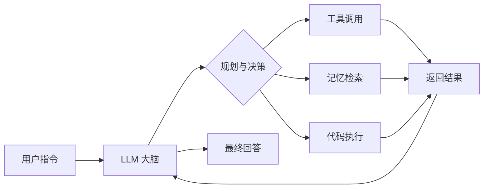

# AI Agent 入门：从概念到实践

## 前言

AI Agent（智能体）是当下最热门的 AI 应用方向之一。它不仅能理解自然语言，还能 **自主规划**、**调用工具** 并完成复杂任务。

<!-- more -->

## 一、什么是 AI Agent？

AI Agent 是一种以大语言模型（LLM）为核心的智能系统，具备以下能力：



### 核心组件

| 组件 | 功能 | 示例 |
|------|------|------|
| **LLM** | 理解、推理、生成 | GPT-4、Claude、Gemini |
| **Tools** | 外部能力扩展 | 搜索、数据库、API |
| **Memory** | 上下文管理 | 短期记忆、长期记忆 |
| **Planning** | 任务分解与规划 | ReAct、CoT |

## 二、ReAct 框架

ReAct（Reasoning + Acting）是最经典的 Agent 框架，交替进行 **推理** 和 **行动**：

```
Thought: 用户想知道今天的天气，我需要调用天气 API
Action: search_weather(city="北京")
Observation: 北京今天晴，25°C，东北风 3 级
Thought: 我已经获取到天气信息，可以回答用户了
Answer: 北京今天天气晴朗，气温 25°C，东北风 3 级，适合外出活动。
```

## 三、使用 LangChain 构建 Agent

```python
from langchain.agents import AgentExecutor, create_react_agent
from langchain_openai import ChatOpenAI
from langchain.tools import Tool

# 定义工具
tools = [
    Tool(
        name="Search",
        func=lambda q: search(q),
        description="搜索互联网获取最新信息"
    ),
    Tool(
        name="Calculator",
        func=lambda q: eval(q),
        description="执行数学计算"
    )
]

# 创建 Agent
llm = ChatOpenAI(model="gpt-4", temperature=0)
agent = create_react_agent(llm, tools, prompt)
agent_executor = AgentExecutor(agent=agent, tools=tools, verbose=True)

# 运行
result = agent_executor.invoke({
    "input": "2024 年诺贝尔物理学奖得主是谁？他们的研究方向是什么？"
})
```

## 四、Agent 应用场景

- 🔍 **智能搜索助手**：自动搜索、整合多源信息
- 💻 **编程助手**：理解需求、生成代码、调试修复
- 📊 **数据分析**：自动编写 SQL、生成可视化报表
- 🤖 **自动化运维**：监控告警、故障排查、自动修复

## 总结

AI Agent 正在重新定义人与 AI 的交互方式。掌握 Agent 的核心原理和开发框架，将帮助你在 AI 时代保持竞争力。
