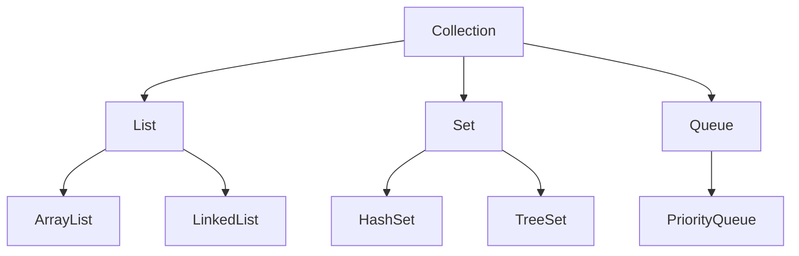

# Java 基础知识总结

## 前言

Java 是一门面向对象的编程语言，凭借其 **跨平台性**、**安全性** 和丰富的生态体系，广泛应用于企业级开发、Android 开发和大数据领域。

<!-- more -->

## 一、数据类型

Java 的数据类型分为 **基本数据类型** 和 **引用数据类型**。

### 基本数据类型

| 类型 | 大小 | 默认值 | 取值范围 |
|------|------|--------|----------|
| `byte` | 1 字节 | 0 | -128 ~ 127 |
| `short` | 2 字节 | 0 | -32768 ~ 32767 |
| `int` | 4 字节 | 0 | -2^31 ~ 2^31 - 1 |
| `long` | 8 字节 | 0L | -2^63 ~ 2^63 - 1 |
| `float` | 4 字节 | 0.0f | IEEE 754 |
| `double` | 8 字节 | 0.0d | IEEE 754 |
| `char` | 2 字节 | '\u0000' | 0 ~ 65535 |
| `boolean` | - | false | true / false |

## 二、面向对象三大特性

### 1. 封装

将数据和操作数据的方法绑定在一起，对外部隐藏实现细节。

```java
public class User {
    private String name;
    private int age;

    public String getName() {
        return name;
    }

    public void setName(String name) {
        this.name = name;
    }
}
```

### 2. 继承

子类可以继承父类的属性和方法，实现代码复用。

```java
public class Student extends User {
    private String school;

    public Student(String name, int age, String school) {
        super.setName(name);
        this.school = school;
    }
}
```

### 3. 多态

同一方法在不同对象上有不同的行为表现。

```java
User user = new Student("Frank", 25, "MIT");
```

## 三、常用集合框架



## 总结

掌握 Java 基础是成为优秀后端开发者的第一步。建议结合项目实战，加深对集合、多线程和 JVM 的理解。
