# MySQL

## MySql概述

### SQL、DB、DBMS以及三者之间的关系

- DB:  DataBase（数据库，数据库实际上在硬盘上以文件的形式存在）
- DBMS：DataBase Management System（数据库管理系统，常见的有：MySQL Oracle DB2 Sybase SqlServer...）
- SQL：
    1. 结构化查询语言，是一门标准通用的语言。标准的SQL适合于所有的数据库产品。
    2. SQL属于高级语言。只要能看懂英语单词的，写出来的SQL语句，可以读懂什么意思。
    3. SQL语句在执行的时候，实际上**内部也会先进行编译，然后再执行SQL**。（SQL语句的编译由DBMS完成。）
- 关系：
    
    **DBMS负责执行SQL语句，通过执行SQL语句来操作DB当中的数据。DBMS -（执行）-> SQL -（操作）-> DB**


### SQL语句分类

1. DQL（Data **Query** Language，数据查询语言）：查询语句，凡是select语句都是DQL。
2. DML（Data **Manipulation** Language，数据操作语言）：`insert delete update`，对表当中的数据进行增删改。
3. DDL（Data **Denifition** Language，数据定义语言）：`create drop alter`，对表结构的增删改。
4. TCL（事务控制语言）：commit提交事务，rollback回滚事务。（TCL中的T是**Transaction**）
5. DCL（Data Control Language，数据控制语言）：grant授权、revoke撤销权限等。

### 系统数据库

| 数据库 | 含义 |
| --- | --- |
| `mysql` | 存储MySQL服务器正常运行所需要的各种信息 （时区、主从、用户、权限等） |
| `information_schema` | 提供了访问数据库元数据的各种表和视图，包含数据库、表、字段类型及访问权限等 |
| `performance_schema` | 为MySQL服务器运行时状态提供了一个底层监控功能，主要用于收集数据库服务器性能参数 |
| `sys` | 包含了一系列方便 DBA 和开发人员利用`performance_schema`性能数据库进行性能调优和诊断的视图 |

### 常见的DML语句

- 插入语句：`INSERT INTO 表名 (字段名1, 字段名2, ...) VALUES (值1, 值2, ...);`
    
    批量插入语句：`INSERT INTO 表名 (字段名1, 字段名2, ...) VALUES (值1_1, 值1_2, ...), (值2_1, 值2_2, ...), (值3_1, 值3_2, ...);`
    
- 更新语句：`UPDATE 表名 SET 字段名1 = 值1 , 字段名2 = 值2 , .... [ WHERE 条件 ];`
    
    批量更新语句：
    
    ```sql
    UPDATE 表名
        SET 字段名1 = CASE id 
            WHEN 1 THEN 值1 
            WHEN 2 THEN 值2
            WHEN 3 THEN 值3
        END, 
        字段名2 = CASE id 
            WHEN 1 THEN 值1 
            WHEN 2 THEN 值2
            WHEN 3 THEN 值3
        END
    WHERE id IN (1,2,3)
    ```
    
- 删除语句：`DELETE FROM 表名 [ WHERE 条件 ] ;`
    
    批量删除语句：`DELETE FROM 表名 WHERE id IN (1, 2, 3);`

### 常见的DDL语句

- 查看MySQL的版本号：`select version();`

#### 数据库操作

- 查看所有数据库：`show databases;`
- 查看当前数据库：`select database();`
- 创建数据库：`create database [if not exists] 数据库名 [default charset 字符集] [collate 排序规则];`
- 删除数据库：`drop database [if exists] 数据库名;`
- 切换数据库：`use 数据库名;`

#### 表操作

- 查看当前数据库所有表：`show tables;`
- 查看表结构：`desc 表名;`
- 查看指定表的建表语句：`show create table 表名;`
- 添加字段：`ALTER TABLE 表名 ADD 字段名 类型(长度) [COMMENT 注释] [约束];`
- 修改数据类型：`ALTER TABLE 表名 MODIFY 字段名 新数据类型(长度);`
- 修改字段名和字段类型：`ALTER TABLE 表名 CHANGE 旧字段名 新字段名 类型(长度) [COMMENT 注释] [约束];`
- 删除字段：`ALTER TABLE 表名 DROP 字段名;`
- 修改表名：`ALTER TABLE 表名 RENAME TO 新表名;`
- 修改字符集：`ALTER TABLE 表名 CHARSET SET 字符集名称;`
- 删除表：`DROP TABLE [IF EXISTS] 表名;`

### 常见的DCL语句

#### 用户操作

- 查询用户：`select * from MySQL.user;`
    
    ```sql
    其中Host代表当前用户访问的主机, **如果为localhost, 仅代表只能够在当前本机访问，是不可以远程访问的；如果是主机名用%通配，表示可以在任意主机访问该数据库。** User代表的是访问该数据库的用户名。在MySQL中需要通过Host和User来唯一标识一个用户。
    +-----------+---------------+-------------+-------------+-------------+-------------+-------------+-----------+-------------+---------------+--------------+-----------+------------+-----------------+------------+------------+--------------+------------+-----------------------+------------------+--------------+-----------------+------------------+------------------+----------------+---------------------+--------------------+------------------+------------+--------------+------------------------+----------+------------+-------------+--------------+---------------+-------------+-----------------+----------------------+-----------------------+-------------------------------------------+------------------+-----------------------+-------------------+----------------+
    | Host      | User          | Select_priv | Insert_priv | Update_priv | Delete_priv | Create_priv | Drop_priv | Reload_priv | Shutdown_priv | Process_priv | File_priv | Grant_priv | References_priv | Index_priv | Alter_priv | Show_db_priv | Super_priv | Create_tmp_table_priv | Lock_tables_priv | Execute_priv | Repl_slave_priv | Repl_client_priv | Create_view_priv | Show_view_priv | Create_routine_priv | Alter_routine_priv | Create_user_priv | Event_priv | Trigger_priv | Create_tablespace_priv | ssl_type | ssl_cipher | x509_issuer | x509_subject | max_questions | max_updates | max_connections | max_user_connections | plugin                | authentication_string                     | password_expired | password_last_changed | password_lifetime | account_locked |
    +-----------+---------------+-------------+-------------+-------------+-------------+-------------+-----------+-------------+---------------+--------------+-----------+------------+-----------------+------------+------------+--------------+------------+-----------------------+------------------+--------------+-----------------+------------------+------------------+----------------+---------------------+--------------------+------------------+------------+--------------+------------------------+----------+------------+-------------+--------------+---------------+-------------+-----------------+----------------------+-----------------------+-------------------------------------------+------------------+-----------------------+-------------------+----------------+
    | localhost | root          | Y           | Y           | Y           | Y           | Y           | Y         | Y           | Y             | Y            | Y         | Y          | Y               | Y          | Y          | Y            | Y          | Y                     | Y                | Y            | Y               | Y                | Y                | Y              | Y                   | Y                  | Y                | Y          | Y            | Y                      |          |            |             |              |             0 |           0 |               0 |                    0 | MySQL_native_password | *5BBBC45EC1AF22C2770C8B4D2DA04B281FCD039F | N                | 2026-07-26 20:12:47   |              NULL | N              |
    | localhost | MySQL.session | N           | N           | N           | N           | N           | N         | N           | N             | N            | N         | N          | N               | N          | N          | N            | Y          | N                     | N                | N            | N               | N                | N                | N              | N                   | N                  | N                | N          | N            | N                      |          |            |             |              |             0 |           0 |               0 |                    0 | MySQL_native_password | *THISISNOTAVALIDPASSWORDTHATCANBEUSEDHERE | N                | 2026-07-26 20:12:42   |              NULL | Y              |
    | localhost | MySQL.sys     | N           | N           | N           | N           | N           | N         | N           | N             | N            | N         | N          | N               | N          | N          | N            | N          | N                     | N                | N            | N               | N                | N                | N              | N                   | N                  | N                | N          | N            | N                      |          |            |             |              |             0 |           0 |               0 |                    0 | MySQL_native_password | *THISISNOTAVALIDPASSWORDTHATCANBEUSEDHERE | N                | 2026-07-26 20:12:42   |              NULL | Y              |
    +-----------+---------------+-------------+-------------+-------------+-------------+-------------+-----------+-------------+---------------+--------------+-----------+------------+-----------------+------------+------------+--------------+------------+-----------------------+------------------+--------------+-----------------+------------------+------------------+----------------+---------------------+--------------------+------------------+------------+--------------+------------------------+----------+------------+-------------+--------------+---------------+-------------+-----------------+----------------------+-----------------------+-------------------------------------------+------------------+-----------------------+-------------------+----------------+
    3 rows in set (0.01 sec)
    ```
    
- 创建用户：`CREATE USER '用户名'@'主机名' IDENTIFIED BY '密码';`
- 修改用户密码：`ALTER USER '用户名'@'主机名' IDENTIFIED WITH MySQL_native_password BY '新密码';`
- 删除用户：`DROP USER '用户名'@'主机名';`

#### 其他命令

- 登录MySQL：`mysql -u root -p`
- 导入数据：
    ```sql
    use bjpowernode;
    source D:\course\05-MySQL\resources\bjpowernode.sql
    ```

- 导出数据：
    ```sql
    ## 整个数据库的所有表都导出
    ## 注意：不要进入到MySQL>MySQLdump bjpowernode>D:\bjpowernode.sql -uroot -p数据库密码
    ## 进入C:\Program Files\MySQL\MySQL Server 5.7\bin>即可
    MySQLdump bjpowernode>D:\bjpowernode.sql -uroot -p

    ## 只导出某个表
    MySQLdump bjpowernode emp>D:\bjpowernode.sql -uroot -p
    ```

## DQL（单表）

### 条件查询

#### 语法格式

```sql
select
	字段,字段...
from
	表名
where
	条件;
```

#### 查询条件

##### = 等于

```sql
## 查询薪资等于 800 的员工姓名和编号？
select empno,ename from emp where sal = 800;
+-------+-------+
| empno | ename |
+-------+-------+
|  7369 | SMITH |
+-------+-------+

## 查询 SMITH 的编号和薪资？
select empno,sal from emp where ename = 'SMITH'; **//字符串使用单引号**
+-------+--------+
| empno | sal    |
+-------+--------+
|  7369 | 800.00 |
+-------+--------+
```

##### <>或!= 不等于

```sql
## 查询薪资不等于 800 的员工姓名和编号？
select empno,ename from emp where sal != 800;
select empno,ename from emp where sal <> 800; // 小于号和大于号组成不等号
+-------+--------+
| empno | ename  |
+-------+--------+
|  7499 | ALLEN  |
|  7521 | WARD   |
|  7566 | JONES  |
|  7654 | MARTIN |
|  7698 | BLAKE  |
|  7782 | CLARK  |
|  7788 | SCOTT  |
|  7839 | KING   |
|  7844 | TURNER |
|  7876 | ADAMS  |
|  7900 | JAMES  |
|  7902 | FORD   |
|  7934 | MILLER |
+-------+--------+
```

##### < 小于

```sql
## 查询薪资小于 2000 的员工姓名和编号？
select empno,ename,sal from emp where sal < 2000;
+-------+--------+---------+
| empno | ename  | sal     |
+-------+--------+---------+
|  7369 | SMITH  |  800.00 |
|  7499 | ALLEN  | 1600.00 |
|  7521 | WARD   | 1250.00 |
|  7654 | MARTIN | 1250.00 |
|  7844 | TURNER | 1500.00 |
|  7876 | ADAMS  | 1100.00 |
|  7900 | JAMES  |  950.00 |
|  7934 | MILLER | 1300.00 |
+-------+--------+---------+
```

##### <= 小于等于

```sql
## 查询薪资小于等于 3000 的员工姓名和编号？
select empno,ename,sal from emp where sal <= 3000;
+-------+--------+---------+
| empno | ename  | sal     |
+-------+--------+---------+
|  7369 | SMITH  |  800.00 |
|  7499 | ALLEN  | 1600.00 |
|  7521 | WARD   | 1250.00 |
|  7566 | JONES  | 2975.00 |
|  7654 | MARTIN | 1250.00 |
|  7698 | BLAKE  | 2850.00 |
|  7782 | CLARK  | 2450.00 |
|  7788 | SCOTT  | 3000.00 |
|  7844 | TURNER | 1500.00 |
|  7876 | ADAMS  | 1100.00 |
|  7900 | JAMES  |  950.00 |
|  7902 | FORD   | 3000.00 |
|  7934 | MILLER | 1300.00 |
+-------+--------+---------+
```

##### > 大于

```sql
## 查询薪资大于 3000 的员工姓名和编号？
select empno,ename,sal from emp where sal > 3000;
+-------+-------+---------+
| empno | ename | sal     |
+-------+-------+---------+
|  7839 | KING  | 5000.00 |
+-------+-------+---------+
```

##### >= 大于等于

```sql
## 查询薪资大于等于 3000 的员工姓名和编号？
select empno,ename,sal from emp where sal >= 3000;
+-------+-------+---------+
| empno | ename | sal     |
+-------+-------+---------+
|  7788 | SCOTT | 3000.00 |
|  7839 | KING  | 5000.00 |
|  7902 | FORD  | 3000.00 |
+-------+-------+---------+
```

##### between … and …. 两个值之间，等同于 >= and <=

- >= and <=（and 是并且的意思）

```sql
## 查询薪资在 2450 和 3000 之间的员工信息？包括 2450 和 3000
select empno,ename,sal from emp where sal >= 2450 and sal <= 3000;
+-------+-------+---------+
| empno | ename | sal     |
+-------+-------+---------+
|  7566 | JONES | 2975.00 |
|  7698 | BLAKE | 2850.00 |
|  7782 | CLARK | 2450.00 |
|  7788 | SCOTT | 3000.00 |
|  7902 | FORD  | 3000.00 |
+-------+-------+---------+
```

- 第二种方式：between … and …

```sql
select empno,ename,sal from emp where sal between 2450 and 3000;
+-------+-------+---------+
| empno | ename | sal     |
+-------+-------+---------+
|  7566 | JONES | 2975.00 |
|  7698 | BLAKE | 2850.00 |
|  7782 | CLARK | 2450.00 |
|  7788 | SCOTT | 3000.00 |
|  7902 | FORD  | 3000.00 |
+-------+-------+---------+
```

💡 注意：使用 `between and` 的时候，必须遵循**左小右大**。`between and` 是**闭区间，包括两端的值**。

##### is null 为空（is not null 不为空）

```sql
## 查询哪些员工的津贴/补助为 null？
select empno,ename,sal,comm from emp where comm = null;  // 错误的SQL语句
Empty set (0.00 sec)

select empno,ename,sal,comm from emp where comm is null;
+-------+--------+---------+------+
| empno | ename  | sal     | comm |
+-------+--------+---------+------+
|  7369 | SMITH  |  800.00 | NULL |
|  7566 | JONES  | 2975.00 | NULL |
|  7698 | BLAKE  | 2850.00 | NULL |
|  7782 | CLARK  | 2450.00 | NULL |
|  7788 | SCOTT  | 3000.00 | NULL |
|  7839 | KING   | 5000.00 | NULL |
|  7876 | ADAMS  | 1100.00 | NULL |
|  7900 | JAMES  |  950.00 | NULL |
|  7902 | FORD   | 3000.00 | NULL |
|  7934 | MILLER | 1300.00 | NULL |
+-------+--------+---------+------+
```

💡 注意：**在数据库当中 `null` 不能使用等号进行衡量。需要使用 `is null` 。因为数据库中的 `null` 代表什么也没有，它不是一个值，所以不能使用等号衡量。**

##### and 并且

```sql
## 查询工作岗位是 MANAGER 并且工资大于 2500 的员工信息？
select empno,ename,job,sal from  emp where job = 'MANAGER' and sal > 2500;
+-------+-------+---------+---------+
| empno | ename | job     | sal     |
+-------+-------+---------+---------+
|  7566 | JONES | MANAGER | 2975.00 |
|  7698 | BLAKE | MANAGER | 2850.00 |
+-------+-------+---------+---------+
```

##### or 或者

```sql
## 查询工作岗位是 MANAGER 和 SALESMAN 的员工？
select empno,ename,job from emp where job = 'MANAGER' or job = 'SALESMAN';
+-------+--------+----------+
| empno | ename  | job      |
+-------+--------+----------+
|  7499 | ALLEN  | SALESMAN |
|  7521 | WARD   | SALESMAN |
|  7566 | JONES  | MANAGER  |
|  7654 | MARTIN | SALESMAN |
|  7698 | BLAKE  | MANAGER  |
|  7782 | CLARK  | MANAGER  |
|  7844 | TURNER | SALESMAN |
+-------+--------+----------+
```

> **and 和 or 同时出现的话，有优先级问题吗？**
> 
> 
> ```sql
> ## 查询工资大于 2500，并且部门编号为 10 或 20 部门的员工？
> select * from emp where sal > 2500 and deptno = 10 or deptno = 20;
> +-------+-------+-----------+------+------------+---------+------+--------+
> | EMPNO | ENAME | JOB       | MGR  | HIREDATE   | SAL     | COMM | DEPTNO |
> +-------+-------+-----------+------+------------+---------+------+--------+
> |  7369 | SMITH | CLERK     | 7902 | 1980-12-17 |  800.00 | NULL |     20 |
> |  7566 | JONES | MANAGER   | 7839 | 1981-04-02 | 2975.00 | NULL |     20 |
> |  7788 | SCOTT | ANALYST   | 7566 | 1987-04-19 | 3000.00 | NULL |     20 |
> |  7839 | KING  | PRESIDENT | NULL | 1981-11-17 | 5000.00 | NULL |     10 |
> |  7876 | ADAMS | CLERK     | 7788 | 1987-05-23 | 1100.00 | NULL |     20 |
> |  7902 | FORD  | ANALYST   | 7566 | 1981-12-03 | 3000.00 | NULL |     20 |
> +-------+-------+-----------+------+------------+---------+------+--------+
> ```
> 

> 分析以上语句的问题？
           **and 优先级比 or 高，以上语句会先执行 and，然后执行 or。**
以上这个语句表示什么含义？
           找出工资大于 2500 并且部门编号为 10 的员工，或者 20 部门所有员工找出来。
> 

> 解决问题：
> 
> 
> ```sql
> select * from emp where sal > 2500 and (deptno = 10 or deptno = 20);
> +-------+-------+-----------+------+------------+---------+------+--------+
> | EMPNO | ENAME | JOB       | MGR  | HIREDATE   | SAL     | COMM | DEPTNO |
> +-------+-------+-----------+------+------------+---------+------+--------+
> |  7566 | JONES | MANAGER   | 7839 | 1981-04-02 | 2975.00 | NULL |     20 |
> |  7788 | SCOTT | ANALYST   | 7566 | 1987-04-19 | 3000.00 | NULL |     20 |
> |  7839 | KING  | PRESIDENT | NULL | 1981-11-17 | 5000.00 | NULL |     10 |
> |  7902 | FORD  | ANALYST   | 7566 | 1981-12-03 | 3000.00 | NULL |     20 |
> +-------+-------+-----------+------+------------+---------+------+--------+
> ```
> 
> 
> 💡 **and 和 or 同时出现，and 优先级较高。如果想让 or 先执行，需要加“小括号”。**以后在开发中，如果不确定优先级，就加小括号就行了。
> 
> 
> 

##### in 包含（不是在某个区间），相当于多个 or （not in 不在这个范围中）

```sql
## 查询工作岗位是 MANAGER 和 SALESMAN 的员工？
select empno,ename,job from emp where job = 'MANAGER' or job = 'SALESMAN';
select empno,ename,job from emp where job **in('MANAGER', 'SALESMAN');**
+-------+--------+----------+
| empno | ename  | job      |
+-------+--------+----------+
|  7499 | ALLEN  | SALESMAN |
|  7521 | WARD   | SALESMAN |
|  7566 | JONES  | MANAGER  |
|  7654 | MARTIN | SALESMAN |
|  7698 | BLAKE  | MANAGER  |
|  7782 | CLARK  | MANAGER  |
|  7844 | TURNER | SALESMAN |
+-------+--------+----------+

## 查询薪资是 800 和 5000 的员工信息？
select ename,sal from emp where sal = 800 or sal = 5000;
select ename,sal from emp where sal in(800, 5000); //这个不是表示800到5000都找出来。
+-------+---------+
| ename | sal     |
+-------+---------+
| SMITH |  800.00 |
| KING  | 5000.00 |
+-------+---------+
```

💡 注意：`in` 不是一个区间，`in` 后面跟的是具体的值。

##### not 为取非，主要用在 is 或 in 中

- is null
- is not null
- in
- not in

##### like

like称为模糊查询，支持`%`或`下划线匹配`，`%`是一个特殊的符号，`_`也是一个特殊符号：

**`%`：匹配任意多个字符
`_`：匹配任意一个字符**

```sql
## 找出名字中含有 O 的？
select ename from emp where ename like '%O%';
+-------+
| ename |
+-------+
| JONES |
| SCOTT |
| FORD  |
+-------+

## 找出名字以 T 结尾的？
select ename from emp where ename like '%T';
+-------+
| ename |
+-------+
| SCOTT |
+-------+

## 找出名字以 K 开始的？
select ename from emp where ename like 'K%';
+-------+
| ename |
+-------+
| KING  |
+-------+

## 找出第二个字每是 A 的？
select ename from emp where ename like '_A%';
+--------+
| ename  |
+--------+
| WARD   |
| MARTIN |
| JAMES  |
+--------+

## 找出第三个字母是 R 的？
select ename from emp where ename like '__R%';
+--------+
| ename  |
+--------+
| WARD   |
| MARTIN |
| TURNER |
| FORD   |
+--------+

## 找出名字中有“_”的？
select name from t_student where name like '%_%'; //这样不行。
select name from t_student where name like '%\_%'; **// \转义字符。**
+----------+
| name     |
+----------+
| jack_son |
+----------+
```

### 排序

#### 升序

```sql
## 按照工资升序，找出员工名和薪资？
select ename,sal from emp order by sal;
+--------+---------+
| ename  | sal     |
+--------+---------+
| SMITH  |  800.00 |
| JAMES  |  950.00 |
| ADAMS  | 1100.00 |
| WARD   | 1250.00 |
| MARTIN | 1250.00 |
| MILLER | 1300.00 |
| TURNER | 1500.00 |
| ALLEN  | 1600.00 |
| CLARK  | 2450.00 |
| BLAKE  | 2850.00 |
| JONES  | 2975.00 |
| SCOTT  | 3000.00 |
| FORD   | 3000.00 |
| KING   | 5000.00 |
+--------+---------+
```

> 注意：**默认是升序**。
怎么指定升序或者降序呢？**asc表示升序，desc表示降序。**
> 

```sql
select ename , sal from emp order by sal; // 升序
select ename , sal from emp order by sal asc; // 升序
select ename , sal from emp order by sal desc; // 降序。
```

#### 降序

```sql
## 按照工资的降序排列，当工资相同的时候再按照名字的升序排列。
select ename,sal from emp order by sal desc, ename asc;
+--------+---------+
| ename  | sal     |
+--------+---------+
| KING   | 5000.00 |
| FORD   | 3000.00 |
| SCOTT  | 3000.00 |
| JONES  | 2975.00 |
| BLAKE  | 2850.00 |
| CLARK  | 2450.00 |
| ALLEN  | 1600.00 |
| TURNER | 1500.00 |
| MILLER | 1300.00 |
| MARTIN | 1250.00 |
| WARD   | 1250.00 |
| ADAMS  | 1100.00 |
| JAMES  |  950.00 |
| SMITH  |  800.00 |
+--------+---------+
```

💡 **注意：越靠前的字段越能起到主导作用。只有当前面的字段无法完成排序的时候，才会启用后面的字段。**

```sql
## 找出工作岗位是SALESMAN的员工，并且要求按照薪资的降序排列。
select ename,job,sal from emp where job = 'SALESMAN' order by sal desc;
+--------+----------+---------+
| ename  | job      | sal     |
+--------+----------+---------+
| ALLEN  | SALESMAN | 1600.00 |
| TURNER | SALESMAN | 1500.00 |
| WARD   | SALESMAN | 1250.00 |
| MARTIN | SALESMAN | 1250.00 |
+--------+----------+---------+
```

### 数据处理函数（单行处理函数）

数据处理函数又被称为单行处理函数。**单行处理函数的特点：一个输入对应一个输出。**

和单行处理函数相对的是：**多行处理函数**。（多行处理函数特点：**多个输入，对应 1 个输出！**） 

#### lower 转换小写

```sql
select lower(ename) as ename from emp;
+--------+
| ename  |
+--------+
| smith  |
| allen  |
| ward   |
| jones  |
| martin |
| blake  |
| clark  |
| scott  |
| king   |
| turner |
| adams  |
| james  |
| ford   |
| miller |
+--------+
```

#### upper 转换大写

```sql
select upper(name) as name from t_student;
+----------+
| name     |
+----------+
| ZHANGSAN |
| LISI     |
| WANGWU   |
| JACK_SON |
+----------+
```

#### substr 取子串

- 语法格式：**`substr(被截取的字符串, 起始下标, 截取的长度)`**

```sql
select substr(ename, 1, 1) as ename from emp;
+-------+
| ename |
+-------+
| S     |
| A     |
| W     |
| J     |
| M     |
| B     |
| C     |
| S     |
| K     |
| T     |
| A     |
| J     |
| F     |
| M     |
+-------+
```

> **注意：起始下标从 1 开始，没有 0.**
> 
> 
> ```sql
> ## 找出员工名字第一个字母是 A 的员工信息？
> ## 第一种方式：模糊查询
> select ename from emp where ename like 'A%';
> +-------+
> | ename |
> +-------+
> | ALLEN |
> | ADAMS |
> +-------+
> 
> ## 第二种方式：substr 函数
> select ename from emp where substr(ename,1,1) = 'A';
> +-------+
> | ename |
> +-------+
> | ALLEN |
> | ADAMS |
> +-------+
> 
> ##### 首字母大写**
> select **concat(upper(substr(name,1,1)),substr(name,2,length(name) - 1))** as result from t_student;
> +----------+
> | result   |
> +----------+
> | Zhangsan |
> | Lisi     |
> | Wangwu   |
> | Jack_son |
> +----------+
> ```
> 

#### concat 字符串的拼接

```sql
select concat(empno,ename) from emp;
+---------------------+
| concat(empno,ename) |
+---------------------+
| 7369SMITH           |
| 7499ALLEN           |
| 7521WARD            |
| 7566JONES           |
| 7654MARTIN          |
| 7698BLAKE           |
| 7782CLARK           |
| 7788SCOTT           |
| 7839KING            |
| 7844TURNER          |
| 7876ADAMS           |
| 7900JAMES           |
| 7902FORD            |
| 7934MILLER          |
+---------------------+
```

#### length 取长度

```sql
select length(ename) enamelength from emp;
+-------------+
| enamelength |
+-------------+
|           5 |
|           5 |
|           4 |
|           5 |
|           6 |
|           5 |
|           5 |
|           5 |
|           4 |
|           6 |
|           5 |
|           5 |
|           4 |
|           6 |
+-------------+
```

#### trim 去空格

```sql
select * from emp where ename = '  KING';
Empty set (0.00 sec)

select * from emp where ename = trim('   KING');
+-------+-------+-----------+------+------------+---------+------+--------+
| EMPNO | ENAME | JOB       | MGR  | HIREDATE   | SAL     | COMM | DEPTNO |
+-------+-------+-----------+------+------------+---------+------+--------+
|  7839 | KING  | PRESIDENT | NULL | 1981-11-17 | 5000.00 | NULL |     10 |
+-------+-------+-----------+------+------------+---------+------+--------+
```

#### str_to_date将字符串 varchar 类型转换成 date 类型

语法格式：**`str_to_date('字符串日期', '日期格式')`**

```sql
drop table if exists t_user;
create table t_user(
    id int,
    name varchar(32),
    birth date    // 生日也可以使用date日期类型
);
```

```sql
## 插入数据
insert into t_user(id,name,birth) values(1, 'zhangsan', **'01-10-1990'**); // 1990 年 10 月 1 日
ERROR 1292 (22007): Incorrect date value: '01-10-1990' for column 'birth' at row 1

【出问题了】：原因是类型不匹配。数据库 birth 是 date 类型，这里给了一个字符串 varchar。
【解决办法】：可以使用 str_to_date 函数进行类型转换。
```

`str_to_date` 函数可以将字符串转换成日期类型 date？

语法格式：**`str_to_date('字符串日期', '日期格式')`**

mysql 的日期格式：

- % Y 年
- % m 月
- % d 日
- % h 时
- % i 分
- % s 秒

```sql
insert into t_user(id,name,birth) values(1, 'zhangsan', str_to_date('01-10-1990','%d-%m-%Y'));
```

> 如果提供的日期字符串是`%Y-%m-%d`这个格式，`str_to_date` 函数就不需要了！（因为mysql**默认**的将字符串转**自动换成**日期格式是`%Y-%m-%d`）
> 

```sql
insert into t_user(id,name,birth) values(2, 'lisi', **'1990-10-01'**);
Query OK, 1 row affected (0.00 sec)
```

#### date_format 格式化日期，将 date 类型转换成具有一定格式的 varchar 字符串类型

语法格式：**`date_format(日期类型数据, '日期格式')`**

```sql
## 查询的时候可以以某个特定的日期格式展示吗？可以
select id,name,date_format(birth, '%m/%d/%Y') as birth from t_user;
+------+------+------------+
| id   | name | birth      |
+------+------+------------+
|    2 | lisi | 10/01/1990 |
+------+------+------------+
```

```sql
select id,name,birth from t_user;
+------+------+------------+
| id   | name | birth      |
+------+------+------------+
|    2 | lisi | 1990-10-01 |
+------+------+------------+
```

以上的 SQL 语句实际上是进行了**默认**的日期格式化，**自动**将数据库中的 date 类型转换成 varchar 类型。并且采用的格式是 mysql 默认的日期格式：**`'%Y-%m-%d'`**

java 中的日期格式：`yyyy-MM-dd HH:mm:ss SSS`

#### date 和 datetime 的区别

`date` 是短日期：只包括年月日信息。

`datetime` 是长日期：包括年月日时分秒信息。

```sql
drop table if exists t_user;
create table t_user(    
    id int,    
    name varchar(32),    
    birth date,    
    create_time datetime
);
```

💡 mysql 短日期默认格式：**`%Y-%m-%d`**，长日期默认格式：**`%Y-%m-%d %h:%i:%s`**

#### case..when..then..when..then..else..end

```sql
## 当员工的工作岗位是 MANAGER 的时候，工资上调 10%，当工作岗位是 SALESMAN 的时候，工资上调 50%, 其它正常。
## 注意：不修改数据库，只是将查询结果显示为工资上调
select
    ename,
    job,
    sal as oldsal,
    (case job
        when 'MANAGER' then sal*1.1 
        when 'SALESMAN' then sal*1.5 
        else sal 
    end) as newsal
from
    emp;
+--------+-----------+---------+---------+
| ename  | job       | oldsal  | newsal  |
+--------+-----------+---------+---------+
| SMITH  | CLERK     |  800.00 |  800.00 |
| ALLEN  | SALESMAN  | 1600.00 | 2400.00 |
| WARD   | SALESMAN  | 1250.00 | 1875.00 |
| JONES  | MANAGER   | 2975.00 | 3272.50 |
| MARTIN | SALESMAN  | 1250.00 | 1875.00 |
| BLAKE  | MANAGER   | 2850.00 | 3135.00 |
| CLARK  | MANAGER   | 2450.00 | 2695.00 |
| SCOTT  | ANALYST   | 3000.00 | 3000.00 |
| KING   | PRESIDENT | 5000.00 | 5000.00 |
| TURNER | SALESMAN  | 1500.00 | 2250.00 |
| ADAMS  | CLERK     | 1100.00 | 1100.00 |
| JAMES  | CLERK     |  950.00 |  950.00 |
| FORD   | ANALYST   | 3000.00 | 3000.00 |
| MILLER | CLERK     | 1300.00 | 1300.00 |
+--------+-----------+---------+---------+
```

#### format 格式化数字（设置千分位）

语法格式：`format (数字, '格式')`

```sql
## 薪资设置千分位
select ename,**format(sal, '$999,999')** as sal from emp;
+--------+-------+
| ename  | sal   |
+--------+-------+
| SMITH  | 800   |
| ALLEN  | 1,600 |
| WARD   | 1,250 |
| JONES  | 2,975 |
| MARTIN | 1,250 |
| BLAKE  | 2,850 |
| CLARK  | 2,450 |
| SCOTT  | 3,000 |
| KING   | 5,000 |
| TURNER | 1,500 |
| ADAMS  | 1,100 |
| JAMES  | 950   |
| FORD   | 3,000 |
| MILLER | 1,300 |
+--------+-------+
```

#### round 四舍五入

```sql
select 'abc' from emp; // select后面直接跟“字面量/字面值”
+-----+
| abc |
+-----+
| abc |
| abc |
| abc |
| abc |
| abc |
| abc |
| abc |
| abc |
| abc |
| abc |
| abc |
| abc |
| abc |
| abc |
+-----+

select abc from emp;
ERROR 1054 (42S22): Unknown column 'abc' in 'field list'
```

💡结论：select 后面可以跟**某个表的字段名（可以等同看做变量名）**，也可以跟**字面量/字面值（数据）**。


```sql
select round(1236.567, 0) as result from emp; //保留整数位。
+--------+
| result |
+--------+
|   1237 |
|   1237 |
|   1237 |
|   1237 |
|   1237 |
|   1237 |
|   1237 |
|   1237 |
|   1237 |
|   1237 |
|   1237 |
|   1237 |
|   1237 |
|   1237 |
+--------+

select round(1236.567, 1) as result from emp; //保留1个小数
+--------+
| result |
+--------+
| 1236.6 |
| 1236.6 |
| 1236.6 |
| 1236.6 |
| 1236.6 |
| 1236.6 |
| 1236.6 |
| 1236.6 |
| 1236.6 |
| 1236.6 |
| 1236.6 |
| 1236.6 |
| 1236.6 |
| 1236.6 |
+--------+

select round(1236.567, 2) as result from emp; //保留2个小数
+---------+
| result  |
+---------+
| 1236.57 |
| 1236.57 |
| 1236.57 |
| 1236.57 |
| 1236.57 |
| 1236.57 |
| 1236.57 |
| 1236.57 |
| 1236.57 |
| 1236.57 |
| 1236.57 |
| 1236.57 |
| 1236.57 |
| 1236.57 |
+---------+

select round(1236.567, -1) as result from emp; // 保留到十位。
+--------+
| result |
+--------+
|   1240 |
|   1240 |
|   1240 |
|   1240 |
|   1240 |
|   1240 |
|   1240 |
|   1240 |
|   1240 |
|   1240 |
|   1240 |
|   1240 |
|   1240 |
|   1240 |
+--------+
```

#### rand() 生成随机数

```sql
select round(rand()*100,0) from emp; // 100以内的随机数
+---------------------+
| round(rand()*100,0) |
+---------------------+
|                  34 |
|                  23 |
|                  10 |
|                  83 |
|                  86 |
|                  81 |
|                  46 |
|                  86 |
|                  91 |
|                  98 |
|                  17 |
|                  90 |
|                   2 |
|                  37 |
+---------------------+
```

#### ifnull 将 null 转换成一个具体值

ifnull 是**空处理函数**。专门处理空的。

💡 **在所有数据库当中，只要有 NULL 参与的数学运算，最终结果就是 NULL。**

```sql
select ename, sal + comm as salcomm from emp;
+--------+---------+
| ename  | salcomm |
+--------+---------+
| SMITH  |    NULL |
| ALLEN  | 1900.00 |
| WARD   | 1750.00 |
| JONES  |    NULL |
| MARTIN | 2650.00 |
| BLAKE  |    NULL |
| CLARK  |    NULL |
| SCOTT  |    NULL |
| KING   |    NULL |
| TURNER | 1500.00 |
| ADAMS  |    NULL |
| JAMES  |    NULL |
| FORD   |    NULL |
| MILLER |    NULL |
+--------+---------+
```

注意：NULL 只要参与运算，最终结果一定是 NULL。为了避免这个现象，需要使用 ifnull 函数。

ifnull 函数用法：**`ifnull(数据, 被当做哪个值)`**

如果“数据”为 NULL 的时候，把这个数据结构当做哪个值。

补助为 NULL 的时候，将补助当做 0

```sql
## 计算每个员工的年薪？年薪 = (月薪 + 月补助) * 12
select ename, (sal + ifnull(comm, 0)) * 12 as yearsal from emp;
+--------+----------+
| ename  | yearsal  |
+--------+----------+
| SMITH  |  9600.00 |
| ALLEN  | 22800.00 |
| WARD   | 21000.00 |
| JONES  | 35700.00 |
| MARTIN | 31800.00 |
| BLAKE  | 34200.00 |
| CLARK  | 29400.00 |
| SCOTT  | 36000.00 |
| KING   | 60000.00 |
| TURNER | 18000.00 |
| ADAMS  | 13200.00 |
| JAMES  | 11400.00 |
| FORD   | 36000.00 |
| MILLER | 15600.00 |
+--------+----------+
```

### 分组函数（多行处理函数）

**多行处理函数的特点：输入多行，最终输出的结果是1行。**

记住：所有的分组函数都是对“某一组”数据进行操作的。

#### 分组函数的分类

##### sum求和

```sql
## 找出工资总和？
select sum(sal) from emp;
+----------+
| sum(sal) |
+----------+
| 29025.00 |
+----------+
```

##### avg 平均值

```sql
## 找出平均工资？
select avg(sal) from emp;
+-------------+
| avg(sal)    |
+-------------+
| 2073.214286 |
+-------------+
```

##### max 最大值

```sql
## 找出最高工资？
select max(sal) from emp;
+----------+
| max(sal) |
+----------+
|  5000.00 |
+----------+
```

##### min最小值

```sql
## 找出最低工资？
select min(sal) from emp;
+----------+
| min(sal) |
+----------+
|   800.00 |
+----------+
```

##### count 计数

```sql
## 找出总人数？
select count(*) from emp;
+----------+
| count(*) |
+----------+
|       14 |
+----------+

```

#### 分组函数的注意事项

##### 分组函数自动忽略 NULL，不需要提前对 NULL 进行处理

```sql
select sum(comm) from emp;
+-----------+
| sum(comm) |
+-----------+
|   2200.00 |
+-----------+

select sum(comm) from emp where comm is not null; // 不需要额外添加这个过滤条件。sum函数自动忽略NULL。
```

##### 分组函数中 count()和 count(具体字段)有什么区别？

```sql
select count(*) from emp;
+----------+
| count(*) |
+----------+
|       14 |
+----------+

select count(comm) from emp;
+-------------+
| count(comm) |
+-------------+
|           4 |
+-------------+
```

count(具体字段)：表示统计该字段下所有不为 NULL 的元素的总数

count(*)：统计表当中的总行数。（只要有一行数据， count 则++），一行数据中有一列不为 NULL，则这行数据就是有效的。

##### count(distinct 字段1, 字段2)

- 对字段1和字段2联合去重计数
- 只有两行记录行完全相同才可去重
- `distinct`必须放在所有字段开头

##### 分组函数不能够直接使用在 where 子句中！！！！！

```sql
## 找出比最低工资高的员工信息
select ename,sal from emp where sal > min(sal);
ERROR 1111 (HY000): Invalid use of group function

思考以上的错误信息：无效的使用了分组函数？
原因：SQL语句当中有一个语法规则，分组函数不可直接使用在where子句当中。
怎么解释？
**因为group by是在where执行之后才会执行的。**
```

##### 所有的分组函数可以组合起来一起用

```sql
select sum(sal),min(sal),max(sal),avg(sal),count(*)* from emp;
**+----------+----------+----------+-------------+----------+
| sum(sal) | min(sal) | max(sal) | avg(sal)    | count()  |
+----------+----------+----------+-------------+----------+
| 29025.00 |   800.00 |  5000.00 | 2073.214286 |       14 |
+----------+----------+----------+-------------+----------+
```

### 分组查询

在实际的应用中，可能有这样的需求，需要先进行分组，然后对每一组的数据进行操作。这个时候我们需要使用分组查询，怎么进行分组查询呢？

#### 语法格式

```sql
select
    ...
from
    ...
group by
    ...
```

#### 执行顺序

```sql
select
	...
from
	...
where
	...
group by
	...
order by
	...

## 执行顺序
1. from
2. where
3. group by
4. select
5. order by

为什么分组函数不能直接使用在 where 后面？
select ename,sal from emp where sal > min(sal);//报错。
因为分组函数在使用的时候必须先分组之后才能使用。where 执行的时候，还没有分组。所以 where 后面不能出现分组函数。

select sum(sal) from emp;
这个没有分组，为啥 sum()函数可以用呢？因为 select 在 group by 之后执行。
```

#### 实例

```sql
## 计算每个岗位的工资和？
## 实现思路：按照工作岗位分组，然后对工资求和。
select job,sum(sal) from emp group by job;
+-----------+----------+
| job       | sum(sal) |
+-----------+----------+
| ANALYST   |  6000.00 |
| CLERK     |  4150.00 |
| MANAGER   |  8275.00 |
| PRESIDENT |  5000.00 |
| SALESMAN  |  5600.00 |
+-----------+----------+

select ename,job,sum(sal) from emp group by job;
+-------+-----------+----------+
| ename | job       | sum(sal) |
+-------+-----------+----------+
| SCOTT | ANALYST   |  6000.00 |
| SMITH | CLERK     |  4150.00 |
| JONES | MANAGER   |  8275.00 |
| KING  | PRESIDENT |  5000.00 |
| ALLEN | SALESMAN  |  5600.00 |
+-------+-----------+----------+
以上语句在 mysql 中可以执行，但是毫无意义。以上语句在 oracle 中执行报错（**因为group by job 只有5个分组，只是取得第一个是此分组的名字**）。
oracle 的语法比 mysql 的语法严格。（mysql 的语法相对来说松散一些！）

## 找出每个部门的最高薪资
## 实现思路是什么？按照部门编号分组，求每一组的最大值。
select deptno,max(sal) from emp group by deptno;
+--------+----------+
| deptno | max(sal) |
+--------+----------+
|     10 |  5000.00 |
|     20 |  3000.00 |
|     30 |  2850.00 |
+--------+----------+

## 找出“每个部门，不同工作岗位”的最高薪资？
### 技巧：两个字段联合成 1 个字段看。（两个字段联合分组）**
select
		deptno, job, max(sal)
from
		emp
group by
		deptno, job;
+--------+-----------+----------+
| deptno | job       | max(sal) |
+--------+-----------+----------+
|     10 | CLERK     |  1300.00 |
|     10 | MANAGER   |  2450.00 |
|     10 | PRESIDENT |  5000.00 |
|     20 | ANALYST   |  3000.00 |
|     20 | CLERK     |  1100.00 |
|     20 | MANAGER   |  2975.00 |
|     30 | CLERK     |   950.00 |
|     30 | MANAGER   |  2850.00 |
|     30 | SALESMAN  |  1600.00 |
+--------+-----------+----------+
```

💡 在一条 select 语句当中，**如果有 group by 语句的话，select 后面只能跟：参加分组的字段，以及分组函数。**其它的一律不能跟。

### having

使用 `having` 可以对分完组之后的数据进一步过滤。**`having 不能代替 where；having 不能单独使用，having 必须和 group by 联合使用。`**

```sql
## 找出每个部门最高薪资，要求显示最高薪资大于 3000 的？
第一步：找出每个部门最高薪资，按照部门编号分组，求每一组最大值。
select deptno,max(sal) from emp group by deptno;
第二步：要求显示最高薪资大于 3000
select deptno,max(sal) from emp group by deptno having max(sal) > 3000;
+--------+----------+
| deptno | max(sal) |
+--------+----------+
|     10 |  5000.00 |
+--------+----------+
思考一个问题：以上的 sql 语句执行效率是不是低？
比较低，实际上可以这样考虑：先将大于 3000 的都找出来，然后再分组。

select deptno,max(sal) from emp where sal > 3000 group by deptno;
+--------+----------+
| deptno | max(sal) |
+--------+----------+
|     10 |  5000.00 |
+--------+----------+
```

💡 where和having的区别：

1. 执行时机不同：where是分组之前进行过滤，不满足where条件，不参与分组；而having是分组之后对结果进行过滤。
2. 判断条件不同：where不能对聚合函数进行判断，而having可以。

优化策略：where 和 having，优先选择 where，where 实在完成不了了，再选择 having。


> where 没办法实现的SQL语句：找出每个部门平均薪资，要求显示平均薪资高于 2500 的
> 

```sql
第一步：找出每个部门平均薪资
select deptno,avg(sal) from emp group by deptno;
第二步：要求显示平均薪资高于 2500 
select deptno,avg(sal) from emp group by deptno having avg(sal) > 2500;  // 因为where之后不能跟分组函数，而having之后可以接分组函数。
+--------+-------------+
| deptno | avg(sal)    |
+--------+-------------+
|     10 | 2916.666667 |
+--------+-------------+
```

### distinct去重

distinct关键字去除重复记录。

```sql
## 查看一个有哪几种种岗位？
select distinct job from emp; 
+-----------+
| job       |
+-----------+
| CLERK     |
| SALESMAN  |
| MANAGER   |
| ANALYST   |
| PRESIDENT |
+-----------+

select ename,distinct job from emp;
以上的sql语句是错误的。
**记住：distinct只能出现在所有字段的最前面。**

select distinct deptno,job from emp;
+--------+-----------+
| deptno | job       |
+--------+-----------+
|     20 | CLERK     |
|     30 | SALESMAN  |
|     20 | MANAGER   |
|     30 | MANAGER   |
|     10 | MANAGER   |
|     20 | ANALYST   |
|     10 | PRESIDENT |
|     30 | CLERK     |
|     10 | CLERK     |
+--------+-----------+

## 统计岗位的数量？
select count(distinct job) from emp;
+---------------------+
| count(distinct job) |
+---------------------+
|                   5 |
+---------------------+
```

### 总结

#### 查询语句格式

```sql
select
	...
from
	...
where
	...
group by
	...
having
	...
order by【放在最后一个，也是最后一个才被执行】
	...
limit
  ...
以上关键字只能按照这个顺序来，不能颠倒！！！
```

#### 执行顺序

1. **from**
2. **where**
3. **group by**
4. **having**
5. **select**
6. **order by**
7. **limit**

从某张表中查询数据，先经过 where 条件筛选出有价值的数据。对这些有价值的数据进行分组 group by。分组之后可以使用 having 继续筛选。select 查询出来。最后排序输出 order by！

```sql
## 找出每个岗位的平均薪资，要求显示平均薪资大于 1500 的，除 MANAGER 岗位之外的，最后要求按照平均薪资降序排。
select 
    job,avg(sal) 
from 
    emp 
where 
    job != 'MANAGER' 
group by 
    job 
having 
    avg(sal) > 1500 
order by 
    avg(sal) desc;
+-----------+-------------+
| job       | avg(sal)    |
+-----------+-------------+
| PRESIDENT | 5000.000000 |
| ANALYST   | 3000.000000 |
+-----------+-------------+
```

## DQL（多表）

### 连接查询

从一张表中单独查询，称为单表查询。

`emp` 表和 `dept` 表联合起来查询数据，从`emp` 表中取员工名字，从 `dept` 表中取部门名字。这种跨表查询，多张表联合起来查询数据，被称为**连接查询**。

> SQL 连接：https://www.runoob.com/sql/sql-join.html
> 


### 连接查询的分类

#### 根据语法的年代分类

- SQL92：1992 年的时候出现的语法
- SQL99：1999 年的时候出现的语法（重点学习 ）

#### 根据表连接的方式分类

- **内连接**
    - 等值连接
    - 非等值连接
    - 自连接
- **外连接**
    - 左外连接（左连接）
    - 右外连接（右连接）
- **全连接**

### 为什么需要连接查询（当两张表进行连接查询时，没有任何条件的限制会发生什么现象？）

```sql
## 案例：查询每个员工所在部门名称？
select ename,dname from emp, dept;
+--------+------------+
| ename  | dname      |
+--------+------------+
| SMITH  | ACCOUNTING |
| SMITH  | RESEARCH   |
| SMITH  | SALES      |
| SMITH  | OPERATIONS |
| ALLEN  | ACCOUNTING |
....
+--------+------------+
56 rows in set (0.00 sec)
```

14 * 4 = 56当两张表进行连接查询，没有任何条件限制的时候，最终查询结果条数，是两张表条数的乘积，这种现象被称为：**笛卡尔积现象**。

#### 怎么避免笛卡尔积现象？

连接时加条件，满足这个条件的记录被筛选出来！

```sql
## 原始方式：不知道ename是emp表还是dept表（dname同理）
select 
	ename,dname 
from 
	emp, dept
where 
	emp.deptno = dept.deptno;

## 表起别名
select 
	emp.ename,dept.dname
from
	emp, dept
where
	emp.deptno = dept.deptno; // 表起别名。很重要，效率问题。

## SQL92 语法
select 
	e.ename,d.dname
from 
	emp e, dept d
where
	e.deptno = d.deptno; 
+--------+------------+
| ename  | dname      |
+--------+------------+
| SMITH  | RESEARCH   |
| ALLEN  | SALES      |
| WARD   | SALES      |
| JONES  | RESEARCH   |
| MARTIN | SALES      |
| BLAKE  | SALES      |
| CLARK  | ACCOUNTING |
| SCOTT  | RESEARCH   |
| KING   | ACCOUNTING |
| TURNER | SALES      |
| ADAMS  | RESEARCH   |
| JAMES  | SALES      |
| FORD   | RESEARCH   |
| MILLER | ACCOUNTING |
+--------+------------+
```

> 思考：最终查询的结果条数是 14 条，但是匹配的过程中，匹配的次数减少了吗？
还是 56 次，只不过进行了四选一。次数没有减少。
注意：**通过笛卡尔积现象得出，表的连接次数越多效率越低，尽量避免表的连接次数。**
> 

### 内连接

#### 等值连接

```sql
## 案例：查询每个员工所在部门名称，显示员工名和部门名?
## 思路：emp e 和 dept d 表进行连接。条件是：e.deptno = d.deptno
## SQL92 语法：
select 
	e.ename,d.dname 
from 
	emp e, dept d 
where 
	e.deptno = d.deptno;

## SQL99语法
select
	e.ename,d.dname
from
	emp e
(inner) join     //join之前还可以有inner，inner可以省略（带着inner可读性更好！！！一眼就能看出来是内连接）
	dept d
on
	e.deptno = d.deptno;   // **条件是等量关系，所以被称为等值连接**。
+--------+------------+
| ename  | dname      |
+--------+------------+
| SMITH  | RESEARCH   |
| ALLEN  | SALES      |
| WARD   | SALES      |
| JONES  | RESEARCH   |
| MARTIN | SALES      |
| BLAKE  | SALES      |
| CLARK  | ACCOUNTING |
| SCOTT  | RESEARCH   |
| KING   | ACCOUNTING |
| TURNER | SALES      |
| ADAMS  | RESEARCH   |
| JAMES  | SALES      |
| FORD   | RESEARCH   |
| MILLER | ACCOUNTING |
+--------+------------+
```

💡 SQL92 的缺点：结构不清晰，表的连接条件，和后期进一步筛选的条件，都放到了 where 后面。
SQL99 的优点：表连接的条件是独立的，连接之后，如果还需要进一步筛选，再往后继续添加 where


#### 非等值连接

```sql
## 案例：找出每个员工的薪资等级，要求显示员工名、薪资、薪资等级？
select
	e.ename, e.sal, s.grade
from
	emp e
join
	salgrade s
on
	e.sal between s.losal and s.hisal; // **条件不是一个等量关系，称为非等值连接**。
+--------+---------+-------+
| ename  | sal     | grade |
+--------+---------+-------+
| SMITH  |  800.00 |     1 |
| ALLEN  | 1600.00 |     3 |
| WARD   | 1250.00 |     2 |
| JONES  | 2975.00 |     4 |
| MARTIN | 1250.00 |     2 |
| BLAKE  | 2850.00 |     4 |
| CLARK  | 2450.00 |     4 |
| SCOTT  | 3000.00 |     4 |
| KING   | 5000.00 |     5 |
| TURNER | 1500.00 |     3 |
| ADAMS  | 1100.00 |     1 |
| JAMES  |  950.00 |     1 |
| FORD   | 3000.00 |     4 |
| MILLER | 1300.00 |     2 |
+--------+---------+-------+
```

#### 自连接

💡 解释：自己和自己连接。本质：将一个表看成两张表

```sql
## 案例：查询员工的上级领导，要求显示员工名和对应的领导名？
select empno,ename,mgr from emp;
+-------+--------+------+
| empno | ename  | mgr  |
+-------+--------+------+
|  7369 | SMITH  | 7902 |
|  7499 | ALLEN  | 7698 |
|  7521 | WARD   | 7698 |
|  7566 | JONES  | 7839 |
|  7654 | MARTIN | 7698 |
|  7698 | BLAKE  | 7839 |
|  7782 | CLARK  | 7839 |
|  7788 | SCOTT  | 7566 |
|  7839 | KING   | NULL |
|  7844 | TURNER | 7698 |
|  7876 | ADAMS  | 7788 |
|  7900 | JAMES  | 7698 |
|  7902 | FORD   | 7566 |
|  7934 | MILLER | 7782 |
+-------+--------+------+

技巧：一张表看成两张表。
emp a 员工表
emp b 领导表
select
	a.ename as '员工名', b.ename as '领导名'
from
	emp a
join
	emp b
on
	a.mgr = b.empno; // 员工的领导编号 = 领导的员工编号
+--------+--------+
| 员工名 | 领导名 |
+--------+--------+
| SMITH  | FORD   |
| ALLEN  | BLAKE  |
| WARD   | BLAKE  |
| JONES  | KING   |
| MARTIN | BLAKE  |
| BLAKE  | KING   |
| CLARK  | KING   |
| SCOTT  | JONES  |
| TURNER | BLAKE  |
| ADAMS  | SCOTT  |
| JAMES  | BLAKE  |
| FORD   | JONES  |
| MILLER | CLARK  |
+--------+--------+
```

💡 13 条记录，没有 KING。（内连接）

以上就是内连接中的自连接，技巧：一张表看做两张表。

### 外连接

#### 内连接和外连接的区别

- 内连接：
    - 假设`A`和`B`表进行连接，使用内连接的话，凡是A表和B表能够匹配上的记录都能查询出来，这就是内连接。
    - `A、B`两张表没有主次之分，两张表是平等的。
- 外连接：
    - 假设`A`和`B`表进行连接，使用外连接的话，`A、B`两张表中有一张表是主表，一张表是副表，主要查询主表中的数据，捎带着查询副表，当副表中的数据没有和主表中的数据匹配上，副表自动模拟出`NULL`与之匹配。
- 外连接的分类？
    - **左外连接（左连接）**：表示左边的这张表是主表。
    - **右外连接（右连接）**：表示右边的这张表是主表。
    - 左连接有右连接的写法，右连接也会有对应的左连接的写法。

#### 左外连接（左连接）

```sql
## 找出每个员工的上级领导？（所有员工必须全部查询出来。）
select 
	a.ename '员工', b.ename '领导'
from
	emp a
left outer join    // outer可以省略，加上可读性更强
	emp b
on
	a.mgr = b.empno;
+--------+-------+
| 员工   | 领导  |
+--------+-------+
| SMITH  | FORD  |
| ALLEN  | BLAKE |
| WARD   | BLAKE |
| JONES  | KING  |
| MARTIN | BLAKE |
| BLAKE  | KING  |
| CLARK  | KING  |
| SCOTT  | JONES |
| KING   | **NULL**  |
| TURNER | BLAKE |
| ADAMS  | SCOTT |
| JAMES  | BLAKE |
| FORD   | JONES |
| MILLER | CLARK |
+--------+-------+
```

#### 右外连接（右连接）

```sql
## 找出每个员工的上级领导？（所有员工必须全部查询出来。）
select 
	a.ename '员工', b.ename '领导'
from
	emp b
right join
	emp a
on
	a.mgr = b.empno;
+--------+-------+
| 员工   | 领导  |
+--------+-------+
| SMITH  | FORD  |
| ALLEN  | BLAKE |
| WARD   | BLAKE |
| JONES  | KING  |
| MARTIN | BLAKE |
| BLAKE  | KING  |
| CLARK  | KING  |
| SCOTT  | JONES |
| KING   | NULL  |
| TURNER | BLAKE |
| ADAMS  | SCOTT |
| JAMES  | BLAKE |
| FORD   | JONES |
| MILLER | CLARK |
+--------+-------+
```

- 有 right 的是右外连接，又叫做右连接。带有 left 的是左外连接，又叫做左连接。
- **right 代表什么：表示将 join 关键字右边的这张表看成主表，主要是为了将这张表的数据全部查询出来，捎带着关联查询左边的表。在外连接当中，两张表连接，产生了主次关系。**
- 任何一个右连接都有左连接的写法。任何一个左连接都有右连接的写法。

> 思考：**外连接的查询结果条数一定是 >= 内连接的查询结果条数？**
正确。


#### 三张表，四张表怎么连接？

- 语法格式

```sql
select
	...
from
	**a**
join
	b
on
	a 和 b 的连接条件
join
	c
on
	a 和 c 的连接条件
join
	d
on
	a 和 d 的连接条件
```

> 注意：一条 SQL 中内连接和外连接可以混合，都可以出现！
> 

```sql
## 案例：找出每个员工的部门名称以及工资等级，要求显示员工名、部门名、薪资、薪资等级？
select * from emp;
+-------+--------+-----------+------+------------+---------+---------+--------+    //e表
| EMPNO | ENAME  | JOB       | MGR  | HIREDATE   | SAL     | COMM    | DEPTNO |
+-------+--------+-----------+------+------------+---------+---------+--------+
|  7369 | SMITH  | CLERK     | 7902 | 1980-12-17 |  800.00 |    NULL |     20 |
|  7499 | ALLEN  | SALESMAN  | 7698 | 1981-02-20 | 1600.00 |  300.00 |     30 |
|  7521 | WARD   | SALESMAN  | 7698 | 1981-02-22 | 1250.00 |  500.00 |     30 |
|  7566 | JONES  | MANAGER   | 7839 | 1981-04-02 | 2975.00 |    NULL |     20 |
|  7654 | MARTIN | SALESMAN  | 7698 | 1981-09-28 | 1250.00 | 1400.00 |     30 |
|  7698 | BLAKE  | MANAGER   | 7839 | 1981-05-01 | 2850.00 |    NULL |     30 |
|  7782 | CLARK  | MANAGER   | 7839 | 1981-06-09 | 2450.00 |    NULL |     10 |
|  7788 | SCOTT  | ANALYST   | 7566 | 1987-04-19 | 3000.00 |    NULL |     20 |
|  7839 | KING   | PRESIDENT | NULL | 1981-11-17 | 5000.00 |    NULL |     10 |
|  7844 | TURNER | SALESMAN  | 7698 | 1981-09-08 | 1500.00 |    0.00 |     30 |
|  7876 | ADAMS  | CLERK     | 7788 | 1987-05-23 | 1100.00 |    NULL |     20 |
|  7900 | JAMES  | CLERK     | 7698 | 1981-12-03 |  950.00 |    NULL |     30 |
|  7902 | FORD   | ANALYST   | 7566 | 1981-12-03 | 3000.00 |    NULL |     20 |
|  7934 | MILLER | CLERK     | 7782 | 1982-01-23 | 1300.00 |    NULL |     10 |
+-------+--------+-----------+------+------------+---------+---------+--------+  

select * from dept;
+--------+------------+----------+  //d表
| DEPTNO | DNAME      | LOC      |
+--------+------------+----------+
|     10 | ACCOUNTING | NEW YORK |
|     20 | RESEARCH   | DALLAS   |
|     30 | SALES      | CHICAGO  |
|     40 | OPERATIONS | BOSTON   |
+--------+------------+----------+

select * from salgrade;
+-------+-------+-------+  //s表
| GRADE | LOSAL | HISAL | 
+-------+-------+-------+
|     1 |   700 |  1200 |
|     2 |  1201 |  1400 |
|     3 |  1401 |  2000 |
|     4 |  2001 |  3000 |
|     5 |  3001 |  9999 |
+-------+-------+-------+

select 
	e.ename, d.deptno, e.sal, s.grade
from 
	emp e
join 
	dept d
on 
	e.deptno = d.deptno
join 
	salgrade s
on 
	e.sal between s.losal and s.hisal;
+--------+--------+---------+-------+
| ename  | deptno | sal     | grade |
+--------+--------+---------+-------+
| SMITH  |     20 |  800.00 |     1 |
| ALLEN  |     30 | 1600.00 |     3 |
| WARD   |     30 | 1250.00 |     2 |
| JONES  |     20 | 2975.00 |     4 |
| MARTIN |     30 | 1250.00 |     2 |
| BLAKE  |     30 | 2850.00 |     4 |
| CLARK  |     10 | 2450.00 |     4 |
| SCOTT  |     20 | 3000.00 |     4 |
| KING   |     10 | 5000.00 |     5 |
| TURNER |     30 | 1500.00 |     3 |
| ADAMS  |     20 | 1100.00 |     1 |
| JAMES  |     30 |  950.00 |     1 |
| FORD   |     20 | 3000.00 |     4 |
| MILLER |     10 | 1300.00 |     2 |
+--------+--------+---------+-------+

## 案例：找出每个员工的部门名称以及工资等级，还有上级领导，要求显示员工名、领导名、部门名、薪资、薪资等级？
select 
	e.ename, d.deptno, e.sal, s.grade, l.ename as leader
from 
	emp e
join 
	dept d
on 
	e.deptno = d.deptno
join 
	salgrade s
on 
	e.sal between s.losal and s.hisal
left join 
	emp l
on 
	e.mgr = l.empno;
+--------+--------+---------+-------+-------+
| ename  | deptno | sal     | grade | ename |
+--------+--------+---------+-------+-------+
| SMITH  |     20 |  800.00 |     1 | FORD  |
| ADAMS  |     20 | 1100.00 |     1 | SCOTT |
| JAMES  |     30 |  950.00 |     1 | BLAKE |
| WARD   |     30 | 1250.00 |     2 | BLAKE |
| MARTIN |     30 | 1250.00 |     2 | BLAKE |
| MILLER |     10 | 1300.00 |     2 | CLARK |
| ALLEN  |     30 | 1600.00 |     3 | BLAKE |
| TURNER |     30 | 1500.00 |     3 | BLAKE |
| JONES  |     20 | 2975.00 |     4 | KING  |
| BLAKE  |     30 | 2850.00 |     4 | KING  |
| CLARK  |     10 | 2450.00 |     4 | KING  |
| SCOTT  |     20 | 3000.00 |     4 | JONES |
| FORD   |     20 | 3000.00 |     4 | JONES |
| KING   |     10 | 5000.00 |     5 | NULL  |
+--------+--------+---------+-------+-------+
```

### 子查询

select 语句中嵌套 select 语句，**被嵌套的 select 语句**称为子查询。

#### 子查询都可以出现在哪里呢？

```sql
select
	..(select).
from
	..(select).
where
	..(select).
```

##### where 子句中的子查询

```sql
## 案例：找出比最低工资高的员工姓名和工资？
## 实现思路：
第一步：查询最低工资是多少
select min(sal) from emp;

第二步：找出 > 800 的
select ename,sal from emp where sal > 800;

第三步：合并
select ename,sal from emp where sal > (select min(sal) from emp);
+--------+---------+
| ename  | sal     |
+--------+---------+
| ALLEN  | 1600.00 |
| WARD   | 1250.00 |
| JONES  | 2975.00 |
| MARTIN | 1250.00 |
| BLAKE  | 2850.00 |
| CLARK  | 2450.00 |
| SCOTT  | 3000.00 |
| KING   | 5000.00 |
| TURNER | 1500.00 |
| ADAMS  | 1100.00 |
| JAMES  |  950.00 |
| FORD   | 3000.00 |
| MILLER | 1300.00 |
+--------+---------+
```

##### from 子句中的子查询**

💡 注意：`from` 后面的子查询，可以将子查询的查询结果当做一张临时表。（技巧）

```sql
## 案例：找出每个岗位的平均工资的薪资等级。
## 实现思路：
第一步：找出每个岗位的平均工资（按照岗位分组求平均值）
select job,avg(sal) from emp group by job;
+-----------+-------------+
| job       | avg(sal)    |
+-----------+-------------+
| ANALYST   | 3000.000000 |
| CLERK     |  962.500000 |
| MANAGER   | 2275.000000 |
| PRESIDENT | 1000.000000 |
| SALESMAN  | 1400.000000 |
+-----------+-------------+

第二步：克服心理障碍，把以上的查询结果就当做一张真实存在的表t。
select
	t.*, s.grade
from
	(select job,**avg(sal) as avgsal** from emp group by job) t
join
	salgrade s
on
	t.avgsal between s.losal and s.hisal;    //必须要将avg(sal) as avgsal，否则使用t.sal,将会报错：因为t表实质上不存在，更不用说sal字段了
+-----------+-------------+-------+
| job       | avgsal      | grade |
+-----------+-------------+-------+
| ANALYST   | 3000.000000 |     4 |
| CLERK     | 1037.500000 |     1 |
| MANAGER   | 2758.333333 |     4 |
| PRESIDENT | 5000.000000 |     5 |
| SALESMAN  | 1400.000000 |     2 |
+-----------+-------------+-------+
```

##### select 后面出现的子查询

```sql
## 案例：找出每个员工的部门名称，要求显示员工名，部门名？
select
	e.ename,e.deptno,(select d.dname from dept d where e.deptno = d.deptno) as dname
from
	emp e;
+--------+--------+------------+
| ename  | deptno | dname      |
+--------+--------+------------+
| SMITH  |     20 | RESEARCH   |
| ALLEN  |     30 | SALES      |
| WARD   |     30 | SALES      |
| JONES  |     20 | RESEARCH   |
| MARTIN |     30 | SALES      |
| BLAKE  |     30 | SALES      |
| CLARK  |     10 | ACCOUNTING |
| SCOTT  |     20 | RESEARCH   |
| KING   |     10 | ACCOUNTING |
| TURNER |     30 | SALES      |
| ADAMS  |     20 | RESEARCH   |
| JAMES  |     30 | SALES      |
| FORD   |     20 | RESEARCH   |
| MILLER |     10 | ACCOUNTING |
+--------+--------+------------+
```

> 注意：对于 select 后面的子查询来说，这个子查询只能一次返回 1 条结果，多于 1 条，就报错了！
> 

### union 合并查询结果集

```sql
## 案例：查询工作岗位是 MANAGER 和 SALESMAN 的员工？
## 之前的方式
select ename,job from emp where job = 'MANAGER' or job = 'SALESMAN';
select ename,job from emp where job in ('MANAGER','SALESMAN');

## 使用union
select ename,job from emp where job = 'MANAGER'
union
select ename,job from emp where job = 'SALESMAN';
+--------+----------+
| ename  | job      |
+--------+----------+
| JONES  | MANAGER  |
| BLAKE  | MANAGER  |
| CLARK  | MANAGER  |
| ALLEN  | SALESMAN |
| WARD   | SALESMAN |
| MARTIN | SALESMAN |
| TURNER | SALESMAN |
+--------+----------+
```

💡 union 的效率要高一些。


对于表连接来说，每连接一次新表，则匹配的次数满足笛卡尔积，成倍的翻。但是 union 可以减少匹配的次数。在减少匹配次数的情况下，还可以完成两个结果集的拼接。

假设a 连接 b 连接 c，a 10 条记录，b 10 条记录，c 10 条记录，之前的SQL语句匹配次数是：1000

a 连接 b 一个结果：10 * 10 --> 100 次

a 连接 c 一个结果：10 * 10 --> 100 次

使用 union 的话是：100 次 + 100 次 = 200 次。（union 把乘法变成了加法运算）

#### union 使用时注意事项

```sql
//错误的：union在进行结果集合并的时候，要求两个结果集的列数相同。
select ename,job from emp where job = 'MANAGER'
union
select ename from emp where job = 'SALESMAN';
// MYSQL可以，oracle语法严格，不可以，报错。oracle要求：结果集合并时列和列的数据类型也要一致。
select ename,**job** from emp where job = 'MANAGER'
union
select ename,**sal** from emp where job = 'SALESMAN';
+--------+---------+
| ename  | job     |
+--------+---------+
| JONES  | MANAGER |
| BLAKE  | MANAGER |
| CLARK  | MANAGER |
| ALLEN  | 1600    |
| WARD   | 1250    |
| MARTIN | 1250    |
| TURNER | 1500    |
+--------+---------+
```

### limit

#### limit作用

作用：将查询结果集的一部分取出来。通常使用在分页查询当中。

分页的作用是为了提高用户的体验，因为一次全部都查出来，用户体验差。可以一页一页翻页看。

#### limit语法格式

完整用法：`limit startIndex, length`，startIndex 是起始下标，length 是长度，起始下标从 0 开始。

缺省用法：limit 5; 这是取前 5.

```sql
## 按照薪资降序，取出排名在前 5 名的员工？
select
	ename,sal
from
	emp
order by
	sal desc
limit 5; //取前5

select
	ename,sal
from
	emp
order by
	sal desc
limit 0,5; //下标从0开始，取前5
+-------+---------+
| ename | sal     |
+-------+---------+
| KING  | 5000.00 |
| FORD  | 3000.00 |
| SCOTT | 3000.00 |
| JONES | 2975.00 |
| BLAKE | 2850.00 |
+-------+---------+
```

#### 实例

```sql
## 取出工资排名在 [3-5] 名的员工？
select
	ename,sal
from
	emp
order by
	sal desc
limit 2, 3; // 2 表示起始位置从下标 2 开始，就是第三条记录。// 3 表示长度。
+-------+---------+
| ename | sal     |
+-------+---------+
| SCOTT | 3000.00 |
| JONES | 2975.00 |
| BLAKE | 2850.00 |
+-------+---------+

## 取出工资排名在 [5-9] 名的员工？
select
	ename,sal
from
	emp
order by
	sal desc
limit 4, 5;
+--------+---------+
| ename  | sal     |
+--------+---------+
| BLAKE  | 2850.00 |
| CLARK  | 2450.00 |
| ALLEN  | 1600.00 |
| TURNER | 1500.00 |
| MILLER | 1300.00 |
+--------+---------+
```

#### 分页

每页显示 3 条记录（PageSize=3）：

- 第 1 （PageNo=1）页：limit 0,3      [0 1 2]，
- 第 2 （PageNo=2）页：limit 3,3      [3 4 5]，
- 第 3（PageNo=3） 页：limit 6,3      [6 7 8]，
- 第 4 （PageNo=4）页：limit 9,3      [9 10 11]

每页显示 pageSize 条记录第 pageNo 页：`limit (pageNo - 1) * pageSize , pageSize`

记公式：`limit (pageNo-1) * pageSize, pageSize`

### DQL 语句大总结

```sql
select
	...
**from
	...
where
	...
group by
	...
having**
	...
order by
	...
limit
	...
```

执行顺序？

1. **from**
2. **where**
3. **group by**
4. **having**
5. **select**
6. **order by**
7. **limit**

## DML

### insert

#### 语法格式

```sql
insert into 表名(字段名 1,字段名 2,字段名 3...) values(值 1,值 2,值 3);

## 表示插入替换数据，需求表中有PrimaryKey，或者unique索引，如果数据库已经存在数据，则用新数据替换，如果没有数据效果则和insert into一样；
**replace** into table(字段名 1,字段名 2,字段名 3...) values(值 1,值 2,值 3);

## 如果中已经存在相同的记录，则忽略当前新数据；
insert **ignore** into table(字段名 1,字段名 2,字段名 3...) values(值 1,值 2,值 3);
```

> 注意：字段名和值要一一对应（数量要对应，数据类型要对应）
> 

```sql
insert into t_student(no,name,sex,age,email) values(1,'zhangsan','m',20,'zhangsan@123.com');
insert into t_student(email,name,sex,age,no) values('lisi@123.com','lisi','f',20,2);
insert into t_student(no) values(3);
+------+----------+------+------+------------------+
| no   | name     | sex  | age  | email            |
+------+----------+------+------+------------------+
|    1 | zhangsan | m    |   20 | zhangsan@123.com |
|    2 | lisi     | f    |   20 | lisi@123.com     |
|    3 | NULL     | NULL | NULL | NULL             |
+------+----------+------+------+------------------+

insert into t_student(name) values('wangwu');
+------+----------+------+------+------------------+
| no   | name     | sex  | age  | email            |
+------+----------+------+------+------------------+
|    1 | zhangsan | m    |   20 | zhangsan@123.com |
|    2 | lisi     | f    |   20 | lisi@123.com     |
|    3 | NULL     | NULL | NULL | NULL             |
| NULL | wangwu   | NULL | NULL | NULL             |
+------+----------+------+------+------------------+
```

💡 注意：
insert 语句但凡是执行成功了，那么必然会多一条记录。没有给其它字段指定值的话，默认值是 NULL。

insert 语句中的 “字段名” 可以省略，`insert into 表名(字段名 1,字段名 2...) values(值 1,值 2);`前面的字段名省略的话，等于都写上了！所以值也要都写上！

#### insert 插入日期

#### format格式化数字

语法格式：`format (数字, '格式')`

```sql
## 薪资设置千分位
select ename,format(sal, '$999,999') as sal from emp;
+--------+-------+
| ename  | sal   |
+--------+-------+
| SMITH  | 800   |
| ALLEN  | 1,600 |
| WARD   | 1,250 |
| JONES  | 2,975 |
| MARTIN | 1,250 |
| BLAKE  | 2,850 |
| CLARK  | 2,450 |
| SCOTT  | 3,000 |
| KING   | 5,000 |
| TURNER | 1,500 |
| ADAMS  | 1,100 |
| JAMES  | 950   |
| FORD   | 3,000 |
| MILLER | 1,300 |
+--------+-------+
```

#### str_to_date将字符串 varchar 类型转换成 date 类型

语法格式：**`str_to_date('字符串日期', '日期格式')`**

```sql
drop table if exists t_user;
create table t_user(
		id int,
		name varchar(32),
		birth date    // 生日也可以使用date日期类型
);
```

```sql
## 插入数据
insert into t_user(id,name,birth) values(1, 'zhangsan', '01-10-1990'); // 1990 年 10 月 1 日
ERROR 1292 (22007): Incorrect date value: '01-10-1990' for column 'birth' at row 1

【出问题了】：原因是类型不匹配。数据库 birth 是 date 类型，这里给了一个字符串 varchar。
【解决办法】：可以使用 str_to_date 函数进行类型转换。
```

str_to_date 函数可以将字符串转换成日期类型 date？

语法格式：**`str_to_date('字符串日期', '日期格式')`**

mysql 的日期格式：

- % Y 年
- % m 月
- % d 日
- % h 时
- % i 分
- % s 秒

```sql
insert into t_user(id,name,birth) values(1, 'zhangsan', str_to_date('01-10-1990','%d-%m-%Y'));
```

> 如果提供的日期字符串是`%Y-%m-%d`这个格式，str_to_date 函数就不需要了！（因为mysql**默认**的将字符串转**自动换成**日期格式是`%Y-%m-%d`）
> 

```sql
insert into t_user(id,name,birth) values(2, 'lisi', '1990-10-01');
Query OK, 1 row affected (0.00 sec)
```

#### date_format：将 date 类型转换成具有一定格式的 varchar 字符串类型

语法格式：**`date_format(日期类型数据, '日期格式')`**

```sql
## 查询的时候可以以某个特定的日期格式展示吗？
select id,name,date_format(birth, '%m/%d/%Y') as birth from t_user;
+------+------+------------+
| id   | name | birth      |
+------+------+------------+
|    2 | lisi | 10/01/1990 |
+------+------+------------+
```

```sql
select id,name,birth from t_user;
+------+------+------------+
| id   | name | birth      |
+------+------+------------+
|    2 | lisi | 1990-10-01 |
+------+------+------------+
```

以上的 SQL 语句实际上是进行了**默认**的日期格式化，**自动**将数据库中的 date 类型转换成 varchar 类型。并且采用的格式是 mysql 默认的日期格式：**`'%Y-%m-%d'`**

java 中的日期格式：`yyyy-MM-dd HH:mm:ss SSS`

##### date 和 datetime 的区别

date 是短日期：只包括年月日信息。

datetime 是长日期：包括年月日时分秒信息。

```sql
drop table if exists t_user;
create table t_user(    
    id int,    
    name varchar(32),    
    birth date,    
    create_time datetime
);
```

💡 mysql 短日期默认格式：**`%Y-%m-%d`**，长日期默认格式：**`%Y-%m-%d %h:%i:%s`**


```sql
insert into t_user(id,name,birth,create_time) values(1,'zhangsan','1990-10-01','2020-03-18 15:49:50');

## 在 mysql 当中怎么获取系统当前时间？
now () 函数，并且获取的时间带有：时分秒信息！是 datetime 类型的。
insert into t_user(id,name,birth,create_time) values(2,'lisi','1991-10-01',now());
```

#### insert 一次插入多条记录

#### 语法格式

```sql
**insert into t_user(字段名1,字段名2) values(),(),(),...,();**
```

#### 实例

```sql
insert into 
    t_user(id,name,birth,create_time) 
values
    (1,'zs','1980-10-11',now()),
    (2,'lisi','1981-10-11',now()),
    (3,'wangwu','1982-10-11',now());

select * from t_user;
+------+--------+------------+---------------------+
| id   | name   | birth      | create_time         |
+------+--------+------------+---------------------+
|    1 | abc    | 1990-10-01 | 2020-03-18 15:49:50 |
|    2 | abc    | 2000-10-11 | 2022-08-25 17:40:19 |
|    1 | zs     | 1980-10-11 | 2022-08-29 12:06:07 |
|    2 | lisi   | 1981-10-11 | 2022-08-29 12:06:07 |
|    3 | wangwu | 1982-10-11 | 2022-08-29 12:06:07 |
+------+--------+------------+---------------------+
```

#### 将查询结果插入到一张表当中？

```sql
create table dept_bak as select * from dept;
select * from dept_bak;
+--------+------------+----------+
| DEPTNO | DNAME      | LOC      |
+--------+------------+----------+
|     10 | ACCOUNTING | NEW YORK |
|     20 | RESEARCH   | DALLAS   |
|     30 | SALES      | CHICAGO  |
|     40 | OPERATIONS | BOSTON   |
+--------+------------+----------+

insert into dept_bak select * from dept; //很少用！
select * from dept_bak;
+--------+------------+----------+
| DEPTNO | DNAME      | LOC      |
+--------+------------+----------+
|     10 | ACCOUNTING | NEW YORK |
|     20 | RESEARCH   | DALLAS   |
|     30 | SALES      | CHICAGO  |
|     40 | OPERATIONS | BOSTON   |
|     10 | ACCOUNTING | NEW YORK |
|     20 | RESEARCH   | DALLAS   |
|     30 | SALES      | CHICAGO  |
|     40 | OPERATIONS | BOSTON   |
+--------+------------+----------+
```

### update

#### 语法格式

```sql
## 语法格式：
update 表名 set 字段名1=值1,字段名2=值2,字段名3=值3, ... where 条件;
```

#### 更新符合条件的数据

```sql
update t_user set name = 'jack', birth = '2000-10-11' where id = 2;
update t_user set name = 'jack', birth = '2000-10-11', create_time = now() where id = 2;
+------+----------+------------+---------------------+
| id   | name     | birth      | create_time         |
+------+----------+------------+---------------------+
|    1 | zhangsan | 1990-10-01 | 2020-03-18 15:49:50 |
|    2 | jack     | 2000-10-11 | 2022-08-25 17:40:19 |
+------+----------+------------+---------------------+
```

> 除了直接设置新的值，还可以使用`replace`命令
> 
> 
> 例如，将`id=2`这行数据中的birth从`2000-10-11`修改为`2008-08-08`
> 
> ```sql
> UPDATE
>     t_user 
> SET
>     birth = REPLACE (birth, '2000-10-11', '2008-08-08')
> WHERE
>     id = 2;
> ```
> 

#### 更新所有数据

> 注意：没有条件限制会导致所有数据全部更新。
> 

```sql
## 更新所有数据
update t_user set name = 'abc';
+------+------+------------+---------------------+
| id   | name | birth      | create_time         |
+------+------+------------+---------------------+
|    1 | abc  | 1990-10-01 | 2020-03-18 15:49:50 |
|    2 | abc  | 2000-10-11 | 2022-08-25 17:40:19 |
+------+------+------------+---------------------+
```

### delete

#### 语法格式

```sql
## 语法格式
delete **from** 表名 where 条件;
```

#### 删除符合条件的数据

```sql
delete from t_user where id = 2;
insert into t_user(id) values(2);
```

#### 删除所有数据

> 注意：没有条件，整张表的数据会全部删除！
> 

```sql
delete from t_user; // 删除所有！
```

#### delete 与 drop 的区别

- delete只是删除符合条件的数据或者整张表的数据，但是表的结构仍然存在！
- drop不仅将表中的所有数据全部清除，并且删除表的结构！
    
    ```sql
    drop table t_student; // 当这张表不存在的时候会报错！
    drop table if exists t_student;  // 如果这张表存在的话，删除
    ```
    

### truncate

#### 语法格式

```sql
truncate table dept_bak;
```

#### delete 与 truncate 的区别

- `delete`语句原理
    1. delete 属于 DML 语句。
    2. 表中的数据被删除了，但是这个数据在硬盘上的真实存储空间不会被释放！！！
    3. 缺点：删除效率比较低。
    4. 优点：支持回滚，后悔了可以再恢复数据！！！
- `truncate`语句原理
    1. truncate属于 DDL 操作
    2. 这种删除效率比较高，表被一次截断，物理删除。
    3. 缺点：不支持回滚。
    4. 优点：快速。

💡 truncate 是删除表中的数据，表还在！不同于drop！

## DDL

💡 DDL包括：create drop alter

### 建表语句

#### 语法格式

```sql
create table 表名(
    字段名1 数据类型,  
    字段名2 数据类型,  
    字段名3 数据类型
);
```

💡 **建表的sql语句最后一个字段后面不能加","**


表名：建议以 `t_` 或者 `tbl_` 开始，可读性强。见名知意。

字段名：见名知意。表名和字段名都属于标识符。

#### MySQL 中的数据类型

##### 数值类型

| **类型名称** | 大小 | 有符号（SIGNED）范围 | 无符号（UNSIGNED）范围 | 描述 |
| --- | --- | --- | --- | --- |
| TINYINT | 1 Byte | (-128, 127) | (0，255) | 小整数值 |
| SMALLINT | 2 Bytes | (-32768, 32767) | (0，65535) | 大整数值 |
| MEDIUMINT | 3 Bytes | (-8388608, 8388607) | (0，16777215) | 大整数值 |
| INT / INTEGHR | 4 Bytes | (-2147483648, 2147483647) | (0，4294967295) | 大整数值 |
| BIGINT | 8 Bytes | $(-2^{63}, 2^{63}-1)$ | $(0，2^{64}-1)$ | 极大整数值 |
| FLOAT | 4 Bytes | (-3.402823466 E+38，
3.402823466351 E+38) | 0 和 (1.175494351 E38，3.402823466 E+38) | 单精度浮点数 |
| DOUBLE | 8 Bytes | (-1.7976931348623157 E+308，
1.7976931348623157 E+308) | 0 和(2.2250738585072014 E-308，
1.7976931348623157E+308) | 双精度浮点数 |
| DECIMAL (M, D) |  | 依赖于M（精度）和D（标度）的值 | 依赖于M（精度）和D（标度）的值 | 小数值（精确定点数）
压缩的“严格”定点数 |

##### 字符型

| **类型名称** | 大小 | 描述 |
| --- | --- | --- |
| CHAR | 0-255 Bytes | 定长字符串（需要指定长度） |
| VARCHAR | 0-65535 Bytes  | 变长字符串（需要指定长度） |
| TINYTEXT | 0-255 Bytes | 短文本字符串 |
| TEXT | 0-65 535 Bytes | 长文本数据 |
| MEDIUMTEXT | 0-16 777 215 Bytes | 中等长度文本数据 |
| LONGTEXT | 0-4 294 967 295 Bytes | 极大文本数据 |
| ENUM | 1或2个字节，取决于枚举值的数目 (最大值为65535) | 枚举类型，只能有一个枚举字符串值 |
| SET | 1、2、3、4或8个字节，取决于集合 成员的数量（最多64个成员） | 一个设置，字符串对象可以有零个或 多个SET成员 |

> 
> 
> 
> char 与 varchar 都可以描述字符串，char是定长字符串，指定长度多长，就占用多少个字符，和字段值的长度无关（分配固定长度的空间去存储数据。使用不恰当的时候，可能会导致空间的浪费） 。
> 
> 而varchar是变长字符串，指定的长度为最大占用长度（比较智能，节省空间，会根据实际的数据长度动态分配空间）。
> 
> 相对来说，char的性能会更高些。
> 

##### 日期类型

| **类型名称** | 大小 | **日期格式** | **日期范围** |
| --- | --- | --- | --- |
| YEAR | 1 Byte | YYYY | 1901 ~ 2155 |
| TIME | 3 Bytes | HH:MM:SS | -838:59:59 ~ 838:59:59 |
| DATE | 3 Bytes | YYYY-MM-DD | 1000-01-01 ~ 9999-12-31 |
| DATETIME | 8 Bytes | YYYY-MM-DD HH:MM:SS | 1000-01-01 00:00:00 ~ 9999-12-31 23:59:59 |
| TIMESTAMP | 4 Bytes | YYYY-MM-DD HH:MM:SS | 1980-01-01 00:00:01 UTC ~ 2040-01-19 03:14:07 UTC |

##### 二进制类型

| **类型名称** | 大小 | **描述** |
| --- | --- | --- |
| BIT(M) | 大约 (M+7)/8 字节 | 位字段类型 |
| BINARY(M) | M 字节 | 固定长度二进制字符串 |
| VARBINARY (M) | M+1 字节 | 可变长度二进制字符串 |
| TINYBLOB (M) | L+1 字节，在此，L<2^8 | 非常小的BLOB |
| BLOB (M) | L+2 字节，在此，L<2^16 | 小 BLOB |
| MEDIUMBLOB (M) | L+3 字节，在此，L<2^24 | 中等大小的BLOB |
| LONGBLOB (M) | L+4 字节，在此，L<2^32 | 非常大的BLOB |

### 约束

- 约束对应的英语单词：constraint
- 在创建表的时候，我们可以给表中的字段加上一些约束，来**保证这个表中数据的完整性、有效性**！！！
- 约束的作用：为了保证表中的数据有效！！

#### 约束包括哪些？

- 非空约束：not null
- 唯一性约束: unique
- 主键约束: primary key （简称 PK）
- 外键约束：foreign key（简称 FK）
- 检查约束：check（MySQL 8.0.16版本之后支持，Oracle 支持）
- 默认约束：DEFAULT

##### 非空约束：not null

- 作用：非空约束 `not null` 约束的字段不能为 NULL
- 特点：`not null`**只有列级约束，没有表级约束！**

```sql
drop table if exists t_vip;
create table t_vip(
		id int,
		name varchar(255) not null  
);
insert into t_vip(id,name) values(1,'zhangsan');
insert into t_vip(id,name) values(2,'lisi');
insert into t_vip(id) values(3);
ERROR 1364 (HY000): Field 'name' doesn't have a default value
```

##### 唯一性约束: unique

- 唯一性约束 `unique` **约束的字段不能重复，但是可以为** `NULL`。
- 特点：`unique`**不仅有列级约束，而且有表级约束！**

```sql
drop table if exists t_vip;
create table t_vip(
		id int,
		name varchar(255) unique,
		email varchar(255)
);
insert into t_vip(id,name,email) values(1,'zhangsan','zhangsan@123.com');
insert into t_vip(id,name,email) values(2,'lisi','lisi@123.com');
insert into t_vip(id,name,email) values(3,'wangwu','wangwu@123.com');
select * from t_vip;
+------+----------+------------------+
| id   | name     | email            |
+------+----------+------------------+
|    1 | zhangsan | zhangsan@123.com |
|    2 | lisi     | lisi@123.com     |
|    3 | wangwu   | wangwu@123.com   |
+------+----------+------------------+

insert into t_vip(id,name,email) values(4,'wangwu','wangwu@sina.com');
ERROR 1062 (23000): Duplicate entry 'wangwu' for key 'name'
 
insert into t_vip(id) values(4);
+------+----------+------------------+
| id   | name     | email            |
+------+----------+------------------+
|    1 | zhangsan | zhangsan@123.com |
|    2 | lisi     | lisi@123.com     |
|    3 | wangwu   | wangwu@123.com   |
|    4 | NULL     | NULL             |   //name 字段虽然被 unique 约束了，但是可以为 NULL。
+------+----------+------------------+
```

- 新需求：name 和 email 两个字段联合起来具有唯一性！！！！

```sql
drop table if exists t_vip;
create table t_vip(
		id int,
		name varchar(255) unique,  // 约束直接添加到列后面的，叫做列级约束。
		email varchar(255) unique
);
```

这张表这样创建是不符合以上 “新需求” 的。

这样创建表示：name 具有唯一性，email 具有唯一性。各自唯一。

```sql
drop table if exists t_vip;
create table t_vip(
		id int,
		name varchar(255),
		email varchar(255),
		**unique(name,email)** // 约束没有添加在列的后面，这种约束被称为表级约束。
);
insert into t_vip(id,name,email) values(1,'zhangsan','zhangsan@123.com');
insert into t_vip(id,name,email) values(2,'zhangsan','zhangsan@sina.com');
select * from t_vip;

insert into t_vip(id,name,email) values(3,'zhangsan','zhangsan@sina.com');    //name 和 email 两个字段联合起来唯一！！！
ERROR 1062 (23000): Duplicate entry 'zhangsan-zhangsan@sina.com' for key 'name'
```

- 什么时候使用表级约束呢？
    - 需要给**多个字段联合起来**添加某一个约束的时候，需要使用表级约束。
- unique 和 not null 可以联合吗？

```sql
drop table if exists t_vip;
create table t_vip(
		id int,
		name varchar(255) not null unique
);
 
MySQL> desc t_vip;
+-------+--------------+------+-----+---------+-------+
| Field | Type         | Null | Key | Default | Extra |
+-------+--------------+------+-----+---------+-------+
| id    | int(11)      | YES  |     | NULL    |       |
| name  | varchar(255) | NO   | PRI | NULL    |       |
+-------+--------------+------+-----+---------+-------+
 
**在MySQL当中，如果一个字段同时被not null和unique约束的话，该字段自动变成主键字段。**（注意：oracle中不一样！）
 
insert into t_vip(id,name) values(1,'zhangsan');
insert into t_vip(id,name) values(2,'zhangsan'); //错误了：name不能重复
insert into t_vip(id) values(2); //错误了：name不能为NULL。
```

##### 主键约束（primary key，简称 PK）

- **主键约束的相关术语？**
    - 主键约束：就是一种约束。
    - 主键字段：该字段上添加了主键约束，这样的字段叫做：主键字段
    - 主键值：主键字段中的每一个值都叫做：主键值。
- **什么是主键？有啥用？**
    
    主键值是每一行记录的唯一标识。主键值是每一行记录的身份证号！
    
    记住：**任何一张表都应该有主键，没有主键，表无效！**
    
    主键的特征：**not null + unique（主键值不能是 NULL，同时也不能重复！）**
    
- **怎么给一张表添加主键约束呢？**
    - 列级约束
        
        ```sql
        drop table if exists t_vip;
        // 1个字段做主键，叫做：**单一主键**
        ## 第一种写法：字段后面跟primary key
        create table t_vip(
        		**id int primary key**,  // 列级约束
        		name varchar(255)
        );
        ## 第二种写法：primary key(id)单写一行
        create table t_vip(
        		id int,
        		name varchar(255),
        		**primary key(id)**
        );
        
        insert into t_vip(id,name) values(1,'zhangsan');
        insert into t_vip(id,name) values(2,'lisi');
         
        //错误：不能重复
        insert into t_vip(id,name) values(2,'wangwu');
        ERROR 1062 (23000): Duplicate entry '2' for key 'PRIMARY'
         
        //错误：不能为NULL
        insert into t_vip(name) values('zhaoliu');
        ERROR 1364 (HY000): Field 'id' doesn't have a default value
        ```
        
    - 表级约束
        
        ```sql
        drop table if exists t_vip;
        // id和name联合起来做主键：**复合主键**！！！！
        create table t_vip(
        		id int,
        		name varchar(255),
        		email varchar(255),
        		**primary key(id,name)**
        );
        insert into t_vip(id,name,email) values(1,'zhangsan','zhangsan@123.com');
        insert into t_vip(id,name,email) values(1,'lisi','lisi@123.com');
         
        //错误：不能重复
        insert into t_vip(id,name,email) values(1,'lisi','lisi@123.com');
        ERROR 1062 (23000): Duplicate entry '1-lisi' for key 'PRIMARY'
        ```
        
    
    在实际开发中不建议使用复合主键。建议使用单一主键！
    
    因为主键值存在的意义就是这行记录的身份证号，只要意义达到即可，单一主键可以做到。复合主键比较复杂，不建议使用！！！
    
- **一个表中主键约束能加两个吗？**
    
    ```sql
    drop table if exists t_vip;
    create table t_vip(
    		id int primary key,
    		name varchar(255) primary key
    );
    ERROR 1068 (42000): Multiple primary key defined
    **结论：一张表，主键约束只能添加1个。（主键只能有1个。）**
    ```
    
    主键值建议使用：`int, bigint, char` 等类型。
    
    不建议使用：varchar 来做主键。主键值一般都是数字，一般都是定长的！
    
- **主键除了：单一主键和复合主键之外，还可以这样进行分类？**
    
    **自然主键**：主键值是一个自然数，和业务没关系。
    
    **业务主键**：主键值和业务紧密关联，例如拿银行卡账号做主键值。这就是业务主键！
    
- **在实际开发中使用业务主键多，还是使用自然主键多一些？**
    
    自然主键使用比较多，因为主键只要做到不重复就行，不需要有意义。
    
    业务主键不好，因为主键一旦和业务挂钩，那么当业务发生变动的时候，可能会影响到主键值，所以业务主键不建议使用。尽量使用自然主键。
    
- **自动维护一个主键值**
    
    ```sql
    //auto_increment表示自增，从1开始，以1递增！
    drop table if exists t_vip;
    create table t_vip(
    		id int primary key **auto_increment**,
    		name varchar(255)
    );
    insert into t_vip(name) values('zhangsan');
    insert into t_vip(name) values('zhangsan');
    insert into t_vip(name) values('zhangsan');
    insert into t_vip(name) values('zhangsan');
    insert into t_vip(name) values('zhangsan');
    insert into t_vip(name) values('zhangsan');
    insert into t_vip(name) values('zhangsan');
    insert into t_vip(name) values('zhangsan');
    select * from t_vip;
    +----+----------+
    | id | name     |
    +----+----------+
    |  1 | zhangsan |
    |  2 | zhangsan |
    |  3 | zhangsan |
    |  4 | zhangsan |
    |  5 | zhangsan |
    |  6 | zhangsan |
    |  7 | zhangsan |
    |  8 | zhangsan |
    +----+----------+
    ```
    

##### 外键约束（foreign key，简称 FK）

- **外键约束涉及到的相关术语**
    - 外键约束：一种约束（foreign key）
    - 外键字段：该字段上添加了外键约束
    - 外键值：外键字段当中的每一个值。
- **业务背景**
    
    请设计数据库表，来描述 “班级和学生” 的信息？
    
    - 第一种方案：班级和学生存储在一张表中？？？
        
        ```sql
        ## t_student
        no(pk)    name        classno      classname
        ----------------------------------------------------------------------
        1         jack        100          北京市大兴区亦庄镇第二中学高三1班
        2         lucy        100          北京市大兴区亦庄镇第二中学高三1班
        3         lilei       100          北京市大兴区亦庄镇第二中学高三1班
        4         hanmeimei   100          北京市大兴区亦庄镇第二中学高三1班
        5         zhangsan    101          北京市大兴区亦庄镇第二中学高三2班
        6         lisi        101          北京市大兴区亦庄镇第二中学高三2班
        7         wangwu      101          北京市大兴区亦庄镇第二中学高三2班
        8         zhaoliu     101          北京市大兴区亦庄镇第二中学高三2班
        
        ```
        
    
    分析以上方案的缺点：数据冗余，空间浪费！这个设计是比较失败的！
    
    - 第二种方案：班级一张表、学生一张表
        
        ```sql
        ## t_class 班级表
        classno(pk)         classname
        ------------------------------------------------------
        100                 北京市大兴区亦庄镇第二中学高三1班
        101                 北京市大兴区亦庄镇第二中学高三1班
        ```
        
        ```sql
        ## t_student 学生表
        no(pk)    name          cno(FK引用t_class这张表的classno)
        -------------------------------------------------------------
        1         jack          100
        2         lucy          100
        3         lilei         100
        4         hanmeimei     100
        5         zhangsan      101
        6         lisi          101
        7         wangwu        101
        8         zhaoliu       101
        ```
        
        当 cno 字段没有任何约束的时候，可能会导致数据无效。可能出现一个 102，但是 102 班级不存在。
        
        所以为了保证 cno 字段中的值都是 100 和 101，需要给 cno 字段添加外键约束，那么 cno 字段就是外键字段，cno 字段中的每一个值都是外键值。
        
        > 父表（主表），子表（从表）的理解：
        > 
        > 1. 简单来说，当两个表建立一对多关系的时候，"一"的那一端是父表，"多"的那一端是子表.
        >     1. 父表设置一个主键
        >     2. 子表设置一个外键
        >     3. 外键与主键相关联
        > 2. `B`表引用`A`表的字段作为外键，那么A表是主表，B表是从表。就像A是B的父亲一样，儿子可以继承父亲的遗产，可以将父亲的东西拿来自己用。用继承的思想想这个问题就会比较明了。
        
        > t_class 是父表，t_student 是子表
        删除表的顺序？先删子，再删父。
        创建表的顺序？先创建父，再创建子。
        删除数据的顺序？先删子，再删父。
        插入数据的顺序？先插父，再插子。
        思考：**子表中的外键引用的父表中的某个字段，被引用的这个字段必须是主键吗？**
        **不一定是主键，但至少具有 unique 约束。**
        > 
- **外键可以为 NULL 吗？**
    
    外键值可以为 NULL。
    
- **创建外键约束**
    
    ```sql
    // foreign key(外键名) references 表名(字段名)
    create table t_student(
    	id int auto_increment primary key,
    	uid int not null,
    	name varchar(6) not null,
    	foreign key(uid) references class(classno)
    );
    ```
    

### 存储引擎

#### MySQL基础架构

下图是 MySQL 的一个简要架构图，从下图你可以很清晰的看到客户端的一条 SQL 语句在 MySQL 内部是如何执行的。

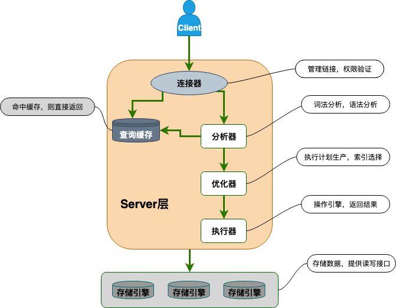

从上图可以看出， MySQL 主要由下面几部分构成：

- **连接器：** 身份认证和权限相关（登录 MySQL 的时候）。
- **查询缓存：** 执行查询语句的时候，会先查询缓存（MySQL 8.0 版本后移除，因为这个功能不太实用）。
- **分析器：** 没有命中缓存的话，SQL 语句就会经过分析器，分析器说白了就是要先看你的 SQL 语句要干嘛，再检查你的 SQL 语句语法是否正确。
- **优化器：** 按照 MySQL 认为最优的方案去执行。
- **执行器：** 执行语句，然后从存储引擎返回数据。 执行语句之前会先判断是否有权限，如果没有权限的话，就会报错。
- **插件式存储引擎**：主要负责数据的存储和读取，采用的是插件式架构，支持 InnoDB、MyISAM、Memory 等多种存储引擎。InnoDB 是 MySQL 的默认存储引擎，绝大部分场景使用 InnoDB 就是最好的选择。

#### 建表指定存储引擎

可以在建表的时候给表指定存储引擎。

```sql
show create table t_user;
CREATE TABLE `t_user` (
  `id` int(11) DEFAULT NULL,
  `name` varchar(32) DEFAULT NULL,
  `birth` date DEFAULT NULL,
  `create_time` datetime DEFAULT NULL
) **ENGINE=InnoDB** DEFAULT CHARSET=utf8mb4 comment '用户表';
```

在建表的时候可以在最后小括号的 ")" 的右边使用：

- ENGINE 来指定存储引擎。
- CHARSET 来指定这张表的字符编码方式。

#### MySQL 常用的存储引擎

#### MySQL支持的存储引擎

MySQL 支持九大存储引擎，当前 5.7.30 支持 8 个。版本不同支持情况不同。

```sql
MySQL>select version();
+------------+
| version()  |
+------------+
| 5.7.30     |
+------------+
MySQL>show engines \G
*************************** 1. row ***************************
      Engine: InnoDB
     Support: DEFAULT
     Comment: Supports transactions, row-level locking, and foreign keys
Transactions: YES
          XA: YES
  Savepoints: YES
*************************** 2. row ***************************
      Engine: MRG_MYISAM
     Support: YES
     Comment: Collection of identical MyISAM tables
Transactions: NO
          XA: NO
  Savepoints: NO
*************************** 3. row ***************************
      Engine: MEMORY
     Support: YES
     Comment: Hash based, stored in memory, useful for temporary tables
Transactions: NO
          XA: NO
  Savepoints: NO
*************************** 4. row ***************************
      Engine: BLACKHOLE
     Support: YES
     Comment: /dev/null storage engine (anything you write to it disappears)
Transactions: NO
          XA: NO
  Savepoints: NO
*************************** 5. row ***************************
      Engine: MyISAM
     Support: YES
     Comment: MyISAM storage engine
Transactions: NO
          XA: NO
  Savepoints: NO
*************************** 6. row ***************************
      Engine: CSV
     Support: YES
     Comment: CSV storage engine
Transactions: NO
          XA: NO
  Savepoints: NO
*************************** 7. row ***************************
      Engine: ARCHIVE
     Support: YES
     Comment: Archive storage engine
Transactions: NO
          XA: NO
  Savepoints: NO
*************************** 8. row ***************************
      Engine: PERFORMANCE_SCHEMA
     Support: YES
     Comment: Performance Schema
Transactions: NO
          XA: NO
  Savepoints: NO
*************************** 9. row ***************************
      Engine: FEDERATED
     Support: NO
     Comment: Federated MySQL storage engine
Transactions: NULL
          XA: NULL
  Savepoints: NULL
9 rows in set (0.00 sec)
```

#### MyISAM vs InnoDB

MySQL 5.5 之前，MyISAM 引擎是 MySQL 的默认存储引擎；在 MySQL 5.5 之后，InnoDB是默认的MySQL 存储引擎，默认的字符编码方式是：utf8。

虽然，MyISAM 的性能还行，各种特性也还不错（比如全文索引、压缩、空间函数等）。但是，MyISAM 不支持事务和行级锁，而且最大的缺陷就是崩溃后无法安全恢复。

> **MyISAM和InnoDB的详细介绍请参考官方文档：**
InnoDB：[https://dev.mysql.com/doc/refman/8.0/en/innodb-introduction.html](https://dev.mysql.com/doc/refman/8.0/en/innodb-introduction.html)
MyISAM：[https://dev.mysql.com/doc/refman/8.0/en/myisam-storage-engine.html](https://dev.mysql.com/doc/refman/8.0/en/myisam-storage-engine.html)
> 
- **是否支持行级锁**

MyISAM 只支持表级锁（table-level locking），而 InnoDB 支持行级锁（row-level locking）和表级锁，默认为行级锁。

也就说，MyISAM 一锁就是锁住了整张表，这在并发写的情况下性能非常差！

- **是否支持事务**

MyISAM 不支持事务。

InnoDB 支持事务，实现了 SQL 标准定义了四个隔离级别，具有提交（commit）和回滚（rollback）事务的能力。并且，InnoDB 默认使用的 REPEATABLE-READ（可重读）隔离级别是可以解决幻读问题发生的（基于 MVCC 和 Next-Key Lock）。

- **是否支持外键**

MyISAM 不支持外键，而 InnoDB 支持。

外键对于维护数据一致性非常有帮助，但是对性能有一定的损耗。因此，通常情况下，我们是不建议在实际生产项目中使用外键的，在业务代码中进行约束即可！

阿里的《Java 开发手册》也是明确规定禁止使用外键的（详见[阿里p3c-SQL](https://alibaba.github.io/p3c/MySQL%E6%95%B0%E6%8D%AE%E5%BA%93/SQL%E8%AF%AD%E5%8F%A5.html)）。

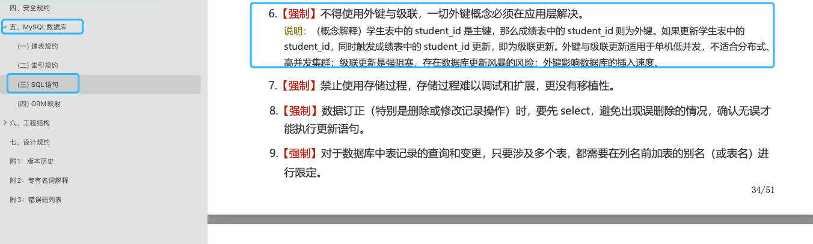

不过，在代码中进行约束的话，对程序员的能力要求更高，具体是否要采用外键还是要根据你的项目实际情况而定。

总结：一般我们也是不建议在数据库层面使用外键的，应用层面可以解决。不过，这样会对数据的一致性造成威胁。具体要不要使用外键还是要根据你的项目来决定。

- **是否支持数据库异常崩溃后的安全恢复**

MyISAM 不支持，而 InnoDB 支持。

使用 InnoDB 的数据库在异常崩溃后，数据库重新启动的时候会保证数据库恢复到崩溃前的状态。这个恢复的过程依赖于 `redo log` 。

- **是否支持 MVCC**

MyISAM 不支持，而 InnoDB 支持。

MyISAM 连行级锁都不支持，肯定也不支持MVCC。MVCC 可以看作是行级锁的一个升级，可以有效减少加锁操作，提高性能。

- **索引实现方式**

虽然 MyISAM 引擎和 InnoDB 引擎都是使用 B+Tree 作为索引结构，但是两者的实现方式不太一样。

InnoDB 引擎中，其数据文件本身就是索引文件。相比 MyISAM，索引文件和数据文件是分离的，其表数据文件本身就是按 B+Tree 组织的一个索引结构，树的叶节点 data 域保存了完整的数据记录。

- **性能差别**

InnoDB 的性能比 MyISAM 更强大，不管是在读写混合模式下还是只读模式下，随着 CPU 核数的增加，InnoDB 的读写能力呈线性增长。MyISAM 因为读写不能并发，它的处理能力跟核数没关系。


- **数据缓存策略和机制实现不同**

InnoDB 使用缓冲池（Buffer Pool）缓存数据页和索引页，MyISAM 使用键缓存（Key Cache）仅缓存索引页而不缓存数据页。

### alter表结构

> 官方文档：[https://dev.MySQL.com/doc/refman/8.0/en/alter-table.html](https://dev.mysql.com/doc/refman/8.0/en/alter-table.html)
> 

**添加一个字段，删除一个字段，修改一个字段**对表结构的修改需要使用：alter，属于 DDL 语句。

- 在实际的开发中，需求一旦确定之后，表一旦设计好之后，很少的进行表结构的修改。因为开发进行中的时候，修改表结构，成本比较高。修改表的结构，对应的 java 代码就需要进行大量的修改。成本是比较高的。这个责任应该由设计人员来承担！
- 由于修改表结构的操作很少，所以我们不需要掌握，如果有一天真的要修改表结构，你可以使用工具（如navicat）！

修改表结构的操作是不需要写到 java 程序中的。实际上也不是 java 程序员的范畴。

##### 修改表名

```sql
alter table 表名 rename to 新的表名;
```

##### 修改表的字符集

```sql
alter table 表名 character set 字符集名称;
```

##### 添加一列

```sql
alter table 表名 add 列名 数据类型;
```

##### 修改列名称、类型

```sql
alter table 表名 change 列名 新列别 新数据类型;

alter table 表名 modify 列名 新数据类型;
```

##### 删除列

```sql
alter table 表名 drop 列名;
```

### TCL

#### 事务

##### 什么是事务？

一个**事务**其实就是**一个完整的业务逻辑，是一个最小的工作单元**。不可再分。

- 什么是一个完整的业务逻辑？

假设转账，从 A 账户向 B 账户中转账 10000，将 A 账户的钱减去 10000（update 语句），将 B 账户的钱加上 10000（update 语句），这就是一个完整的业务逻辑。

以上的操作是一个最小的工作单元，要么同时成功，要么同时失败，不可再分。

这两个 update 语句要求必须同时成功或者同时失败，这样才能保证钱是正确的。


💡
虽然事务中的`commit`，`rollback`语句属于TCL，但是只有 DML 语句（`insert / delete / update`）才会有事务这一说，其它语句和事务无关。

##### 怎么提交事务，怎么回滚事务？

提交事务：`commit;` 语句

回滚事务：`rollback;` 语句（回滚永远都是只能回滚到上一次的提交点！）

事务对应的英语单词是：`transaction`

测试一下，在MySQL当中默认的事务行为是怎样的？**MySQL默认情况下是支持自动提交事务的。（自动提交）**


> 💡**MySQL默认情况下是支持自动提交事务的。（自动提交：每执行一条 DML 语句，则提交一次！**这种自动提交实际上是不符合我们的开发习惯，因为一个业务通常是需要多条 DML 语句共同执行才能完成的，为了保证数据的安全，必须要求同时成功之后再提交，所以不能执行一条就提交一条。**）**
> 
> - **查看当前自动提交状态**
>   ```sql
>   mysql> SHOW VARIABLES LIKE 'autocommit';
>   +---------------+-------+
>   | Variable_name | Value |
>   +---------------+-------+
>   | autocommit    | ON    |
>   +---------------+-------+
>   1 row in set, 1 warning (0.03 sec)
>   ```
> 
> - **关闭自动提交**
>   可以使用`SET autocommit = 0;`语句来设置事务的自动提交模式。此命令将关闭自动提交模式，之后的每个事务都需要手动提交。
> 
> - **永久关闭自动提交**
>   如果希望永久关闭自动提交，可以修改MySQL的配置文件`my.cnf`，添加以下内容：
>   ```sql
>   [mysqld]
>   autocommit = 0
>   ```
>   然后重启MySQL服务：`service mysqld restart`

##### 回滚事务

💡将之前所有的 DML 操作全部撤销，并且清空事务性活动的日志文件。

回滚事务标志着事务的结束。并且是一种全部失败的结束。


```sql
mysql> use bjpowernode;
Database changed
mysql> select * from dept_bak;
Empty set (0.00 sec)
 
mysql> **start transaction;**
Query OK, 0 rows affected (0.00 sec)
 
mysql> insert into dept_bak values(10,'abc', 'tj');
Query OK, 1 row affected (0.00 sec)
 
mysql> insert into dept_bak values(10,'abc', 'tj');
Query OK, 1 row affected (0.00 sec)
 
mysql> select * from dept_bak;
+--------+-------+------+
| DEPTNO | DNAME | LOC  |
+--------+-------+------+
|     10 | abc   | tj   |
|     10 | abc   | tj   |
+--------+-------+------+
2 rows in set (0.00 sec)
 
mysql> **rollback;**
Query OK, 0 rows affected (0.00 sec)
 
mysql> select * from dept_bak;
Empty set (0.00 sec)
```

##### 提交事务

💡清空事务性活动的日志文件，将数据全部彻底持久化到数据库表中。

提交事务标志着，事务的结束。并且是一种全部成功的结束。


```sql
mysql> use bjpowernode;
Database changed
mysql> select * from dept_bak;
+--------+-------+------+
| DEPTNO | DNAME | LOC  |
+--------+-------+------+
|     10 | abc   | bj   |
+--------+-------+------+
1 row in set (0.00 sec)
 
mysql> start transaction;
Query OK, 0 rows affected (0.00 sec)
 
mysql> insert into dept_bak values(20,'abc', 'tj');
Query OK, 1 row affected (0.00 sec)
 
mysql> insert into dept_bak values(20,'abc','tj');
Query OK, 1 row affected (0.00 sec)
 
mysql> insert into dept_bak values(20,'abc','tj');
Query OK, 1 row affected (0.00 sec)
 
mysql> commit;
Query OK, 0 rows affected (0.01 sec)
 
mysql> select * from dept_bak;
+--------+-------+------+
| DEPTNO | DNAME | LOC  |
+--------+-------+------+
|     10 | abc   | bj   |
|     20 | abc   | tj   |
|     20 | abc   | tj   |
|     20 | abc   | tj   |
+--------+-------+------+
4 rows in set (0.00 sec)
 
// **提交后无法回滚**
mysql> rollback;
Query OK, 0 rows affected (0.00 sec)
 
mysql> select * from dept_bak;
+--------+-------+------+
| DEPTNO | DNAME | LOC  |
+--------+-------+------+
|     10 | abc   | bj   |
|     20 | abc   | tj   |
|     20 | abc   | tj   |
|     20 | abc   | tj   |
+--------+-------+------+
4 rows in set (0.00 sec)
```

#### 事务的 4 大特性

##### 原子性 Atomicity

说明事务是最小的工作单元。不可再分。

##### 一致性 Consistency

在同一个事务当中，所有操作必须同时成功，或者同时失败，也就是说执行事务前后，数据保持一致。

##### 隔离性 Isolation

并发访问数据库时，一个用户的事务不被其他事务所干扰，各并发事务之间数据库是独立的。

##### 持久性 Durability

一个事务被提交之后。它对数据库中数据的改变是持久的，即使数据库发生故障也不应该对其有任何影响。

> **只有保证了事务的持久性、原子性、隔离性之后，一致性才能得到保障。也就是说 A、I、D 是手段，C 是目的！**
> 

#### 并发事务带来哪些问题？

##### 脏读（Dirty read）

- 一个事务读到另一个事务还没提交的数据

> 比如事务B读取到了事务A未提交的数据。
> 

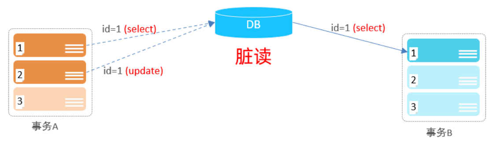

##### 不可重复读

- 一个事务先后读取同一条记录，但两次读取的数据不同
    
> 事务A两次读取同一条记录，但是读取到的数据却是不一样的。

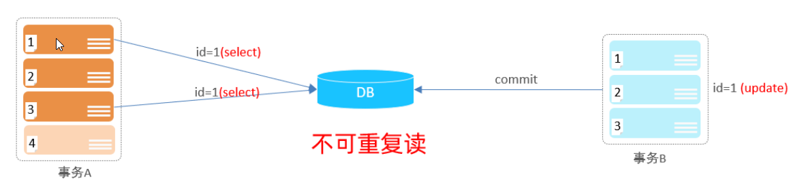

##### 幻读

- 一个事务按照条件查询数据时，没有对应的数据行，但是再插入数据时，又发现这行数据已经存在，好像出现了 "幻影"。

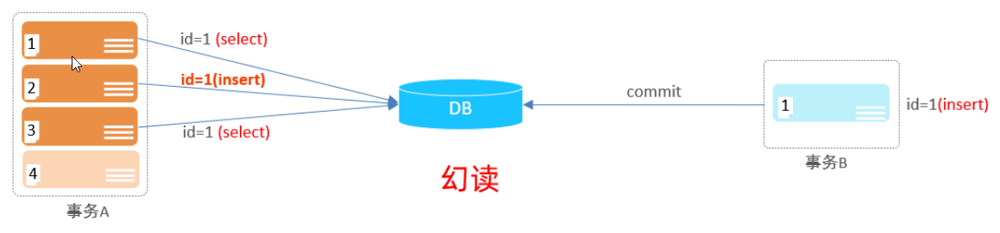

#### MySQL的InnoDB引擎是如何保证事务的这四大特性的？（事务是怎么做到多条 DML 语句同时成功和同时失败的呢？）

而对于这四大特性，实际上分为两个部分。 其中的原子性、一致性、持久化，实际上是由InnoDB中的两份日志来保证的，一份是`redo log`日志，一份是`undo log`日志。 而隔离性是通过数据库的锁和`MVCC`来保证的。


##### redo log

重做日志，记录的是事务提交时数据页的物理修改，是用来实现事务的持久性。

**该日志文件由两部分组成：重做日志缓冲（redo log buffer）以及重做日志文件（redo log file），前者是在内存中，后者在磁盘中**。当事务提交之后会把所有修改信息都存到该日志文件中，用于在刷新脏页到磁盘，发生错误时，进行数据恢复使用。

如果没有`redo log`，可能会存在什么问题的？

在InnoDB引擎中的内存结构中，主要的内存区域就是缓冲池，在缓冲池中缓存了很多的数据页。 当在一个事务中，执行多个增删改的操作时，InnoDB引擎会先操作缓冲池中的数据，如果缓冲区没有对应的数据，会通过后台线程将磁盘中的数据加载出来，存放在缓冲区中，然后将缓冲池中的数据修改，修改后的数据页我们称为**脏页**。 而脏页则会在一定的时机，通过后台线程刷新到磁盘中，从而保证缓冲区与磁盘的数据一致。 而缓冲区的脏页数据并不是实时刷新的，而是一段时间之后将缓冲区的数据刷新到磁盘中，假如刷新到磁盘的过程出错了，而提示给用户事务提交成功，而数据却没有持久化下来，这就出现问题了，没有保证事务的持久性。

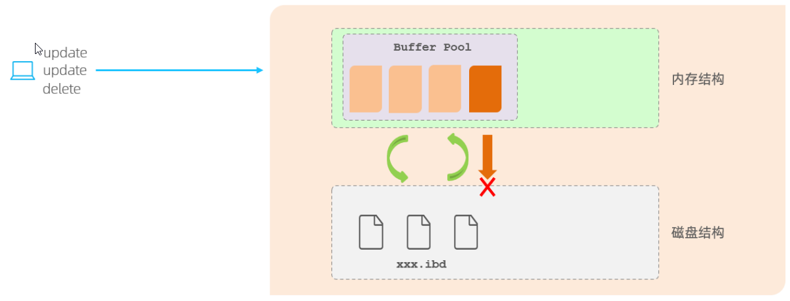

那么，如何解决上述的问题呢？ 在InnoDB中提供了一份日志 `redo log`，接下来我们再来分析一下，通过`redo log`如何解决这个问题。

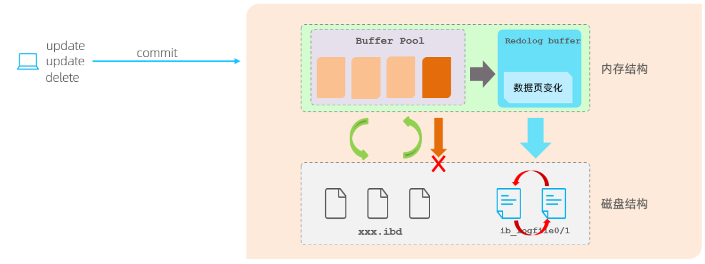

有了`redo log`之后，当对缓冲区的数据进行增删改之后，会首先将操作的数据页的变化，记录在`redo log buffer`中。在事务提交时，会将`redo log buffer`中的数据刷新到`redo log file`中。过一段时间之后：

1. 如果刷新缓冲区的脏页到磁盘时，发生错误，此时就可以借助于`redo log`进行数据恢复，这样就保证了事务的持久性。 
2. 如果脏页成功刷新到磁盘或者涉及到的数据已经落盘，此时`redo log`就没有作用了，就可以删除了，所以存在的两个`redo log`文件是循环写的。

> 💡那为什么每一次提交事务，要刷新`redo log`到磁盘中呢？而不是直接将`buffer pool`中的脏页刷新到磁盘呢？因为在业务操作中，我们操作数据一般都是随机读写磁盘的，而不是顺序读写磁盘。 而`redo log`在往磁盘文件中写入数据，由于是日志文件，所以都是顺序写的。顺序写的效率，要远大于随机写。 这种先写日志的方式，称之为 WAL（Write-Ahead Logging）。

##### undo log

回滚日志，用于记录数据被修改前的信息，作用包含两个：提供回滚（保证事务的原子性）和MVCC（多版本并发控制） 。

`undo log`和`redo log`记录物理日志不一样，它是逻辑日志。可以认为当`delete`一条记录时，`undo log`中会记录一条对应的`insert`记录，反之亦然，当`update`一条记录时，它记录一条对应相反的`update`记录。当执行`rollback`时，就可以从`undo log`中的逻辑记录读取到相应的内容并进行回滚。

**undo log销毁**：`undo log`在事务执行时产生，事务提交时，并不会立即删除`undo log`，因为这些日志可能还用于MVCC。
u**ndo log存储**：`undo log`采用段的方式进行管理和记录，存放在前面介绍的 `rollback segment` 回滚段中，内部包含**1024**个undo log segment。

##### MVCC

全称 Multi-Version Concurrency Control，多版本并发控制。即对一份数据会存储多个版本，通过事务的可见性来保证事务能看到自己应该看到的版本。通常会有一个全局的版本分配器来为每一行数据设置版本号，版本号是唯一的。

MVCC 在 MySQL 中实现所依赖的手段主要是：**隐藏字段、read view、undo log**。

- undo log：undo log 用于记录某行数据的多个版本的数据。
- read view 和隐藏字段：用来判断当前版本数据的可见性。

#### 事务的隔离级别

| 隔离级别 | 脏读 (Dirty Read) | 不可重复读 (Non-Repeatable Read) | 幻读 (Phantom Read) |
| --- | --- | --- | --- |
| READ UNCOMMITTED | √ | √ | √ |
| READ COMMITTED | × | √ | √ |
| REPEATABLE READ | × | × | √ (标准) / ≈× (InnoDB) |
| SERIALIZABLE | × | × | × |

##### 读未提交：read uncommitted（最低的隔离级别）（没有提交就读到了）

- 什么是读未提交？事务 A 可以读取到事务 B 未提交的数据。
- 这种隔离级别存在的问题就是：**脏读现象！（Dirty Read），我们称读到了脏数据。**
- 这种隔离级别一般都是理论上的，大多数的数据库隔离级别都是二档起步！

```sql
mysql> set global transaction isolation level read uncommitted;
事务A                                             事务B
---------------------------------------------------------------------------------------------
use bjpowernode;
                                                  use bjpowernode;
start transaction;
select * from t_user;
Empty set (0.00 sec)
                                                  start transaction;
                                                  insert into t_user values('zhangsan');
select * from t_user;
+------+----------+-------+-------------+
| id   | name     | birth | create_time |
+------+----------+-------+-------------+
| NULL | zhangsan | NULL  | NULL        |
+------+----------+-------+-------------+
## B事务未执行commit，在A事务中就可以查到t_user中插入的数据
## 这就是**读未提交read uncommited的隔离级别**
```

##### 读已提交：read committed（提交之后才能读到）

- 什么是读已提交？事务 A 只能读取到事务 B 提交之后的数据。
- 这种隔离级别解决了什么问题？**解决了脏读的现象。**
- 这种隔离级别存在什么问题？**不可重复读取数据。**
- 什么是不可重复读取数据呢？**在事务开启之后，第一次读到的数据是 3 条，当前事务还没有结束，可能第二次再读取的时候，读到的数据是 4 条，3 不等于 4 称为【不可重复读取】。**

**这种隔离级别是比较真实的数据，每一次读到的数据是绝对的真实。**

**oracle 数据库默认的隔离级别是：read committed**

```sql
set global transaction isolation level read committed;
事务A                                       事务B
--------------------------------------------------------------------------------
use bjpowernode;
                                            use bjpowernode;
start transaction;
                                            start transaction;
select * from t_user;
Empty set (0.00 sec)
                                            insert into t_user（name） values('zhangsan');
select * from t_user;
Empty set (0.00 sec)
                                            commit;
select * from t_user;
+------+----------+-------+-------------+
| id   | name     | birth | create_time |
+------+----------+-------+-------------+
| NULL | zhangsan | NULL  | NULL        |
+------+----------+-------+-------------+
## 只有当B事务commit提交之后，才能在A事务中的t_user中查找到数据
## 这就是**读已提交 read commited**
```

##### 可重复读：repeatable read（提交之后也读不到，永远读取的都是刚开启事务时的数据）

- 什么是可重复读取？**事务 A 开启之后，不管是多久，每一次在事务 A 中读取到的数据都是一致的，即使事务 B 将数据已经修改，并且提交了，事务 A 读取到的数据还是没有发生改变**，这就是**【可重复读】**。
- 可重复读解决了什么问题？**解决了不可重复读取数据。**
- 可重复读存在的问题是什么？**可以会出现幻影读。每一次读取到的数据都是幻象。不够真实！**

早晨 9 点开始开启了事务，只要事务不结束，到晚上 9 点，读到的数据还是那样！读到的是假象。不够绝对的真实。

**MySQL中默认的事务隔离级别就是这个！**

```sql
mysql> set global transaction isolation level repeatable read;
事务A                                                             事务B
----------------------------------------------------------------------------------------------------------
use bjpowernode;
                                                                  use bjpowernode;
start transaction;
                                                                  start transaction;
select * from t_user;
+------+----------+-------+-------------+
| id   | name     | birth | create_time |
+------+----------+-------+-------------+
| NULL | zhangsan | NULL  | NULL        |
+------+----------+-------+-------------+
																	                                insert into t_user(name) values('frank');
																	                                insert into t_user(name) values('mary');
																	                                commit;
select * from t_user;
+------+----------+-------+-------------+
| id   | name     | birth | create_time |
+------+----------+-------+-------------+
| NULL | zhangsan | NULL  | NULL        |
+------+----------+-------+-------------+
## 尽管B事务新插入数据，并且已经提交，但是A事务读取到的数据仍然是开启事务之后读到的数据
## 这就是**可重复读 repeatable read**
```

##### 串行化：serializable

这是最高隔离级别，效率最低。解决了所有的问题。

这种隔离级别表示**事务排队，不能并发**！效率是最低的。

```sql
mysql> set global transaction isolation level serializable;
事务A                                      事务B
--------------------------------------------------------------------------------
use bjpowernode;
                                           use bjpowernode;
start transaction;
                                           start transaction;
select * from t_user;
insert into t_user values('abc');
                                           select * from t_user;
commit      
																						Query OK
## 只有当A事务提交之后，B事务才能继续操作。           
```


> 💡MySQL 的隔离级别是基于锁和 MVCC 机制共同实现的。
> 
> SERIALIZABLE 隔离级别是通过锁来实现的，READ-COMMITTED 和 REPEATABLE-READ 隔离级别是基于 MVCC 实现的。不过， SERIALIZABLE 之外的其他隔离级别可能也需要用到锁机制，就比如 REPEATABLE-READ 在当前读情况下需要使用加锁读来保证不会出现幻读。

#### 查看隔离级别

```sql
// 5.x 版本
SELECT @@tx_isolation;
+-----------------+
| @@tx_isolation  |
+-----------------+
| REPEATABLE-READ |
+-----------------+
 
// 8.x 版本
SELECT @@transaction_isolation;
+-------------------------+
| @@transaction_isolation |
+-------------------------+
| REPEATABLE-READ         |
+-------------------------+
```

#### 设定隔离级别

```sql
// SESSION 是会话级别，表示只针对当前会话有效，GLOBAL 表示对所有会话有效
SET [ SESSION | GLOBAL ] TRANSACTION ISOLATION LEVEL {READ UNCOMMITTED | READ COMMITTED | REPEATABLE READ | SERIALIZABLE };
```

## DCL

### 权限控制

MySQL中定义了很多种权限，但是常用的就以下几种：

| 权限 | 说明 |
| --- | --- |
| ALL, ALL PRIVILEGES | 所有权限 |
| SELECT | 查询数据 |
| INSERT | 插入数据 |
| UPDATE | 修改数据 |
| DELETE | 删除数据 |
| ALTER | 修改表 |
| DROP | 删除数据库/表/视图 |
| CREATE | 创建数据库/表 |

上述只是简单罗列了常见的几种权限描述，其他权限描述及含义，可以直接参考[官方文档](https://dev.mysql.com/doc/refman/8.0/en/privileges-provided.html)。

- 查询权限：`SHOW GRANTS FOR '用户名'@'主机名';`
- 授予权限：`GRANT 权限列表 ON 数据库名.表名 TO '用户名'@'主机名';`
- 撤销权限：`REVOKE 权限列表 ON 数据库名.表名 FROM '用户名'@'主机名';`

### 索引index

#### 什么是索引？

##### 索引的作用

**索引是一种用于快速查询和检索数据的数据结构，其本质可以看成是一种排序好的数据结构。**

**索引**是在数据库表的字段上添加的，是为了提高查询效率存在的一种机制。索引相当于一本书的目录，是为了缩小扫描范围而存在的一种机制。

- 对于一本字典来说，查找某个汉字有两种方式：
1. 第一种方式：一页一页挨着找，直到找到为止，这种查找方式属于全字典扫描，效率比较低。
2. 第二种方式：先通过目录（索引）去定位一个大概的位置，然后直接定位到这个位置，做局域性扫描，缩小扫描的范围，快速的查找。这种查找方式属于通过索引检索，效率较高

##### 索引的特点（优缺点）

**一张表的一个字段可以添加一个索引，当然，多个字段联合起来也可以添加索引（复合索引）。**

```sql
id(idIndex)  name(nameIndex)  ...
---------------------------------------
1            zhangsan         ...
2            lisi             ...
3            wangwu           ...
4            zhaoliu          ...
5            hanmeimei        ...
6            jack             ...
---------------------------------------
 
select * from t_user where name = 'jack';
-- 如果 name 字段上没有添加索引（目录），或者说没有给 name 字段创建索引，MySQL 会进行全扫描，会将 name 字段上的每一个值都比对一遍。效率比较低。
```

- **索引的优点**
    1. **加快查询速度（主要目的）**：通过索引，数据库可以**大幅减少需要扫描的数据量**，直接定位到符合条件的记录，从而显著加快数据检索速度，减少磁盘 I/O 次数。
    2. **保证数据唯一性**：通过创建**唯一索引（Unique Index）**，可以确保表中的某一列（或几列组合）的值是独一无二的，比如用户 ID、邮箱等。主键本身就是一种唯一索引。
    3. **加速排序和分组**：如果查询中的 ORDER BY 或 GROUP BY 子句涉及的列建有索引，数据库往往可以直接利用索引已经排好序的特性，避免额外的排序操作，从而提升性能。
- **索引的缺点**
    1. **创建和维护耗时**：创建索引本身需要时间，特别是对大表操作时。更重要的是，当对表中的数据进行**增、删、改（DML 操作）**时，不仅要操作数据本身，相关的索引也必须动态更新和维护，这会**降低这些 DML 操作的执行效率**。
    2. **占用存储空间**：索引本质上也是一种数据结构，需要以物理文件（或内存结构）的形式存储，因此会**额外占用一定的磁盘空间**。索引越多、越大，占用的空间也就越多。
    3. **可能被误用或失效**：如果索引设计不当，或者查询语句写得不好，数据库优化器可能不会选择使用索引（或者选错索引），反而导致性能下降。


💡

**用了索引就一定能提高查询性能吗？**

**不一定。** 大多数情况下，合理使用索引确实比全表扫描快得多。但也有例外：

- **数据量太小**：如果表里的数据非常少（比如就几百条），全表扫描可能比通过索引查找更快，因为走索引本身也有开销。
- **查询结果集占比过大**：如果要查询的数据占了整张表的大部分（比如超过 20%-30%），优化器可能会认为全表扫描更划算，因为通过索引多次回表（随机 I/O）的成本可能高于一次顺序的全表扫描。
- **索引维护不当或统计信息过时**：导致优化器做出错误判断。


##### 索引类型

- 按照数据结构维度划分：
    - BTree 索引：MySQL 里默认和最常用的索引类型。只有叶子节点存储 value，非叶子节点只有指针和 key。存储引擎 MyISAM 和 InnoDB 实现 BTree 索引都是使用 B+Tree，但二者实现方式不一样。
    - 哈希索引：类似键值对的形式，一次即可定位。
    - RTree 索引：一般不会使用，仅支持 geometry 数据类型，优势在于范围查找，效率较低，通常使用搜索引擎如 ElasticSearch 代替。
    - 全文索引：对文本的内容进行分词，进行搜索。目前只有 `CHAR`、`VARCHAR`、`TEXT` 列上可以创建全文索引。一般不会使用，效率较低，通常使用搜索引擎如 ElasticSearch 代替。
- 按照底层存储方式角度划分：
    - **聚簇索引（聚集索引）：索引结构和数据一起存放的索引**，InnoDB 中的主键索引就属于聚簇索引。必须有，而且只有一个。
    - **非聚簇索引（非聚集索引）：索引结构和数据分开存放的索引**，二级索引（辅助索引）就属于非聚簇索引。MySQL 的 MyISAM 引擎，不管主键还是非主键，使用的都是非聚簇索引。可以存在多个。
- 按照应用维度划分：
    - **主键索引（PRIMARY）：加速查询 + 列值唯一（不可以有 NULL）+ 表中只有一个。**
    - 普通索引：仅加速查询，可以有多个。
    - **唯一索引（UNIQUE）：加速查询 + 列值唯一（可以有 NULL）+ 可以有多个。**
    - 覆盖索引：一个索引包含（或者说覆盖）所有需要查询的字段的值。
    - **联合索引：多列值组成一个索引，专门用于组合搜索，其效率大于索引合并。**
        
        `CREATE INDEX idx_user_pro_age_sta ON tb_user(profession,age,status); --为profession、age、status创建联合索引`
        
    - **全文索引（FULLTEXT）**：对文本的内容进行分词，进行搜索。目前只有 `CHAR`、`VARCHAR`、`TEXT` 列上可以创建全文索引。一般不会使用，效率较低，通常使用搜索引擎如 ElasticSearch 代替。
    - 前缀索引：对文本的前几个字符创建索引，相比普通索引建立的数据更小，因为只取前几个字符。
    
    > 
    > 
    > 
    > **什么是覆盖索引？**
    > 
    > **如果一个索引包含（或者说覆盖）所有需要查询的字段的值，就称之为覆盖索引（Covering Index）**。
    > 
    > 在 InnoDB 存储引擎中，非主键索引的叶子节点包含的是主键的值。这意味着，当使用非主键索引进行查询时，数据库会先找到对应的主键值，然后再通过主键索引来定位和检索完整的行数据。这个过程被称为“回表”。
    > 
    > **覆盖索引即需要查询的字段正好是索引的字段，那么直接根据该索引，就可以查到数据了，而无需回表查询。**
    > 

###### 联合索引及最左匹配原则

使用表中的多个字段创建索引，就是**联合索引**，也叫**组合索引**或**复合索引**。

以 `score` 和 `name` 两个字段建立联合索引：

```sql
ALTER TABLE `cus_order` ADD INDEX id_score_name(score,name);
```

**最左前缀匹配原则指的是在使用联合索引时，MySQL 会根据索引中的字段顺序，从左到右依次匹配查询条件中的字段。如果查询条件与索引中的最左侧字段相匹配，那么 MySQL 就会使用索引来过滤数据，这样可以提高查询效率。**

最左匹配原则会一直向右匹配，直到遇到范围查询（如 >、<）为止。对于 >=、<=、BETWEEN 以及前缀匹配 LIKE 的范围查询，不会停止匹配。

假设有一个联合索引 `(column1, column2, column3)`，其从左到右的所有前缀为 `(column1)`、`(column1, column2)`、`(column1, column2, column3)`（创建 1 个联合索引相当于创建了 3 个索引），包含这些列的所有查询都会走索引而不会全表扫描。

在使用联合索引时，可以将区分度高的字段放在最左边，这也可以过滤更多数据。

1. 创建一个名为 `student` 的表，这张表只有 `id`、`name`、`class` 这 3 个字段。
    
    ```sql
    CREATE TABLE `student` (
      `id` int NOT NULL,
      `name` varchar(100)DEFAULT NULL,
      `class` varchar(100)DEFAULT NULL,
      PRIMARY KEY (`id`),
      KEY `name_class_idx` (`name`,`class`)
    ) ENGINE=InnoDB DEFAULT CHARSET=utf8mb4;
    ```
    
2. 下面分别测试三条不同的 SQL 语句。
    
    https://oss.javaguide.cn/github/javaguide/database/mysql/leftmost-prefix-matching-rule.png
    
    ```sql
    ## 可以命中索引
    SELECT * FROM student WHERE name = 'Anne Henry';
    EXPLAIN SELECT * FROM student WHERE name = 'Anne Henry' AND class= 'lIrm08RYVk';
    ## 无法命中索引
    SELECT * FROM student WHERE class= 'lIrm08RYVk';
    ```
    


💡

再来看一个常见的面试题：如果有索引 `联合索引(a, b, c)`，查询 `a=1 AND c=1` 会走索引么？`c=1` 呢？`b=1 AND c=1` 呢？ `b = 1 AND a = 1 AND c = 1` 呢？

1. 查询 `a=1 AND c=1`：根据最左前缀匹配原则，查询可以使用索引的前缀部分。因此，该查询仅在 `a=1` 上使用索引，然后对结果进行 `c=1` 的过滤。
2. 查询 `c=1`：由于查询中不包含最左列 `a`，根据最左前缀匹配原则，整个索引都无法被使用。
3. 查询 `b=1 AND c=1`：和第二种一样的情况，整个索引都不会使用。
4. 查询 `b=1 AND a=1 AND c=1`：这个查询是可以用到索引的。查询优化器分析 SQL 语句时，对于联合索引，会对查询条件进行重排序，以便用到索引。会将 `b=1` 和 `a=1` 的条件进行重排序，变成 `a=1 AND b=1 AND c=1`。


###### 前缀索引

当字段类型为字符串（`varchar，text，longtext`等）时，有时候需要索引很长的字符串，这会让索引变得很大，查询时，浪费大量的磁盘IO， 影响查询效率。此时可以只将字符串的一部分前缀，建立索引，这样可以大大节约索引空间，从而提高索引效率。

- 语法：`create index idx_xxxx on table_name(column(n));`
    
    ```sql
    -- 为tb_user表的email字段，建立长度为5的前缀索引
    create index idx_email_5 on tb_user(email(5));
    ```
    
- 前缀长度：可以根据索引的选择性来决定，而**选择性是指不重复的索引值（基数）和数据表的记录总数的比值**，索引选择性越高则查询效率越高， **唯一索引的选择性是1**，这是最好的索引选择性，性能也是最好的。
    
    ```sql
    select count(distinct email) / count(*) from tb_user;
    select count(distinct substring(email,1,5)) / count(*) from tb_user;
    ```
    

#### 索引的实现原理（底层数据结构）

```sql
## 假设有一张用户表：t_user
id(PK)  name       每一行记录在硬盘上都有物理存储编号
----------------------------------------------------------------------------------
100     zhangsan   0x1111
120     lisi       0x2222
99      wangwu     0x8888
88      zhaoliu    0x9999
101     jack       0x6666
55      lucy       0x5555
130     tom        0x7777
```


- **在任何数据库当中主键上都会自动添加索引对象，id 字段上自动有索引，因为 id 是 PK。另外在 MySQL 当中，一个字段上如果有 unique 约束的话，也会自动创建索引对象。**
- 在任何数据库当中，任何一张表的任何一条记录在硬盘存储上都有一个硬盘的物理存储编号。
- **在 MySQL 当中，索引是一个单独的对象，不同的存储引擎以不同的形式存在**，在 MyISAM 存储引擎中，索引存储在一个.MYI 文件中。在 InnoDB 存储引擎中索引存储在一个逻辑名称叫做 tablespace 的当中。在 MEMORY 存储引擎当中索引被存储在内存当中。不管索引存储在哪里，索引在 MySQL 当中都是一个树的形式存在。（自平衡二叉树：B-Tree）


💡

为什么InnoDB存储引擎选择使用B+tree索引结构？【回答的角度】

1. 相对于二叉树，层级更少，搜索效率高；
2. 对于B-tree，无论是叶子节点还是非叶子节点，都会保存数据，这样导致一页中存储的键值减少，指针跟着减少，要同样保存大量数据，只能增加树的高度，导致性能降低；
3. 相对Hash索引，B+tree支持范围匹配及排序操作；


#### 索引语法

- **创建索引**：`CREATE [ UNIQUE | FULLTEXT ] INDEX index_name ON table_name (index_col_name,... );`
- **查看索引**：`SHOW INDEX FROM table_name;`
- **删除索引**：`DROP INDEX index_name ON table_name;`

```sql
## 创建索引：给 emp 表的 ename 字段添加索引，起名：emp_ename_index
create index emp_ename_index on emp(ename);

## 删除索引：将 emp 表上的 emp_ename_index 索引对象删除
drop index emp_ename_index on emp;
```

#### 索引设计原则（哪些字段适合添加索引？）

- **不为 NULL 的字段**：索引字段的数据应该尽量不为 NULL，因为对于数据为 NULL 的字段，数据库较难优化。如果字段频繁被查询，但又避免不了为 NULL，建议使用 0，1，true，false 这样语义较为清晰的短值或短字符作为替代。
- 针对于常作为**查询条件（where）、排序（order by）、分组（group by）、连接（join）**操作的字段建立索引。
- 尽量选择**频繁查询且区分度高**的字段作为索引，**尽量建立唯一索引**，区分度越高，使用索引的效率越高。
- 如果是字符串类型的字段，字段的长度较长，可以针对于字段的特点，建立**前缀索引**。
- **尽量使用联合索引，减少单列索引**，查询时，联合索引很多时候可以覆盖索引，节省存储空间，避免回表，提高查询效率。
- **很少执行DML**（`insert delete update`）**操作的字段**。**（因为 DML 之后，索引需要重新排序。）**

💡 建议不要随意添加索引，因为索引也是需要维护的，太多的话反而会降低系统的性能。

建议通过主键查询，建议通过 unique 约束的字段进行查询，效率是比较高的。

#### 索引失效的原因有哪些？

1. 创建了联合索引，但查询条件未遵守最左匹配原则。
    
    ```sql
    create index emp_job_sal_index on emp(job,sal);
     
    explain select * from emp where job = 'MANAGER';
    +----+-------------+-------+------------+------+-------------------+-------------------+---------+-------+------+----------+-------+
    | id | select_type | table | partitions | type | possible_keys     | key               | key_len | ref   | rows | filtered | Extra |
    +----+-------------+-------+------------+------+-------------------+-------------------+---------+-------+------+----------+-------+
    |  1 | SIMPLE      | emp   | NULL       | ref  | emp_job_sal_index | emp_job_sal_index | 30      | const |    3 |   100.00 | NULL  |
    +----+-------------+-------+------------+------+-------------------+-------------------+---------+-------+------+----------+-------+
     
    explain select * from emp where sal = 800;   //未使用job字段
    +----+-------------+-------+------------+------+---------------+------+---------+------+------+----------+-------------+
    | id | select_type | table | partitions | type | possible_keys | key  | key_len | ref  | rows | filtered | Extra       |
    +----+-------------+-------+------------+------+---------------+------+---------+------+------+----------+-------------+
    |  1 | SIMPLE      | emp   | NULL       | ALL  | NULL          | NULL | NULL    | NULL |   14 |    10.00 | Using where |
    +----+-------------+-------+------------+------+---------------+------+---------+------+------+----------+-------------+
    ```
    
2. 在索引列上进行计算、函数、类型转换等操作。
    
    ```sql
    create index emp_sal_index on emp(sal);
     
    explain select * from emp where sal = 800;
    +----+-------------+-------+------------+------+---------------+---------------+---------+-------+------+----------+-------+
    | id | select_type | table | partitions | type | possible_keys | key           | key_len | ref   | rows | filtered | Extra |
    +----+-------------+-------+------------+------+---------------+---------------+---------+-------+------+----------+-------+
    |  1 | SIMPLE      | emp   | NULL       | ref  | emp_sal_index | emp_sal_index | 9       | const |    1 |   100.00 | NULL  |
    +----+-------------+-------+------------+------+---------------+---------------+---------+-------+------+----------+-------+
     
    explain select * from emp where sal+1 = 800;
    +----+-------------+-------+------------+------+---------------+------+---------+------+------+----------+-------------+
    | id | select_type | table | partitions | type | possible_keys | key  | key_len | ref  | rows | filtered | Extra       |
    +----+-------------+-------+------------+------+---------------+------+---------+------+------+----------+-------------+
    |  1 | SIMPLE      | emp   | NULL       | ALL  | NULL          | NULL | NULL    | NULL |   14 |   100.00 | Using where |
    +----+-------------+-------+------------+------+---------------+------+---------+------+------+----------+-------------+
    
    ## 在where当中索引列使用了函数
    explain select * from emp where lower(ename) = 'smith';
    +----+-------------+-------+------------+------+---------------+------+---------+------+------+----------+-------------+
    | id | select_type | table | partitions | type | possible_keys | key  | key_len | ref  | rows | filtered | Extra       |
    +----+-------------+-------+------------+------+---------------+------+---------+------+------+----------+-------------+
    |  1 | SIMPLE      | emp   | NULL       | ALL  | NULL          | NULL | NULL    | NULL |   14 |   100.00 | Using where |
    +----+-------------+-------+------------+------+---------------+------+---------+------+------+----------+-------------+
    ```
    
3. 以 % 开头的 LIKE 查询比如 `LIKE '%abc';`
    
    ```sql
    explain select * from emp where ename like '%T';
    +----+-------------+-------+------------+------+---------------+------+---------+------+------+----------+-------------+
    | id | select_type | table | partitions | type | possible_keys | key  | key_len | ref  | rows | filtered | Extra       |
    +----+-------------+-------+------------+------+---------------+------+---------+------+------+----------+-------------+
    |  1 | SIMPLE      | emp   | NULL       | ALL  | NULL          | NULL | NULL    | NULL |   14 |    11.11 | Using where |
    +----+-------------+-------+------------+------+---------------+------+---------+------+------+----------+-------------+
    -- ename 上即使添加了索引，也不会走索引，为什么？原因是因为模糊匹配当中以 % 开头了！B-Tree无法定位到树根！
    ```
    
4. 查询条件中使用 OR，且 OR 的前后条件中有一个列没有索引，涉及的索引都不会被使用到。
    
    使用 or 的时候会失效，**如果使用 or，那么要求 or 两边的条件字段都要有索引，才会走索引，如果其中一边有一个字段没有索引，那么另一个字段上的索引也会失效！这就是为什么不建议使用 or 的原因。**
    
    ```sql
    explain select * from emp where ename = 'KING' or job = 'MANAGER';
    +----+-------------+-------+------------+------+-----------------+------+---------+------+------+----------+-------------+
    | id | select_type | table | partitions | type | possible_keys   | key  | key_len | ref  | rows | filtered | Extra       |
    +----+-------------+-------+------------+------+-----------------+------+---------+------+------+----------+-------------+
    |  1 | SIMPLE      | emp   | NULL       | ALL  | emp_ename_index | NULL | NULL    | NULL |   14 |    19.00 | Using where |
    +----+-------------+-------+------------+------+-----------------+------+---------+------+------+----------+-------------+
    ```
    
5. IN 的取值范围较大时会导致索引失效，走全表扫描（NOT IN 和 IN 的失效场景相同）。

### SQL性能分析

#### SQL执行频率

MySQL 客户端连接成功后，通过 `show [session | global] status` 命令可以提供服务器状态信息。通过如下指令，可以查看当前数据库的INSERT、UPDATE、DELETE、SELECT的访问频次：

```sql
-- session 是查看当前会话; global 是查询全局数据;
SHOW GLOBAL STATUS LIKE 'Com_______';

MySQL> SHOW GLOBAL STATUS LIKE 'Com_______';
+---------------+-------+
| Variable_name | Value |
+---------------+-------+
| Com_binlog    | 0     |
| Com_commit    | 0     |
| Com_delete    | 0     |
| Com_insert    | 0     |
| Com_repair    | 0     |
| Com_revoke    | 0     |
| Com_select    | 4     |
| Com_signal    | 0     |
| Com_update    | 0     |
| Com_xa_end    | 0     |
+---------------+-------+
10 rows in set (0.01 sec)
```

> 
> 
> 
> 通过上述指令，可以查看到当前数据库到底是以查询为主，还是以增删改为主，从而为数据库优化提供参考依据。 如果是以增删改为主，可以考虑不对其进行索引的优化。 如果是以查询为主，那么就要考虑对数据库的索引进行优化了。
> 

#### 慢查询日志

慢查询日志记录了所有执行时间超过指定参数（`long_query_time`，单位：秒，默认10秒）的所有SQL语句的日志。

MySQL的慢查询日志默认没有开启，可以查看一下系统变量 `slow_query_log`。

```sql
MySQL> show variables like 'slow_query_log';
+----------------+-------+
| Variable_name  | Value |
+----------------+-------+
| slow_query_log | OFF   |
+----------------+-------+
1 row in set, 1 warning (0.01 sec)
```

如果要开启慢查询日志，需要在MySQL的配置文件（/etc/my.cnf）中配置如下信息：

```sql
## 开启 MySQL 慢日志查询开关
slow_query_log=1

## 设置慢日志的时间为 2 秒，SQL语句执行时间超过 2 秒，就会视为慢查询，记录慢查询日志
long_query_time=2
```

配置完毕之后，通过指令`systemctl restart MySQLd`重新启动MySQL服务器进行测试，查看慢日志文件中记录的信息/var/lib/MySQL/localhost-slow.log。

> Windows电脑在`C:\ProgramData\MySQL\MySQL Server 5.7\my.ini`中添加上面的配置
> 

```bash
[mysqld]
slow-query-log=1
long_query_time=2
```

尝试执行一条时长超过2秒的`select`语句：`select empno,ename,sleep(4) from emp where ename='smith';`

```jsx
mysql> select id, username, sleep(3) from system_user where nickname='frank';
+------+----------+----------+
| id   | username | sleep(3) |
+------+----------+----------+
|    1 | Frank    |        0 |
| 1024 | root     |        0 |
+------+----------+----------+
2 rows in set (6.02 sec)
```

慢查询日志文件默认存储在：C:\ProgramData\MySQL\MySQL Server 5.7\Data 目录下，默认的名字是：计算机名-slow.log通过该文件可以清晰的看到哪些DQL语句属于慢查询。

#### profile详情

`show profiles` 能够在做SQL优化时帮助了解时间都耗费到哪里去了。通过`have_profiling`参数，能够看到当前MySQL是否支持`profile`操作：

```sql
MySQL> SELECT @@have_profiling;
+------------------+
| @@have_profiling |
+------------------+
| YES              |
+------------------+
1 row in set, 1 warning (0.00 sec)

MySQL> SELECT @@profiling;
+-------------+
| @@profiling |
+-------------+
|           0 |
+-------------+
1 row in set, 1 warning (0.00 sec)
```

可以看到，当前MySQL是支持 `profile`操作的，但是开关是关闭的。可以通过`set`语句在`session/global`级别开启`profiling`：

```sql
SET global profiling = 1;
```

开关打开之后，所执行的SQL语句，都会被MySQL记录，并记录执行时间消耗到哪儿去了。执行一系列的业务SQL的操作，然后通过如下指令查看指令的执行耗时：

```sql
-- 查看每一条SQL的耗时基本情况
show profiles;

-- 查看指定query_id的SQL语句各个阶段的耗时情况
show profile for query query_id;

-- 查看指定query_id的SQL语句CPU的使用情况
show profile cpu for query query_id;
```

```sql
MySQL> show profiles;
+----------+------------+-----------------------------------------------+
| Query_ID | Duration   | Query                                         |
+----------+------------+-----------------------------------------------+
|        1 | 0.00061100 | select @@version_comment limit 1              |
|        2 | 0.00081125 | show databases                                |
|        3 | 0.00019075 | SELECT DATABASE()                             |
|        4 | 0.00199125 | select * from system_role_menu where id = 485 |
|        5 | 0.00050500 | select count(*) from system_role_menu         |
+----------+------------+-----------------------------------------------+
5 rows in set, 1 warning (0.00 sec)

MySQL> show profile for query 4;
+----------------------+----------+
| Status               | Duration |
+----------------------+----------+
| starting             | 0.000115 |
| checking permissions | 0.000013 |
| Opening tables       | 0.001550 |
| init                 | 0.000038 |
| System lock          | 0.000008 |
| optimizing           | 0.000009 |
| statistics           | 0.000073 |
| preparing            | 0.000009 |
| executing            | 0.000003 |
| Sending data         | 0.000023 |
| end                  | 0.000004 |
| query end            | 0.000006 |
| closing tables       | 0.000007 |
| freeing items        | 0.000110 |
| cleaning up          | 0.000024 |
+----------------------+----------+
15 rows in set, 1 warning (0.00 sec)
MySQL> show profile cpu for query 4;
+----------------------+----------+----------+------------+
| Status               | Duration | CPU_user | CPU_system |
+----------------------+----------+----------+------------+
| starting             | 0.000115 | 0.000000 |   0.000000 |
| checking permissions | 0.000013 | 0.000000 |   0.000000 |
| Opening tables       | 0.001550 | 0.000000 |   0.000000 |
| init                 | 0.000038 | 0.000000 |   0.000000 |
| System lock          | 0.000008 | 0.000000 |   0.000000 |
| optimizing           | 0.000009 | 0.000000 |   0.000000 |
| statistics           | 0.000073 | 0.000000 |   0.000000 |
| preparing            | 0.000009 | 0.000000 |   0.000000 |
| executing            | 0.000003 | 0.000000 |   0.000000 |
| Sending data         | 0.000023 | 0.000000 |   0.000000 |
| end                  | 0.000004 | 0.000000 |   0.000000 |
| query end            | 0.000006 | 0.000000 |   0.000000 |
| closing tables       | 0.000007 | 0.000000 |   0.000000 |
| freeing items        | 0.000110 | 0.000000 |   0.000000 |
| cleaning up          | 0.000024 | 0.000000 |   0.000000 |
+----------------------+----------+----------+------------+
15 rows in set, 1 warning (0.00 sec)
```

#### explain分析

`EXPLAIN` 或者 `DESC`命令获取 MySQL 如何执行 SELECT 语句的信息，包括在 SELECT 语句执行过程中表如何连接和连接的顺序。

```sql
MySQL> explain select * from system_role_menu where id = 485;
+----+-------------+------------------+------------+-------+---------------+---------+---------+-------+------+----------+-------+
| id | select_type | table            | partitions | type  | possible_keys | key     | key_len | ref   | rows | filtered | Extra |
+----+-------------+------------------+------------+-------+---------------+---------+---------+-------+------+----------+-------+
|  1 | SIMPLE      | system_role_menu | NULL       | const | PRIMARY       | PRIMARY | 8       | const |    1 |   100.00 | NULL  |
+----+-------------+------------------+------------+-------+---------------+---------+---------+-------+------+----------+-------+
1 row in set, 1 warning (0.00 sec)
```

Explain 执行计划中各个字段的含义：

| 字段 | 含义 |
| --- | --- |
| id | select查询的序列号，表示查询中执行select子句或者是操作表的顺序（id相同，执行顺序从上到下；id不同，值越大，越先执行）。 |
| select_type | 表示 SELECT 的类型，常见的取值有 SIMPLE（简单表，即不使用表连接或者子查询）、PRIMARY（主查询，即外层的查询）、UNION（UNION 中的第二个或者后面的查询语句）、SUBQUERY（SELECT/WHERE之后包含了子查询）等 |
| type | 表示连接类型，描述了找到所需数据使用的扫描方式，性能由好到差的连接类型为：
1. NULL、
2. system（系统表，少量数据，往往不需要进行磁盘IO）
3. const（常量连接）
4. **eq_ref**（主键索引（primary key）或者非空唯一索引（unique not null）等值扫描）
5. **ref**（非主键非唯一索引等值扫描）
6. range（范围扫描）
7.  index（索引树扫描）
8. ALL（全表扫描（full table scan））。 |
| possible_key | 显示可能应用在这张表上的索引，一个或多个。 |
| key | 实际使用的索引，如果为NULL，则没有使用索引。 |
| key_len | 表示索引中使用的字节数， 该值为索引字段最大可能长度，并非实际使用长度，在不损失精确性的前提下， 长度越短越好 。 |
| rows | MySQL认为必须要执行查询的行数，在innodb引擎的表中，是一个估计值，可能并不总是准确的。 |
| filtered  | 表示返回结果的行数占需读取行数的百分比， filtered 的值越大越好。 |
| Extra | **Using where**：表示SQL使用了WHERE过滤。
**Using filesort**：表示需要进行文件排序，可能会影响性能。典型的，在一个没有建立索引的列上进行了order by，就会触发filesort，常见的优化方案是，在order by的列上添加索引，避免每次查询都全量排序。
**Using index**：SQL所需要返回的所有列数据均在一棵索引树上，而无需访问实际的行记录。
**Using index condition：表示**确实命中了索引，但不是所有的列数据都在索引树上，还需要访问实际的行记录。
**Using temporary：** 需要建立临时表（temporary table）来暂存中间结果。这类SQL语句性能较低，往往也需要进行优化。典型的，group by和order by同时存在，且作用于不同的字段时，就会建立临时表，以便计算出最终的结果集。 |

### SQL优化

#### insert

如果需要一次性往数据库表中插入多条记录，可以从以下三个方面进行优化。

- 批量插入数据
    
    ```sql
    INSERT INTO 表名 (字段名1, 字段名2, ...) VALUES (值1_1, 值1_2, ...), (值2_1, 值2_2, ...), (值3_1, 值3_2, ...);
    ```
    
- 手动控制事务
    
    ```sql
    start transaction;
    insert into tb_test values(1,'Tom'),(2,'Cat'),(3,'Jerry');
    insert into tb_test values(4,'Tom'),(5,'Cat'),(6,'Jerry');
    insert into tb_test values(7,'Tom'),(8,'Cat'),(9,'Jerry');
    commit;
    ```
    
- 主键顺序插入，性能要高于乱序插入。
    
    ```sql
    主键乱序插入 : 8 1 9 21 88 2 4 15 89 5 7 3
    主键顺序插入 : 1 2 3 4 5 7 8 9 15 21 88 89
    ```
    
- 如果一次性需要插入大批量数据（比如: 几百万的记录），使用`insert`语句插入性能较低，此时可以使用MySQL数据库提供的`load`指令进行插入。
    
    ```sql
    -- 客户端连接服务端时，加上参数 -–local-infile
    MySQL –-local-infile -u root -p
    
    -- 设置全局参数local_infile为1，开启从本地加载文件导入数据的开关
    set global local_infile = 1;
    
    -- 执行load指令将准备好的数据，加载到表结构中
    load data local infile '/root/sql1.log' into table tb_user fields terminated by ',' lines terminated by '\n';
    ```
    

#### 主键

1. 满足业务需求的情况下，尽量降低主键的长度。
2. 插入数据时，尽量选择顺序插入，选择使用AUTO_INCREMENT自增主键。
3. 尽量不要使用UUID做主键或者是其他自然主键，如身份证号。
4. 业务操作时，避免对主键的修改。

#### Order By

1. 根据排序字段建立合适的索引，多字段排序时，也遵循最左前缀法则。
2. 尽量使用覆盖索引。
3. 多字段排序，一个升序一个降序，此时需要注意联合索引在创建时的规则（ASC/DESC）。
4. 如果不可避免的出现filesort，大数据量排序时，可以适当增大排序缓冲区大小`sort_buffer_size`（默认256k）。

#### Group By

1. 在分组操作时，可以通过索引来提高效率。
2. **分组操作时，索引的使用也是满足最左前缀法则的。**

#### Limit

在数据量比较大时，如果进行limit分页查询，在查询时，越往后，分页查询效率越低。

优化思路：一般分页查询时，通过创建覆盖索引能够比较好地提高性能，可以通过覆盖索引加子查询形式进行优化。

#### Count

在之前的测试中，发现，如果数据量很大，在执行count操作时，是非常耗时的。

- MyISAM引擎把一个表的总行数存在了磁盘上，因此执行`count()`的时候会直接返回这个数，效率很高； 但是如果是带条件的count，MyISAM也慢。
- InnoDB 引擎就麻烦了，它执行`count()` 的时候，需要把数据一行一行地从引擎里面读出来，然后累积计数。

如果说要大幅度提升InnoDB表的count效率，主要的优化思路：自己计数（可以借助于redis这样的数据库进行，但是如果是带条件的count又比较麻烦了）。

`count()` 是一个聚合函数，对于返回的结果集，一行行地判断，如果 count 函数的参数不是NULL，累计值就加 1，否则不加，最后返回累计值。

用法：count（*）、count（主键）、count（字段）、count（数字）

| count用法 | 含义 |
| --- | --- |
| count(主键) | InnoDB 引擎会遍历整张表，把每一行的 主键 id 值都取出来，返回给服务层。服务层拿到主键后，直接按行进行累加(主键不可能为null) |
| count(字段) | 没有not null 约束 : InnoDB 引擎会遍历整张表把每一行的字段值都取出来，返回给服务层，服务层判断是否为null，不为null，计数累加。有not null 约束：InnoDB 引擎会遍历整张表把每一行的字段值都取出来，返回给服务层，直接按行进行累加。 |
| count(数字) | InnoDB 引擎遍历整张表，但不取值。服务层对于返回的每一行，放一个数字“1”进去，直接按行进行累加。 |
| count(*) | InnoDB引擎并不会把全部字段取出来，而是专门做了优化，不取值，服务层直接按行进行累加。 |


💡

按照效率排序的话，`count(字段)` < `count(主键 id)` < `count(1)` ≈ `count()`，所以尽量使用 `count(*)`。


#### Update

主要需要注意一下update语句执行时的注意事项。

```sql
update course set name = 'javaEE' where id = 1;
```

当在执行删除的SQL语句时，会锁定id为1这一行的数据，然后事务提交之后，行锁释放。

但是当在执行如下SQL时。

```sql
update course set name = 'SpringBoot' where name = 'PHP';
```

当开启多个事务，在执行上述的SQL时，发现行锁升级为了表锁。 导致该update语句的性能大大降低。

> 
> 
> 
> InnoDB的**行锁是针对索引加的锁，不是针对记录加的锁，并且该索引不能失效，否则会从行锁升级为表锁 。**
> 

#### where 和 having：优先使用 where

```sql
## 找出每个部门的最高薪资，并要求最高薪资 > 3000

-- 第一步：按部门编号分组，求每组最大值
select deptno, max(sal) from emp group by deptno;

-- 第二步：筛选最高薪资 > 3000 的部门
select deptno, max(sal) from emp group by deptno having max(sal) > 3000;
+--------+----------+
| deptno | max(sal) |
+--------+----------+
|     10 |  5000.00 |
+--------+----------+

-- 思考：以上 SQL 的执行效率是否偏低？
-- 偏低。可以先过滤 sal > 3000，再分组。

select deptno, max(sal) from emp where sal > 3000 group by deptno;
+--------+----------+
| deptno | max(sal) |
+--------+----------+
|     10 |  5000.00 |
+--------+----------+
```


💡

优化策略：where 和 having，优先选择 where；where 实在完成不了，再选择 having。


#### union

```sql
## 案例：查询工作岗位是 MANAGER 和 SALESMAN 的员工

## 之前的方式
select ename, job from emp where job = 'MANAGER' or job = 'SALESMAN';
select ename, job from emp where job in ('MANAGER','SALESMAN');

## 使用 union
select ename, job from emp where job = 'MANAGER'
union
select ename, job from emp where job = 'SALESMAN';
+--------+----------+
| ename  | job      |
+--------+----------+
| JONES  | MANAGER  |
| BLAKE  | MANAGER  |
| CLARK  | MANAGER  |
| ALLEN  | SALESMAN |
| WARD   | SALESMAN |
| MARTIN | SALESMAN |
| TURNER | SALESMAN |
+--------+----------+
```


💡

结论：**在明显不会有重复值时使用 UNION ALL 而不是 UNION**

- UNION 会把两个结果集的所有数据放到临时表中后再进行去重操作。
- UNION ALL 不会再对结果集进行去重操作。


#### 优先选择符合存储需要的最小的数据类型

存储字节越小，占用空间也就越小，性能也越好。

- **某些字符串可以转换成数字类型存储，比如可以将 IP 地址转换成整型数据。**
    
    数字是连续的，性能更好，占用空间也更小。
    
    MySQL 提供了两个方法来处理 ip 地址：
    
    - `INET_ATON()`：把 ip 转为无符号整型（4-8 位）
    - `INET_NTOA()`：把整型的 ip 转为地址。
    
    插入数据前，先用 `INET_ATON()` 把 ip 地址转为整型；显示数据时，使用 `INET_NTOA()` 把整型的 ip 地址转为地址显示即可。
    
- **对于非负型的数据 (如自增 ID、整型 IP、年龄) 来说，要优先使用无符号整型来存储。**
    
    无符号相对于有符号可以多出一倍的存储空间：
    
    ```sql
    SIGNEDINT -2147483648~2147483647
    UNSIGNEDINT 0~4294967295
    ```
    
- **小数值类型（比如年龄、状态表示如 0/1）优先使用 TINYINT 类型**

#### WHERE 从句中禁止对列进行函数转换和计算

对列进行函数转换或计算时会导致无法使用索引。

**不推荐**：

```sql
where date(create_time) = '20190101'
```

**推荐**：

```sql
where create_time >= '20190101' and create_time < '20190102'
```

#### 避免使用子查询，可以把子查询优化为 join 操作

通常子查询在 in 子句中，且子查询中为简单 SQL（不包含 union、group by、order by、limit 从句）时，才可以把子查询转化为关联查询进行优化。

**子查询性能差的原因**：子查询的结果集无法使用索引，通常子查询的结果集会被存储到临时表中，不论是内存临时表还是磁盘临时表都不会存在索引，所以查询性能会受到一定的影响。特别是对于返回结果集比较大的子查询，其对查询性能的影响也就越大。由于子查询会产生大量的临时表也没有索引，所以会消耗过多的 CPU 和 IO 资源，产生大量的慢查询。

### 视图View

#### 什么是视图？

视图（View）是一种虚拟存在的表。视图中的数据并不在数据库中实际存在，行和列数据来自定义视图的查询中使用的表，并且是在使用视图时动态生成的。

通俗的讲，视图只保存了查询的SQL逻辑，不保存查询结果。所以在创建视图的时候，主要的工作就落在创建这条SQL查询语句上。

#### 视图语法

- 创建：`CREATE [OR REPLACE] VIEW 视图名称[(列名列表)] AS SELECT语句 [ WITH [CASCADED | LOCAL] CHECK OPTION]`
- 查询：
    1. 查看创建视图语句：`SHOW CREATE VIEW 视图名称;`
    2. 查看视图数据：`SELECT * FROM 视图名称 ......;`
- 修改：
    1. 方式一：`CREATE [OR REPLACE] VIEW 视图名称[(列名列表)] AS SELECT语句 [ WITH [ CASCADED | LOCAL ] CHECK OPTION ]`
    2. 方式二：`ALTER VIEW 视图名称[(列名列表)] AS SELECT语句 [ WITH [ CASCADED | LOCAL ] CHECK OPTION ]`
- 删除：`DROP VIEW [IF EXISTS] 视图名称 [,视图名称] …`

#### 视图特点

可以面向视图对象进行增删改查，对视图对象的增删改查，会导致原表被操作！


💡 视图的特点：通过对视图的操作，会影响到原表数据。


```sql
// 面向视图查询
select * from dept2_view;
+--------+------------+----------+
| DEPTNO | DNAME      | LOC      |
+--------+------------+----------+
|     10 | ACCOUNTING | NEW YORK |
|     20 | RESEARCH   | DALLAS   |
|     30 | SALES      | CHICAGO  |
|     40 | OPERATIONS | BOSTON   |
+--------+------------+----------+

// 面向视图插入
insert into dept2_view(deptno,dname,loc) values(60,'SALES', 'BEIJING');
 
// 查询原表数据
select * from dept2;
+--------+------------+----------+
| DEPTNO | DNAME      | LOC      |
+--------+------------+----------+
|     10 | ACCOUNTING | NEW YORK |
|     20 | RESEARCH   | DALLAS   |
|     30 | SALES      | CHICAGO  |
|     40 | OPERATIONS | BOSTON   |
|     60 | SALES      | BEIJING  |     //新插入了一条数据！
+--------+------------+----------+
 
// 面向视图删
delete from dept2_view;
 
// 查询原表数据
select * from dept2;
Empty set (0.00 sec)

// 面向视图更新
// 创建视图对象
create view
		emp_dept_view
as
		select
				e.ename,e.sal,d.dname
		from
				emp e
		join
				dept d
		on
				e.deptno = d.deptno;
 
// 查询视图对象
select * from emp_dept_view;
+--------+---------+------------+
| ename  | sal     | dname      |
+--------+---------+------------+
| CLARK  | 2450.00 | ACCOUNTING |
| KING   | 5000.00 | ACCOUNTING |
| MILLER | 1300.00 | ACCOUNTING |
| SMITH  |  800.00 | RESEARCH   |
| JONES  | 2975.00 | RESEARCH   |
| SCOTT  | 3000.00 | RESEARCH   |
| ADAMS  | 1100.00 | RESEARCH   |
| FORD   | 3000.00 | RESEARCH   |
| ALLEN  | 1600.00 | SALES      |
| WARD   | 1250.00 | SALES      |
| MARTIN | 1250.00 | SALES      |
| BLAKE  | 2850.00 | SALES      |
| TURNER | 1500.00 | SALES      |
| JAMES  |  950.00 | SALES      |
+--------+---------+------------+
 
//面向视图更新
update emp_dept_view set sal = 1000 where dname = 'ACCOUNTING';
 
// 原表数据被更新
MySQL> select * from emp;
+-------+--------+-----------+------+------------+---------+---------+--------+
| EMPNO | ENAME  | JOB       | MGR  | HIREDATE   | SAL     | COMM    | DEPTNO |
+-------+--------+-----------+------+------------+---------+---------+--------+
|  7369 | SMITH  | CLERK     | 7902 | 1980-12-17 |  800.00 |    NULL |     20 |
|  7499 | ALLEN  | SALESMAN  | 7698 | 1981-02-20 | 1600.00 |  300.00 |     30 |
|  7521 | WARD   | SALESMAN  | 7698 | 1981-02-22 | 1250.00 |  500.00 |     30 |
|  7566 | JONES  | MANAGER   | 7839 | 1981-04-02 | 2975.00 |    NULL |     20 |
|  7654 | MARTIN | SALESMAN  | 7698 | 1981-09-28 | 1250.00 | 1400.00 |     30 |
|  7698 | BLAKE  | MANAGER   | 7839 | 1981-05-01 | 2850.00 |    NULL |     30 |
|  7782 | CLARK  | MANAGER   | 7839 | 1981-06-09 | 1000.00 |    NULL |     10 |
|  7788 | SCOTT  | ANALYST   | 7566 | 1987-04-19 | 3000.00 |    NULL |     20 |
|  7839 | KING   | PRESIDENT | NULL | 1981-11-17 | 1000.00 |    NULL |     10 |
|  7844 | TURNER | SALESMAN  | 7698 | 1981-09-08 | 1500.00 |    0.00 |     30 |
|  7876 | ADAMS  | CLERK     | 7788 | 1987-05-23 | 1100.00 |    NULL |     20 |
|  7900 | JAMES  | CLERK     | 7698 | 1981-12-03 |  950.00 |    NULL |     30 |
|  7902 | FORD   | ANALYST   | 7566 | 1981-12-03 | 3000.00 |    NULL |     20 |
|  7934 | MILLER | CLERK     | 7782 | 1982-01-23 | 1000.00 |    NULL |     10 |
+-------+--------+-----------+------+------------+---------+---------+--------+
```

#### 检查选项

当定义视图时，如果指定了条件，然后在插入、修改、删除数据时，是否可以做到必须满足条件才能操作，否则不能够操作呢？ 答案是可以的，这就需要借助于视图的检查选项了。

当使用`WITH CHECK OPTION`子句创建视图时，MySQL会通过视图检查正在更改的每个行，例如插入，更新，删除，以使其符合视图的定义。 MySQL允许基于另一个视图创建视图，它还会检查依赖视图中的规则以保持一致性。为了确定检查的范围，MySQL提供了两个选项： CASCADED 和 LOCAL，默认值为 CASCADED 。

##### CASCADED（级联）

比如，v2视图是基于v1视图的，如果在v2视图创建的时候指定了检查选项为`CASCADED`，但是v1视图创建时未指定检查选项。 则在执行检查时，不仅会检查v2，还会级联检查v2的关联视图v1。

##### LOCAL（本地）

比如，v2视图是基于v1视图的，如果在v2视图创建的时候指定了检查选项为`LOCAL`，但是v1视图创建时未指定检查选项。 则在执行检查时，只会检查v2，不会检查v2的关联视图v1。

#### 视图更新

要使视图可更新，视图中的行与基础表中的行之间必须存在一对一的关系。如果视图包含以下任何一项，则该视图不可更新：

1. 聚合函数或窗口函数（`SUM()`、 `MIN()`、 `MAX()`、 `COUNT()`等）
2. `DISTINCT`
3. `GROUP BY`
4. `HAVING`
5. `UNION` 或者 `UNION ALL`

```sql
MySQL> create view role_menu_count as select count(*) from system_role_menu;
Query OK, 0 rows affected (0.01 sec)

MySQL> insert into role_menu_count values(10);
ERROR 1471 (HY000): The target table role_menu_count of the INSERT is not insertable-into
```

#### 视图对象的应用场景

```sql
create view
    emp_dept_view
as
    select
        e.ename, e.sal, d.dname
    from
        emp e
    join
        dept d
    on
        e.deptno = d.deptno;
```

假设有一条非常复杂的 SQL 语句，而这条 SQL 语句需要在不同的位置上反复使用。每一次使用这个 sql 语句的时候都需要重新编写，很长，很麻烦，怎么办？

可以把这条复杂的 SQL 语句以视图对象的形式新建。**在需要编写这条 SQL 语句的位置直接使用视图对象，可以大大简化开发。并且利于后期的维护，因为修改的时候也只需要修改一个位置就行，只需要修改视图对象所映射的 SQL 语句。**

以后面向视图开发的时候，使用视图的时候可以像使用 table 一样，可以对视图进行增删改查等操作。

**视图对象存储在硬盘上的，不是内存当中，不会消失。**

### 存储过程

存储过程是事先经过编译并存储在数据库中的一段 SQL 语句的集合，调用存储过程可以简化应用开发人员的很多工作，减少数据在数据库和应用服务器之间的传输，对于提高数据处理的效率是有好处的。

存储过程思想上很简单，就是数据库 SQL 语言层面的代码封装与重用。


#### 特点

1. **封装，复用**：可以把某一业务SQL封装在存储过程中，需要用到的时候直接调用即可。
2. **可以接收参数，也可以返回数据**：再存储过程中，可以传递参数，也可以接收返回值。
3. **减少网络交互，效率提升**：如果涉及到多条SQL，每执行一次都是一次网络传输。 而如果封装在存储过程中，只需要网络交互一次可能就可以了。

#### 语法

- **创建**：
    
    ```sql
    CREATE PROCEDURE 存储过程名称 ([ 参数列表 ])
    BEGIN
    	-- SQL语句
    END ;
    ```
    
- **调用**：`CALL 名称 ([ 参数 ]);`
- **查看**：
    
    ```sql
    -- 查询指定数据库xxx的存储过程及状态信息
    SELECT * FROM INFORMATION_SCHEMA.ROUTINES WHERE ROUTINE_SCHEMA = 'xxx';
    
    -- 查询某个存储过程的定义
    SHOW CREATE PROCEDURE 存储过程名称;
    ```
    
- **删除**：`DROP PROCEDURE [ IF EXISTS ] 存储过程名称;`

#### 变量

在MySQL中变量分为三种类型: 系统变量、用户定义变量、局部变量。

##### 系统变量

系统变量是MySQL服务器提供，不是用户定义的，属于服务器层面。分为全局变量（GLOBAL）、会话变量（SESSION）。

- **查看系统变量**
    
    ```sql
    -- 查看所有系统变量
    SHOW [ SESSION | GLOBAL ] VARIABLES;
    
    -- 可以通过LIKE模糊匹配方式查找变量
    SHOW [ SESSION | GLOBAL ] VARIABLES LIKE '......';
    
    -- 查看指定变量的值
    SELECT @@[SESSION | GLOBAL] 系统变量名;
    ```
    
- **设置系统变量**
    
    ```sql
    SET [ SESSION | GLOBAL ] 系统变量名 = 值;
    SET @@[SESSION | GLOBAL]系统变量名 = 值;
    ```
    


💡

注意：

- 如果没有指定`SESSION`/`GLOBAL`，默认是`SESSION`（会话变量）。
    1. 全局变量`GLOBAL`：全局变量针对于所有的会话。
    2. 会话变量`SESSION`：会话变量针对于单个会话，在另外一个会话窗口就不生效了。
- MySQL服务重新启动之后，所设置的全局参数会失效，要想不失效，可以在 /etc/my.cnf 中配置。


##### 用户定义变量

用户定义变量是用户根据需要自己定义的变量，用户变量不用提前声明，在用的时候直接用 "@变量名" 使用就可以。其作用域为当前连接。

- **赋值**：赋值时，可以使用 = ，也可以使用 :=
    
    ```sql
    -- 方式一
    SET @var_name = expr [, @var_name = expr] ... ;
    SET @var_name := expr [, @var_name := expr] ... ;
    
    -- 方式二
    SELECT @var_name := expr [, @var_name := expr] ... ;
    SELECT 字段名 INTO @var_name FROM 表名;
    ```
    
- **使用**
    
    ```sql
    SELECT @var_name;
    ```
    

> 用户定义的变量无需对其进行声明或初始化，只不过获取到的值为NULL。
> 

```sql
-- 赋值
set @myname = 'Frank';
set @myage := 10;
set @mygender := '男', @myhobby := 'java';
select @mycolor := 'red';
select count(*) into @mycount from tb_user; -- 相当于将 select count(*) from tb_user; 的结果赋值给 @mycount

-- 使用
select @myname, @myage, @mygender, @myhobby;
select @mycolor, @mycount;
```

##### 局部变量

局部变量是根据需要定义的在局部生效的变量，访问之前，需要`DECLARE`声明。可用作存储过程内的局部变量和输入参数，局部变量的范围是在其内声明的`BEGIN ... END`块。

- **声明**：`DECLARE 变量名 变量类型 [DEFAULT ... ];`
    
    > 变量类型就是数据库字段类型：`INT`、`BIGINT`、`CHAR`、`VARCHAR`、`DATE`、`TIME`等。
    > 
- 赋值
    
    ```sql
    SET 变量名 = 值 ;
    SET 变量名 := 值 ;
    SELECT 字段名 INTO 变量名 FROM 表名 ... ;
    ```
    
    ```sql
    create procedure p2()
    
    begin
    		declare stu_count int default 0;
    		select count(*) into stu_count from student;
    		select stu_count;
    end;
    
    call p2();
    ```
    

#### If

`if`用于做条件判断，具体的语法结构为：

```sql
IF 条件1 THEN
.....
ELSEIF 条件2 THEN -- 可选
.....
ELSE -- 可选
.....
END IF;
```

在`if`条件判断的结构中，`ELSE IF` 结构可以有多个，也可以没有。 `ELSE`结构可以有，也可以没有。

```sql
/**
根据定义的分数score变量，判定当前分数对应的分数等级。
score >= 85分，等级为优秀。
score >= 60分 且 score < 85分，等级为及格。
score < 60分，等级为不及格。
*/
create procedure p3()

begin
		declare score int default 58;
		declare result varchar(10);
		
		if score >= 85 then
				set result := '优秀';
		elseif score >= 60 then
				set result := '及格';
		else
				set result := '不及格';
		end if;
		
		select result;
end;

call p3();
```

上述的需求虽然已经实现了，但是也存在一些问题，比如：`score`分数是在存储过程中定义死的，而且最终计算出来的分数等级，也仅仅是最终查询展示出来而已。

那么能不能，把`score`分数动态的传递进来，计算出来的分数等级是否可以作为返回值返回呢？答案是肯定的，可以通过接下来所讲解的 参数 来解决上述的问题。

#### 参数

参数的类型，主要分为以下三种：`IN`、`OUT`、`INOUT`。 具体的含义如下：

| 类型 | 含义 | 备注 |
| --- | --- | --- |
| IN | 该类参数作为输入，也就是需要调用时传入值 | 默认 |
| OUT | 该类参数作为输出，也就是该参数可以作为返回值 |  |
| INOUT | 既可以作为输入参数，也可以作为输出参数 |  |

```sql
CREATE PROCEDURE 存储过程名称 ([ IN/OUT/INOUT 参数名 参数类型 ])

BEGIN
	-- SQL语句
END ;
```

```sql
/**
案例一
根据定义的分数score变量，判定当前分数对应的分数等级。
score >= 85分，等级为优秀。
score >= 60分 且 score < 85分，等级为及格。
score < 60分，等级为不及格。
*/

CREATE PROCEDURE p4(IN score int, OUT result VARCHAR(10))

BEGIN
  IF score >= 85 THEN SET result := '优秀';
  ELSEIF score >= 60 THEN SET result := '及格';
  ELSE SET result := '不及格';
  END IF;
END;

call p4(18, @result);

select @result;
+----------+
| @result  |
+----------+
| 不及格    |
+----------+
```

```sql
/**
案例二
将传入的200分制的分数换算成百分制，然后返回
*/
DROP PROCEDURE IF EXISTS p5;
CREATE PROCEDURE p5(INOUT score double)

BEGIN
  SET score := score * 0.5;
END;

SET @score := 189;
call p5(@score);

SELECT @score;
+----------+
| @result  |
+----------+
| 94.5     |
+----------+
```

#### case

case结构及作用，和流程控制函数很类似。有两种语法格式：

- 语法一
    
    ```sql
    -- 含义：当 case_value 的值为 when_value1 时，执行 statement_list1，当值为 when_value2 时，执行statement_list2，否则就执行 statement_list
    CASE case_value
      WHEN when_value1 THEN statement_list1
      [ WHEN when_value2 THEN statement_list2] ...
    	[ ELSE statement_list ]
    END CASE;
    ```
    
- 语法二
    
    ```sql
    -- 含义：当条件search_condition1 成立时，执行 statement_list1，当条件 search_condition2 成立时，执行 statement_list2，否则就执行 statement_list
    CASE
    	WHEN search_condition1 THEN statement_list1
    	[WHEN search_condition2 THEN statement_list2] ...
    	[ELSE statement_list]
    END CASE;
    ```
    

```sql
/**
根据传入的月份，判定月份所属的季节（要求采用case结构）。
1-3月份，为第一季度
4-6月份，为第二季度
7-9月份，为第三季度
10-12月份，为第四季度
*/

DROP PROCEDURE IF EXISTS p6;
CREATE PROCEDURE p6(IN num INT)

BEGIN
  DECLARE result VARCHAR(10);
  
  CASE 
    WHEN num >= 1 AND num <= 3 THEN SET result := '第一季度';
    WHEN num >= 4 AND num <= 6 THEN SET result := '第二季度';
    WHEN num >= 7 AND num <= 9 THEN SET result := '第三季度';
    WHEN num >= 10 AND num <= 12 THEN SET result := '第四季度';
    ELSE SET result := '非法参数';
  END CASE;
  
  SELECT concat('您输入的月份为: ', num, ', 所属的季度为: ', result) AS 季度查询结果;
END;

call p6(16);
+---------------------------------------------+
| 季度查询结果                                 |
+---------------------------------------------+
| 您输入的月份为: 16, 所属的季度为: 非法参数     |
+---------------------------------------------+
```

#### while

`while` 循环是有条件的循环控制语句。满足条件后，再执行循环体中的SQL语句。具体语法为：

```sql
-- 先判定条件，如果条件为 true，则执行逻辑，否则，不执行逻辑
WHILE 条件 DO
	SQL逻辑...
END WHILE;
```

```sql
/**
计算从 1 累加到 n 的值，n为传入的参数值。
*/
DROP PROCEDURE IF EXISTS p7;
CREATE PROCEDURE p7(IN n INT)

BEGIN
  DECLARE sum INT DEFAULT 0;
  DECLARE i INT DEFAULT 1;
--   或者使用下面的计算方式
--   WHILE n > 0 DO
--     SET sum := sum + n;
--     SET n := n - 1;
--   END WHILE;
  WHILE i <= n DO
    SET sum := sum + i;
    SET i := i + 1;
  END WHILE;
  
  SELECT sum;
END;

call p7(10);
+------+
| sum  |
+------+
| 55   |
+------+
```

#### repeat

`repeat`是有条件的循环控制语句，当满足`until`声明的条件的时候，则退出循环 。具体语法为：

```sql
-- 先执行一次逻辑，然后判定 UNTIL 条件是否满足，如果满足，则退出。如果不满足，则继续下一次循环
REPEAT
	SQL逻辑...
	UNTIL 条件
END REPEAT;
```

```sql
/**
计算从1累加到n的值，n为传入的参数值（使用repeat实现）
。
*/
DROP PROCEDURE IF EXISTS p8;
CREATE PROCEDURE p8(IN n INT)

BEGIN
  DECLARE sum INT DEFAULT 0;
  
  REPEAT 
    SET sum = sum + n;
    SET n = n - 1;
  UNTIL n <= 0 
  END REPEAT;

  SELECT sum;
END;

call p8(10);
+------+
| sum  |
+------+
| 55   |
+------+
```

#### loop

LOOP 实现简单的循环，如果不在SQL逻辑中增加退出循环的条件，可以用其来实现简单的死循环。LOOP可以配合一下两个语句使用：

- `LEAVE`：配合循环使用，退出循环。
- `ITERATE`：必须用在循环中，作用是跳过当前循环剩下的语句，直接进入下一次循环。

```sql
[begin_label:] LOOP
	SQL逻辑...
END LOOP [end_label];
```

```sql
-- 退出指定标记的循环体
LEAVE label;

-- 直接进入下一次循环
ITERATE label;
```

```sql
/** 计算从1累加到n的值，n为传入的参数值（使用loop）*/
DROP PROCEDURE IF EXISTS p9;
CREATE PROCEDURE p9 (IN n INT)

BEGIN
  DECLARE sum INT DEFAULT 0;
  total : LOOP
    IF n <= 0 THEN LEAVE total;
    END IF;
    
    SET sum = sum + n;
    SET n = n - 1;
    
  END LOOP total;
  SELECT sum;
END;

CALL p9 (10);
+------+
| sum  |
+------+
| 55   |
+------+
```

```sql
/** 计算从 1 到 n 之间的偶数累加的值，n为传入的参数值*/
DROP PROCEDURE IF EXISTS p10;
CREATE PROCEDURE p10 (IN n INT)

BEGIN
  DECLARE sum INT DEFAULT 0;

  total : LOOP
    IF n <= 0 THEN 
      LEAVE total;
    END IF;
    
    IF n % 2 = 1 THEN
      SET n = n - 1;  -- 必须要有这句，否则会出现死循环！
      ITERATE total;
    END IF;
    
    SET sum = sum + n;
    SET n = n - 1;
  END LOOP total;
  
  SELECT sum;
END;

CALL p10(10);
+------+
| sum  |
+------+
| 30   |
+------+
```

#### 游标

游标（CURSOR）是用来存储查询结果集的数据类型，在存储过程和函数中可以使用游标对结果集进行循环的处理。游标的使用包括游标的声明、OPEN、FETCH 和 CLOSE，其语法分别如下。

- 声明游标：`DECLARE 游标名称 CURSOR FOR 查询语句;`
- 打开游标：`OPEN 游标名称;`
- 获取游标记录：`FETCH 游标名称 INTO 变量 [, 变量 ];`
- 关闭游标：`CLOSE 游标名称;`

```sql
/**根据传入的参数uage，来查询用户表tb_user中，所有的用户年龄小于等于uage的用户姓名（name）和专业（profession），
并将用户的姓名和专业插入到所创建的一张新表(id,name,profession)中。*/

-- 逻辑:
-- A. 声明游标, 存储查询结果集
-- B. 准备: 创建表结构
-- C. 开启游标
-- D. 获取游标中的记录
-- E. 插入数据到新表中
-- F. 关闭游标

CREATE PROCEDURE p11 (IN uage INT)
BEGIN
  DECLARE uname VARCHAR (100);
  DECLARE upro VARCHAR (100);
  DECLARE u_cursor CURSOR FOR SELECT NAME, profession FROM tb_user WHERE age <= uage;
  
  DROP TABLE IF EXISTS tb_user_pro;
  CREATE TABLE IF NOT EXISTS tb_user_pro(
    id INT PRIMARY KEY auto_increment, 
    NAME VARCHAR (100), 
    profession VARCHAR (100)
  );
  
  OPEN u_cursor;
  WHILE TRUE DO
    FETCH u_cursor INTO uname, upro;
    INSERT INTO tb_user_pro VALUES(NULL, uname, upro);
  END WHILE;
  CLOSE u_cursor;
END;

CALL p11(30);
```

上述的存储过程，最终在调用的过程中，会报错，之所以报错是因为上面的while循环中，并没有退出条件。当游标的数据集获取完毕之后，再次获取数据，就会报错，从而终止了程序的执行。

`ERROR 1329 (02000): No data - zero rows fetched, selected, or processed`

但是此时，tb_user_pro表结构及其数据都已经插入成功了，可以直接刷新表结构，检查表结构中的数据。

上述的功能，虽然实现了，但是逻辑并不完善，而且程序执行完毕，获取不到数据，数据库还报错。 接下来就需要来完成这个存储过程，并且解决这个问题。要想解决这个问题，就需要通过MySQL中提供的 条件处理程序 Handler 来解决。

#### 存储函数

存储函数是有返回值的存储过程，存储函数的参数只能是IN类型的。具体语法如下：

```sql
CREATE FUNCTION 存储函数名称 ([ 参数列表 ])
RETURNS type [characteristic ...]
BEGIN
	-- SQL语句
	RETURN ...;
END;
```

> 
> 
> 
> characteristic说明：
> 
> 1. `DETERMINISTIC`：相同的输入参数总是产生相同的结果
> 2. `NO SQL` ：不包含 SQL 语句。
> 3. `READS SQL DATA`：包含读取数据的语句，但不包含写入数据的语句。

```sql
/**计算从1累加到n的值，n为传入的参数值*/ 
DROP FUNCTION IF EXISTS func;
CREATE FUNCTION func (n INT) RETURNS INT DETERMINISTIC

BEGIN
  DECLARE sum INT DEFAULT 0;
  
  WHILE n > 0 DO
    SET sum := sum + n;
    SET n := n - 1;
  END WHILE;
  
  RETURN sum;
END;

SELECT func(100);
+------------+
| func(100)  |
+------------+
| 5050       |
+------------+
```

> 
> 
> 
> 在MySQL8.0版本中binlog默认是开启的，一旦开启了，MySQL就要求在定义存储过程时，需要指定characteristic特性，否则就会报如下错误：
> 
> `ERROR 1418 (HY000): This function has none of DETERMINISTIC, NO SQL,or READS SQL DATA in its declaration and binary logging is enabled (you *might* want to use the less safe log_bin_trust_function_creators variable)`
> 

### 触发器

触发器是与表有关的数据库对象，指在`insert/update/delete`之前（BEFORE）或之后（AFTER），触发并执行触发器中定义的SQL语句集合。触发器的这种特性可以协助应用在数据库端确保数据的完整性，日志记录，数据校验等操作 。

使用别名`OLD`和`NEW`来引用触发器中发生变化的记录内容，这与其他的数据库是相似的。**现在触发器还只支持行级触发，不支持语句级触发。**

| **触发器类型** | **NEW 和 OLD** |
| --- | --- |
| insert 型触发器 | NEW 表示将要或者已经新增的数据 |
| update 型触发器 | OLD 表示修改之前的数据，NEW 表示将要或已经修改后的数据 |
| delete 型触发器 | OLD 表示将要或者已经删除的数据 |

#### 语法

- **创建**
    
    ```sql
    CREATE TRIGGER trigger_name
    BEFORE/AFTER INSERT/UPDATE/DELETE
    ON tb_name FOR EACH ROW -- 行级触发器
    
    BEGIN
    	trigger_stmt;
    END;
    ```
    
- **查看**：`SHOW TRIGGERS;`
- **删除**：`DROP TRIGGER [schema_name.]trigger_name; -- 如果没有指定 schema_name，默认为当前数据库。`

### 锁

锁是计算机协调多个进程或线程并发访问某一资源的机制。在数据库中，除传统的计算资源（CPU、RAM、I/O）的争用以外，数据也是一种供许多用户共享的资源。如何保证数据并发访问的一致性、有效性是所有数据库必须解决的一个问题，锁冲突也是影响数据库并发访问性能的一个重要因素。从这个
角度来说，锁对数据库而言显得尤其重要，也更加复杂。锁是一种常见的并发事务的控制方式。

MySQL中的锁，按照锁的粒度分，分为以下三类：

1. 全局锁：锁定数据库中的所有表。
2. 表级锁：每次操作锁住整张表。
3. 行级锁：每次操作锁住对应的行数据。

#### 全局锁

全局锁就是对整个数据库实例加锁，加锁后整个实例就处于只读状态，后续的DML的写语句，DDL语句，已经更新操作的事务提交语句都将被阻塞。
其典型的使用场景是做全库的逻辑备份，对所有的表进行锁定，从而获取一致性视图，保证数据的完整性。

##### 语法

- 加全局锁：`flush tables with read lock;`
- 数据备份：`mysqldump -u root –p ****** db_name > db_name.sql`
- 释放锁：`unlock tables;`

##### 特点

数据库中加全局锁，是一个比较重的操作，存在以下问题：

1. 如果在主库上备份，那么在备份期间都不能执行更新，业务基本上就得停摆。
2. 如果在从库上备份，那么在备份期间从库不能执行主库同步过来的二进制日志（`binlog`），会导致主从延迟。

> 
> 
> 
> 在InnoDB引擎中，我们可以在备份时加上参数 `--single-transaction` 参数来完成不加锁的一致性数据备份。
> 
> `mysqldump --single-transaction -u root –p ****** db_name > db_name.sql`
> 

#### 表级锁

表级锁，每次操作锁住整张表。锁定粒度大，发生锁冲突的概率最高，并发度最低。应用在MyISAM、InnoDB、BDB等存储引擎中。

对于表级锁，主要分为以下三类：

1. 表锁
2. 元数据锁（meta data lock，MDL）
3. 意向锁

##### 表锁

对于表锁，分为两类：表共享锁（read lock，读锁）和表排他锁（write lock，又称写锁/排他锁）

- 语法：
    - 加锁：`lock tables 表名 read/write;`
    - 释放锁：`unlock tables;`


💡

**不论是表级锁还是行级锁，都存在共享锁（Share Lock，S 锁）和排他锁（Exclusive Lock，X 锁）这两类。**

读锁不会阻塞其他客户端的读，但是会阻塞写。写锁既会阻塞其他客户端的读，又会阻塞其他客户端的写。


##### 元数据锁

meta data lock，元数据锁，简写MDL。

**MDL加锁过程是系统自动控制，无需显式使用，在访问一张表的时候会自动加上**。MDL锁主要作用是维护表元数据的数据一致性，在表上有活动事务的时候，不可以对元数据进行写入操作。为了避免DML与DDL冲突，保证读写的正确性。

这里的元数据，大家可以简单理解为就是一张表的表结构。 也就是说，某一张表涉及到未提交的事务时，是不能够修改这张表的表结构的。

在MySQL5.5中引入了MDL，当对一张表进行增删改查的时候，加MDL读锁（共享）；当对表结构进行变更操作的时候，加MDL写锁（排他）。

常见的SQL操作时，所添加的元数据锁：

| 对应SQL | 锁类型 | 说明 |
| --- | --- | --- |
| lock tables xxx read / write | SHARED_READ_ONLY / SHARED_NO_READ_WRITE |  |
| select 、select ... lock in share mode | SHARED_READ | 与SHARED_READ、SHARED_WRITE兼容，与EXCLUSIVE互斥 |
| insert 、update、delete、select ... for update | SHARED_WRITE | 与SHARED_READ、SHARED_WRITE兼容，与
EXCLUSIVE互斥 |
| alter table … | EXCLUSIVE | 与其他的MDL都互斥 |

```sql
-- 可以通过下面的SQL，来查看数据库中的元数据锁的情况：
select object_type, object_schema, object_name, lock_type, lock_duration from performance_schema.metadata_locks;
```

##### 意向锁

如果需要用到表锁的话，如何判断表中的记录没有行锁呢？一行一行遍历肯定是不行，性能太差。我们可以使**用意向锁来快速判断是否可以对某个表使用表锁（使用意向锁来减少表锁的检查）**。

意向锁是表级锁，共有两种：

- **意向共享锁（Intention Shared Lock，IS 锁）**：事务有意向对表中的某些记录加共享锁（S 锁），加共享锁前必须先取得该表的 IS 锁。
- **意向排他锁（Intention Exclusive Lock，IX 锁）**：事务有意向对表中的某些记录加排他锁（X 锁），加排他锁之前必须先取得该表的 IX 锁。

**意向锁是由数据引擎自己维护的，用户无法手动操作意向锁，在为数据行加共享/排他锁之前，InnoDB 会先获取该数据行所在在数据表的对应意向锁。**

意向锁之间是互相兼容的。

|  | IS 锁 | IX 锁 |
| --- | --- | --- |
| IS 锁 | 兼容 | 兼容 |
| IX 锁 | 兼容 | 兼容 |

意向锁和共享锁和排它锁互斥（这里指的是表级的共享锁和排他锁，意向锁不会与行级的共享锁和排他锁互斥）。

|  | IS 锁 | IX 锁 |
| --- | --- | --- |
| S 锁 | 兼容 | 互斥 |
| X 锁 | 互斥 | 互斥 |

> 一旦事务提交了，意向共享锁、意向排他锁，都会自动释放。
> 

```sql
-- 可以通过以下SQL，查看意向锁及行锁的加锁情况：
select object_schema, object_name, index_name, lock_type, lock_mode, lock_data from performance_schema.data_locks;
```

#### 行级锁

行级锁，每次操作锁住对应的行数据。锁定粒度最小，发生锁冲突的概率最低，并发度最高。应用在InnoDB存储引擎中。

InnoDB的数据是基于索引组织的，**行锁是通过对索引上的索引项加锁来实现的，而不是对记录加的锁**。对于行级锁，主要分为以下三类：

- 行锁（Record Lock，又叫记录锁）：**锁定单个行记录的锁**，防止其他事务对此行进行update和delete。在RC、RR隔离级别下都支持。
    
    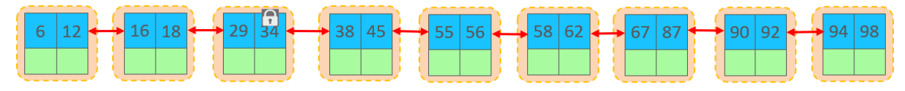
    
- 间隙锁（Gap Lock）：**锁定一个范围，不包括记录本身。**锁定索引记录间隙（不含该记录），确保索引记录间隙不变，防止其他事务在这个间隙进行insert，产生幻读。在RR隔离级别下都支持。
    
    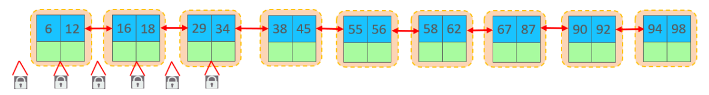
    
- 临键锁（Next-Key Lock）：Record Lock+Gap Lock，**锁定一个范围，包含记录本身**，主要目的是为了解决幻读问题（MySQL 事务部分提到过）。记录锁只能锁住已经存在的记录，为了避免插入新记录，需要依赖间隙锁。。在RR隔离级别下支持。
    
    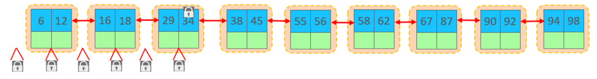
    


💡

在 InnoDB 默认的隔离级别 REPEATABLE-READ 下，**行锁默认使用的是 Next-Key Lock**。但是，如果操作的索引是唯一索引或主键，InnoDB 会对 Next-Key Lock 进行优化，将其降级为 Record Lock，即仅锁住索引本身，而不是范围。


##### 行锁（记录锁）

InnoDB实现了以下两种类型的行锁：

- **共享锁（S 锁）**：又称读锁，事务在读取记录的时候获取共享锁，允许多个事务同时获取（锁兼容）。
- **排他锁（X 锁）**：又称写锁/独占锁，事务在修改记录的时候获取排他锁，不允许多个事务同时获取。如果一个记录已经被加了排他锁，那其他事务不能再对这条事务加任何类型的锁（锁不兼容）。

排他锁与任何的锁都不兼容，共享锁仅和共享锁兼容。

|  | S 锁 | X 锁 |
| --- | --- | --- |
| S 锁 | 不冲突 | 冲突 |
| X 锁 | 冲突 | 冲突 |


💡

**不论是表级锁还是行级锁，都存在共享锁（Share Lock，S 锁）和排他锁（Exclusive Lock，X 锁）这两类。**


常见的SQL语句，在执行时，所加的行锁如下：

| SQL | 行锁类型 | 说明 |
| --- | --- | --- |
| INSERT ... | 排他锁 | 自动加锁 |
| UPDATE ... | 排他锁 | 自动加锁 |
| DELETE ... | 排他锁 | 自动加锁 |
| SELECT（正常） | 不加任何锁 |  |
| SELECT ... LOCK IN SHARE MODE | 共享锁 | 需要手动在SELECT之后加LOCK IN SHARE MODE |
| SELECT ... FOR UPDATE | 共享锁 | 需要手动在SELECT之后加FOR UPDATE |

```sql
-- 可以通过以下SQL，查看意向锁及行锁的加锁情况：
select object_schema, object_name, index_name, lock_type, lock_mode, lock_data from performance_schema.data_locks;
```

##### 间隙锁 & 临键锁

默认情况下，InnoDB 在 `REPEATABLE READ`事务隔离级别运行，InnoDB使用 `next-key` 锁进行搜索和索引扫描，以防止幻读。

- **间隙锁（Gap Lock）**：锁定一个范围，不包括记录本身。
- **临键锁（Next-Key Lock）**：Record Lock+Gap Lock，锁定一个范围，包含记录本身，主要目的是为了解决幻读问题（MySQL 事务部分提到过）。记录锁只能锁住已经存在的记录，为了避免插入新记录，需要依赖间隙锁。

> 索引上的等值查询（唯一索引），给不存在的记录加锁时，优化为间隙锁 。
索引上的等值查询（非唯一普通索引），向右遍历时最后一个值不满足查询需求时，`next-key lock` 退化为间隙锁。
索引上的范围查询（唯一索引），会访问到不满足条件的第一个值为止。
> 

> 
> 
> 
> 注意：间隙锁唯一目的是防止其他事务插入间隙。间隙锁可以共存，一个事务采用的间隙锁不会阻止另一个事务在同一间隙上采用间隙锁。
> 

#### 表级锁 vs 行级锁

| **表级锁** | **行级锁** |
| --- | --- |
| 锁定粒度最大的一种锁（全局锁除外） | 锁定粒度最小的一种锁 |
| 针对非索引字段加的锁 | 针对非索引字段加的锁 |
| 对当前操作的整张表加锁 | 只针对当前操作的行记录进行加锁 |
| 加锁快，不会出现死锁 | 加锁慢，会出现死锁 |
| 实现简单，资源消耗也比较少 | 加锁的开销最大 |
| 触发锁冲突的概率最高，高并发下效率极低 | 大大减少数据库操作的冲突，并发度高 |
| 表级锁和存储引擎无关，MyISAM 和 InnoDB 引擎都支持表级锁。 | 行级锁和存储引擎有关，是在存储引擎层面实现的 |

### MySQL函数

##### 字符串函数

| 函数 | 描述 | 实例 |
| --- | --- | --- |
| ASCII(s) | 返回字符串 s 的第一个字符的 ASCII 码。 | 返回 CustomerName 字段第一个字母的 ASCII 码：
`SELECT ASCII(CustomerName) AS NumCodeOfFirstChar
FROM Customers;` |
| CHAR_LENGTH(s) | 返回字符串 s 的字符数 | 返回字符串 RUNOOB 的字符数
`SELECT CHAR_LENGTH("RUNOOB") AS LengthOfString;` |
| CHARACTER_LENGTH(s) | 返回字符串 s 的字符数，等同于 CHAR_LENGTH(s) | 返回字符串 RUNOOB 的字符数
`SELECT CHARACTER_LENGTH("RUNOOB") AS LengthOfString;` |
| CONCAT(s1,s2...sn) | 字符串 s1,s2 等多个字符串合并为一个字符串 | 合并多个字符串
`SELECT CONCAT("SQL ", "Runoob ", "Gooogle ", "Facebook") AS ConcatenatedString;` |
| CONCAT_WS(x, s1,s2...sn) | 同 CONCAT(s1,s2,...) 函数，但是每个字符串之间要加上 x，x 可以是分隔符 | 合并多个字符串，并添加分隔符：
`SELECT CONCAT_WS("-", "SQL", "Tutorial", "is", "fun!")AS ConcatenatedString;` |
| FIELD(s,s1,s2...) | 返回第一个字符串 s 在字符串列表(s1,s2...)中的位置 | 返回字符串 c 在列表值中的位置：
`SELECT FIELD("c", "a", "b", "c", "d", "e");` |
| FIND_IN_SET(s1,s2) | 返回在字符串s2中与s1匹配的字符串的位置 | 返回字符串 c 在指定字符串中的位置：
`SELECT FIND_IN_SET("c", "a,b,c,d,e");` |
| FORMAT(x,n) | 函数可以将数字 x 进行格式化 "#,###.##", 将 x 保留到小数点后 n 位，最后一位四舍五入。 | 格式化数字 "#,###.##" 形式：
`SELECT FORMAT(250500.5634, 2);     -- 输出 250,500.56` |
| INSERT(s1,x,len,s2) | 字符串 s2 替换 s1 的 x 位置开始长度为 len 的字符串 | 从字符串第一个位置开始的 6 个字符替换为 runoob：
`SELECT INSERT("google.com", 1, 6, "runoob");  -- 输出：runoob.com` |
| LOCATE(s1,s) | 从字符串 s 中获取 s1 的开始位置 | 获取 b 在字符串 abc 中的位置：
`SELECT LOCATE('st','myteststring');  -- 5`
返回字符串 abc 中 b 的位置：
`SELECT LOCATE('b', 'abc') -- 2` |
| POSITION(s1 IN s) | 从字符串 s 中获取 s1 的开始位置 | 返回字符串 abc 中 b 的位置：
`SELECT POSITION('b' in 'abc') -- 2` |
| REPEAT(s,n) | 将字符串 s 重复 n 次 | 将字符串 runoob 重复三次：
`SELECT REPEAT('runoob',3) -- runoobrunoobrunoob` |
| REPLACE(s,s1,s2) | 将字符串 s2 替代字符串 s 中的字符串 s1 | 将字符串 abc 中的字符 a 替换为字符 x：
`SELECT REPLACE('abc','a','x') --xbc` |
| REVERSE(s) | 将字符串s的顺序反过来 | 将字符串 abc 的顺序反过来：
`SELECT REVERSE('abc') -- cba` |
| LEFT(s,n) | 返回字符串 s 的前 n 个字符 | 返回字符串 runoob 中的前两个字符：
`SELECT LEFT('runoob',2) -- ru` |
| RIGHT(s,n) | 返回字符串 s 的后 n 个字符 | 返回字符串 runoob 的后两个字符：
`SELECT RIGHT('runoob',2) -- ob` |
| LPAD(s1,len,s2) | 在字符串 s1 的开始处填充字符串 s2，使字符串长度达到 len | 将字符串 xx 填充到 abc 字符串的开始处：
`SELECT LPAD('abc',5,'xx') -- xxabc` |
| RPAD(s1,len,s2) | 在字符串 s1 的结尾处添加字符串 s2，使字符串的长度达到 len | 将字符串 xx 填充到 abc 字符串的结尾处：
`SELECT RPAD('abc',5,'xx') -- abcxx` |
| SPACE(n) | 返回 n 个空格 | 返回 10 个空格：
`SELECT SPACE(10);` |
| STRCMP(s1,s2) | 比较字符串 s1 和 s2，如果 s1 与 s2 相等返回 0 ，如果 s1>s2 返回 1，如果 s1<s2 返回 -1 | 比较字符串：
`SELECT STRCMP("runoob", "runoob");  -- 0` |
| SUBSTR(s, start, length) | 从字符串 s 的 start 位置截取长度为 length 的子字符串 | 从字符串 RUNOOB 中的第 2 个位置截取 3个 字符：
`SELECT SUBSTR("RUNOOB", 2, 3) AS ExtractString; -- UNO` |
| SUBSTRING(s, start, length) | 从字符串 s 的 start 位置截取长度为 length 的子字符串，等同于 SUBSTR(s, start, length) | 从字符串 RUNOOB 中的第 2 个位置截取 3个 字符：
`SELECT SUBSTRING("RUNOOB", 2, 3) AS ExtractString; -- UNO` |
| MID(s,n,len) | 从字符串 s 的 n 位置截取长度为 len 的子字符串，同 SUBSTRING(s,n,len) | 从字符串 RUNOOB 中的第 2 个位置截取 3个 字符：
`SELECT MID("RUNOOB", 2, 3) AS ExtractString; -- UNO` |
| SUBSTRING_INDEX(s, delimiter, number) | 返回从字符串 s 的第 number 个出现的分隔符 delimiter 之后的子串。
如果 number 是正数，返回第 number 个字符左边的字符串。
如果 number 是负数，返回第(number 的绝对值(从右边数))个字符右边的字符串。 | `SELECT SUBSTRING_INDEX('a*b','*',1) -- a
SELECT SUBSTRING_INDEX('a*b','*',-1)    -- b
SELECT SUBSTRING_INDEX(SUBSTRING_INDEX('a*b*c*d*e','*',3),'*',-1)    -- c` |
| LTRIM(s) | 去掉字符串 s 开始处的空格 | 去掉字符串 RUNOOB开始处的空格：

`SELECT LTRIM("    RUNOOB") AS LeftTrimmedString;-- RUNOOB` |
| RTRIM(s) | 去掉字符串 s 结尾处的空格 | 去掉字符串 RUNOOB 的末尾空格：
`SELECT RTRIM("RUNOOB     ") AS RightTrimmedString;   -- RUNOOB` |
| TRIM(s) | 去掉字符串 s 开始和结尾处的空格 | 去掉字符串 RUNOOB 的首尾空格：
`SELECT TRIM('    RUNOOB    ') AS TrimmedString;` |
| LCASE(s) | 将字符串 s 的所有字母变成小写字母 | 字符串 RUNOOB 转换为小写：
`SELECT LCASE('RUNOOB') -- runoob` |
| LOWER(s) | 将字符串 s 的所有字母变成小写字母 | 字符串 RUNOOB 转换为小写：
`SELECT LOWER('RUNOOB') -- runoob` |
| UCASE(s) | 将字符串转换为大写 | 将字符串 runoob 转换为大写：
`SELECT UCASE("runoob"); -- RUNOOB` |
| UPPER(s) | 将字符串转换为大写 | 将字符串 runoob 转换为大写：
`SELECT UPPER("runoob"); -- RUNOOB` |

##### 数字函数

| 函数名 | 描述 | 实例 |
| --- | --- | --- |
| ABS(x) | 返回 x 的绝对值 | 返回 -1 的绝对值：
`SELECT ABS(-1) -- 返回1` |
| ACOS(x) | 求 x 的反余弦值（单位为弧度），x 为一个数值 | `SELECT ACOS(0.25);` |
| ASIN(x) | 求反正弦值（单位为弧度），x 为一个数值 | `SELECT ASIN(0.25);` |
| ATAN(x) | 求反正切值（单位为弧度），x 为一个数值 | `SELECT ATAN(2.5);` |
| ATAN2(n, m) | 求反正切值（单位为弧度） | `SELECT ATAN2(-0.8, 2);` |
| TAN(x) | 求正切值(参数是弧度) | `SELECT TAN(1.75);  -- -5.52037992250933` |
| SIN(x) | 求正弦值(参数是弧度) | `SELECT SIN(RADIANS(30)) -- 0.5` |
| COS(x) | 求余弦值(参数是弧度) | `SELECT COS(2);` |
| COT(x) | 求余切值(参数是弧度) | `SELECT COT(6);` |
| RADIANS(x) | 将角度转换为弧度 | 180 度转换为弧度：
`SELECT RADIANS(180) -- 3.1415926535898` |
| CEIL(x) | 返回大于或等于 x 的最小整数（向上取整） | `SELECT CEIL(1.5) -- 返回2` |
| CEILING(x) | 返回大于或等于 x 的最小整数（向上取整） | `SELECT CEILING(1.5); -- 返回2` |
|  |  |  |
| COUNT(expression) | 返回查询的记录总数，expression 参数是一个字段或者 * 号 | 返回 Products 表中 products 字段总共有多少条记录：
`SELECT COUNT(ProductID) AS NumberOfProducts FROM Products;` |
| DEGREES(x) | 将弧度转换为角度 | `SELECT DEGREES(3.1415926535898) -- 180` |
| n DIV m | 整除，n 为被除数，m 为除数 | 计算 10 除于 5：
`SELECT 10 DIV 5;  -- 2` |
|  |  |  |
| FLOOR(x) | 返回小于或等于 x 的最大整数（向下取整） | 小于或等于 1.5 的整数：
`SELECT FLOOR(1.5) -- 返回1` |
| GREATEST(expr1, expr2, expr3, ...) | 返回列表中的最大值 | 返回以下数字列表中的最大值：
`SELECT GREATEST(3, 12, 34, 8, 25); -- 34`
返回以下字符串列表中的最大值：
`SELECT GREATEST("Google", "Runoob", "Apple");   -- Runoob` |
| LEAST(expr1, expr2, expr3, ...) | 返回列表中的最小值 | 返回以下数字列表中的最小值：
`SELECT LEAST(3, 12, 34, 8, 25); -- 3`
返回以下字符串列表中的最小值：
`SELECT LEAST("Google", "Runoob", "Apple");   -- Apple` |
| LN | 返回数字的自然对数，以 e 为底。 | 返回 2 的自然对数：
`SELECT LN(2);  -- 0.6931471805599453` |
| LOG(x) 或 LOG(base, x) | 返回自然对数(以 e 为底的对数)，如果带有 base 参数，则 base 为指定带底数。 | `SELECT LOG(20.085536923188) -- 3
SELECT LOG(2, 4); -- 2` |
| LOG10(x) | 返回以 10 为底的对数 | `SELECT LOG10(100) -- 2` |
| LOG2(x) | 返回以 2 为底的对数 | 返回以 2 为底 6 的对数：
`SELECT LOG2(6);  -- 2.584962500721156` |
| MAX(expression) | 返回字段 expression 中的最大值 | 返回数据表 Products 中字段 Price 的最大值：
`SELECT MAX(Price) AS LargestPrice FROM Products;` |
| MIN(expression) | 返回字段 expression 中的最小值 | 返回数据表 Products 中字段 Price 的最小值：
`SELECT MIN(Price) AS MinPrice FROM Products;` |
| AVG(expression) | 返回一个表达式的平均值，expression 是一个字段 | 返回 Products 表中Price 字段的平均值：
`SELECT AVG(Price) AS AveragePrice FROM Products;` |
| SUM(expression) | 返回指定字段的总和 | 计算 OrderDetails 表中字段 Quantity 的总和：
`SELECT SUM(Quantity) AS TotalItemsOrdered FROM OrderDetails;` |
| MOD(x,y) | 返回 x 除以 y 以后的余数 | 5 除于 2 的余数：
`SELECT MOD(5,2) -- 1` |
| PI() | 返回圆周率(3.141593） | `SELECT PI() --3.141593` |
| POW(x,y) | 返回 x 的 y 次方 | 2 的 3 次方：
`SELECT POW(2,3) -- 8` |
| POWER(x,y) | 返回 x 的 y 次方 | 2 的 3 次方：
`SELECT POWER(2,3) -- 8` |
| EXP(x) | 返回 e 的 x 次方 | 计算 e 的三次方：
`SELECT EXP(3) -- 20.085536923188` |
| RAND() | 返回 0 到 1 的随机数 | `SELECT RAND() --0.93099315644334` |
| ROUND(x [,y]) | 返回离 x 最近的整数，可选参数 y 表示要四舍五入的小数位数，如果省略，则返回整数。
（参数x的四舍五入的值，保留y位小数） | `SELECT ROUND(1.23456) --1

SELECT ROUND(345.156, 2) -- 345.16` |
| SIGN(x) | 返回 x 的符号，x 是负数、0、正数分别返回 -1、0 和 1 | `SELECT SIGN(-10) -- (-1)` |
| SQRT(x) | 返回x的平方根 | 25 的平方根：
`SELECT SQRT(25) -- 5` |
| TRUNCATE(x,y) | 返回数值 x 保留到小数点后 y 位的值（与 ROUND 最大的区别是不会进行四舍五入） | `SELECT TRUNCATE(1.23456,3) -- 1.234` |

##### 日期函数

| 函数名 | 描述 | 实例 |
| --- | --- | --- |
| ADDDATE(d,n) | 计算起始日期 d 加上 n 天的日期 | `SELECT ADDDATE("2017-06-15", INTERVAL 10 DAY);
->2017-06-25` |
| ADDTIME(t,n) | n 是一个时间表达式，时间 t 加上时间表达式 n | 加 5 秒：
`SELECT ADDTIME('2011-11-11 11:11:11', 5);
->2011-11-11 11:11:16 (秒)`
添加 2 小时, 10 分钟, 5 秒:
`SELECT ADDTIME("2020-06-15 09:34:21", "2:10:5"); 
-> 2020-06-15 11:44:26` |
| CURDATE() | 返回当前日期 | `SELECT CURDATE();
-> 2018-09-19` |
| CURRENT_DATE() | 返回当前日期 | `SELECT CURRENT_DATE();
-> 2018-09-19` |
| CURRENT_TIME | 返回当前时间 | `SELECT CURRENT_TIME();
-> 19:59:02` |
| CURTIME() | 返回当前时间 | `SELECT CURTIME();
-> 19:59:02` |
| **CURRENT_TIMESTAMP()** | 返回当前日期和时间 | `SELECT CURRENT_TIMESTAMP()
-> 2018-09-19 20:57:43` |
| **NOW()** | 返回当前日期和时间 | `SELECT NOW()
-> 2018-09-19 20:57:43` |
| **LOCALTIME()** | 返回当前日期和时间 | `SELECT LOCALTIME()
-> 2018-09-19 20:57:43` |
| **LOCALTIMESTAMP()** | 返回当前日期和时间 | `SELECT LOCALTIMESTAMP()
-> 2018-09-19 20:57:43` |
| DATE() | 从日期或日期时间表达式中提取日期值 | `SELECT DATE("2017-06-15");    
-> 2017-06-15` |
| DATEDIFF(d1,d2) | 计算日期 d1->d2 之间相隔的天数 | `SELECT DATEDIFF('2001-01-01','2001-02-02')
-> -32` |
| DATE_ADD(d，INTERVAL expr type) | 计算起始日期 d 加上一个时间段后的日期，type 值可以是：
• MICROSECOND
• SECOND
• MINUTE
• HOUR
• DAY
• WEEK
• MONTH
• QUARTER
• YEAR
• SECOND_MICROSECOND
• MINUTE_MICROSECOND
• MINUTE_SECOND
• HOUR_MICROSECOND
• HOUR_SECOND
• HOUR_MINUTE
• DAY_MICROSECOND
• DAY_SECOND
• DAY_MINUTE
• DAY_HOUR
• YEAR_MONTH | `SELECT DATE_ADD("2017-06-15", INTERVAL 10 DAY);    
-> 2017-06-25

SELECT DATE_ADD("2017-06-15 09:34:21", INTERVAL 15 MINUTE);
-> 2017-06-15 09:49:21

SELECT DATE_ADD("2017-06-15 09:34:21", INTERVAL -3 HOUR);
->2017-06-15 06:34:21

SELECT DATE_ADD("2017-06-15 09:34:21", INTERVAL -3 MONTH);
->2017-03-15 09:34:21` |
| DATE_FORMAT(d,f) | 按表达式f的要求显示日期 d | `SELECT DATE_FORMAT('2011-11-11 11:11:11','%Y-%m-%d %r')
-> 2011-11-11 11:11:11 AM` |
| DATE_SUB(date,INTERVAL expr type) | 函数从日期减去指定的时间间隔。 | Orders 表中 OrderDate 字段减去 2 天：
`SELECT OrderId,DATE_SUB(OrderDate,INTERVAL 2 DAY) AS OrderPayDate
FROM Orders` |
| DAYNAME(d) | 返回日期 d 是星期几，如 Monday,Tuesday | `SELECT DAYNAME('2011-11-11 11:11:11')
->Friday` |
| DAYOFMONTH(d) | 计算日期 d 是本月的第几天 | `SELECT DAYOFMONTH('2011-11-11 11:11:11')
->11` |
| DAYOFWEEK(d) | 日期 d 今天是星期几，1 星期日，2 星期一，以此类推 | `SELECT DAYOFWEEK('2011-11-11 11:11:11')
->6` |
| DAYOFYEAR(d) | 计算日期 d 是本年的第几天 | `SELECT DAYOFYEAR('2011-11-11 11:11:11')
->315` |
| EXTRACT(type FROM d) | 从日期 d 中获取指定的值，type 指定返回的值。
type可取值为：
• MICROSECOND
• SECOND
• MINUTE
• HOUR
• DAY
• WEEK
• MONTH
• QUARTER
• YEAR
• SECOND_MICROSECOND
• MINUTE_MICROSECOND
• MINUTE_SECOND
• HOUR_MICROSECOND
• HOUR_SECOND
• HOUR_MINUTE
• DAY_MICROSECOND
• DAY_SECOND
• DAY_MINUTE
• DAY_HOUR
• YEAR_MONTH | `SELECT EXTRACT(MINUTE FROM '2011-11-11 11:11:11') 
-> 11` |
| FROM_DAYS(n) | 计算从 0000 年 1 月 1 日开始 n 天后的日期 | `SELECT FROM_DAYS(1111)
-> 0003-01-16` |
| LAST_DAY(d) | 返回给给定日期的那一月份的最后一天 | `SELECT LAST_DAY("2017-06-20");
-> 2017-06-30` |
| MAKEDATE(year, day-of-year) | 基于给定参数年份 year 和所在年中的天数序号 day-of-year 返回一个日期 | `SELECT MAKEDATE(2017, 3);
-> 2017-01-03` |
| MAKETIME(hour, minute, second) | 组合时间，参数分别为小时、分钟、秒 | `SELECT MAKETIME(11, 35, 4);
-> 11:35:04` |
| MICROSECOND(date) | 返回日期参数所对应的微秒数 | `SELECT MICROSECOND("2017-06-20 09:34:00.000023");
-> 23` |
| PERIOD_ADD(period, number) | 为 年-月 组合日期添加一个时段 | `SELECT PERIOD_ADD(201703, 5);   
-> 201708` |
| PERIOD_DIFF(period1, period2) | 返回两个时段之间的月份差值 | `SELECT PERIOD_DIFF(201710, 201703);
-> 7` |
| SEC_TO_TIME(s) | 将以秒为单位的时间 s 转换为时分秒的格式 | `SELECT SEC_TO_TIME(4320)
-> 01:12:00` |
| STR_TO_DATE(string, format_mask) | 将字符串转变为日期 | `SELECT STR_TO_DATE("August 10 2017", "%M %d %Y");
-> 2017-08-10` |
| SUBDATE(d,n) | 日期 d 减去 n 天后的日期 | `SELECT SUBDATE('2011-11-11 11:11:11', 1)
->2011-11-10 11:11:11 (默认是天)` |
| SUBTIME(t,n) | 时间 t 减去 n 秒的时间 | `SELECT SUBTIME('2011-11-11 11:11:11', 5)
->2011-11-11 11:11:06 (秒)` |
| SYSDATE() | 返回当前日期和时间 | `SELECT SYSDATE()
-> 2018-09-19 20:57:43` |
| TIME(expression) | 提取传入表达式的时间部分 | `SELECT TIME("19:30:10");
-> 19:30:10` |
| TIME_FORMAT(t,f) | 按表达式 f 的要求显示时间 t | `SELECT TIME_FORMAT('11:11:11','%r')
11:11:11 AM` |
| TIME_TO_SEC(t) | 将时间 t 转换为秒 | `SELECT TIME_TO_SEC('1:12:00')
-> 4320` |
| TIMEDIFF(time1, time2) | 计算时间差值 | `MySQL> SELECT TIMEDIFF("13:10:11", "13:10:10");
-> 00:00:01
MySQL> SELECT TIMEDIFF('2000:01:01 00:00:00',
    ->                 '2000:01:01 00:00:00.000001');
        -> '-00:00:00.000001'
MySQL> SELECT TIMEDIFF('2008-12-31 23:59:59.000001',
    ->                 '2008-12-30 01:01:01.000002');
        -> '46:58:57.999999'` |
| TIMESTAMP(expression, interval) | 单个参数时，函数返回日期或日期时间表达式；有2个参数时，将参数加和 | `MySQL> SELECT TIMESTAMP("2017-07-23",  "13:10:11");
-> 2017-07-23 13:10:11
MySQL> SELECT TIMESTAMP('2003-12-31');
        -> '2003-12-31 00:00:00'
MySQL> SELECT TIMESTAMP('2003-12-31 12:00:00','12:00:00');
        -> '2004-01-01 00:00:00'` |
| TIMESTAMPDIFF(unit,datetime_expr1,datetime_expr2) | 计算时间差，返回 datetime_expr2 − datetime_expr1 的时间差 | `MySQL> SELECT TIMESTAMPDIFF(DAY,'2003-02-01','2003-05-01');   // 计算两个时间相隔多少天
        -> 89
MySQL> SELECT TIMESTAMPDIFF(MONTH,'2003-02-01','2003-05-01');   // 计算两个时间相隔多少月
        -> 3
MySQL> SELECT TIMESTAMPDIFF(YEAR,'2002-05-01','2001-01-01');    // 计算两个时间相隔多少年
        -> -1
MySQL> SELECT TIMESTAMPDIFF(MINUTE,'2003-02-01','2003-05-01 12:05:55');  // 计算两个时间相隔多少分钟
        -> 128885` |
| TO_DAYS(d) | 计算日期 d 距离 0000 年 1 月 1 日的天数 | `SELECT TO_DAYS('0001-01-01 01:01:01')
-> 366` |
| WEEK(d) | 计算日期 d 是本年的第几个星期，范围是 0 到 53 | `SELECT WEEK('2011-11-11 11:11:11')
-> 45` |
| WEEKDAY(d) | 日期 d 是星期几，0 表示星期一，1 表示星期二 | `SELECT WEEKDAY("2017-06-15");
-> 3` |
| WEEKOFYEAR(d) | 计算日期 d 是本年的第几个星期，范围是 0 到 53 | `SELECT WEEKOFYEAR('2011-11-11 11:11:11')
-> 45` |
| YEAR(d) | 返回年份 | `SELECT YEAR("2017-06-15");
-> 2017` |
| MONTH(d) | 返回日期d中的月份值，1 到 12 | `SELECT MONTH('2011-11-11 11:11:11')
->11` |
| MONTHNAME(d) | 返回日期当中的月份名称，如 November | `SELECT MONTHNAME('2011-11-11 11:11:11')
-> November` |
| DAY(d) | 返回日期值 d 的日期部分 | `SELECT DAY("2017-06-15");  
-> 15` |
| HOUR(t) | 返回 t 中的小时值 | `SELECT HOUR('1:2:3')
-> 1` |
| MINUTE(t) | 返回 t 中的分钟值 | `SELECT MINUTE('1:2:3')
-> 2` |
| SECOND(t) | 返回 t 中的秒钟值 | `SELECT SECOND('1:2:3')
-> 3` |
| QUARTER(d) | 返回日期d是第几季节，返回 1 到 4 | `SELECT QUARTER('2011-11-11 11:11:11')
-> 4` |
| YEARWEEK(date, mode) | 返回年份及第几周（0到53），mode 中 0 表示周天，1表示周一，以此类推 | `SELECT YEARWEEK("2017-06-15");
-> 201724` |

##### 高级函数

| 函数名 | 描述 | 实例 |
| --- | --- | --- |
| BIN(x) | 返回 x 的二进制编码，x 为十进制数 | 15 的 2 进制编码:
`SELECT BIN(15); -- 1111` |
| BINARY(s) | 将字符串 s 转换为二进制字符串 | `SELECT BINARY "RUNOOB";
-> RUNOOB` |
| `CASE expression
    WHEN condition1 THEN result1
    WHEN condition2 THEN result2
   ...
    WHEN conditionN THEN resultN
    ELSE default
END` | CASE 表示函数开始，END 表示函数结束。如果 condition1 成立，则返回 result1, 如果 condition2 成立，则返回 result2，当全部不成立则返回 `default`，而当有一个成立之后，后面的就不执行了。 | `SELECT CASE 
　　WHEN 1 > 0
　　THEN '1 > 0'
　　WHEN 2 > 0
　　THEN '2 > 0'
　　ELSE '3 > 0'
　　END
->1 > 0` |
| CAST(x AS type) | 转换数据类型 | 字符串日期转换为日期：

`SELECT CAST("2017-08-29" AS DATE);
-> 2017-08-29` |
| COALESCE(expr1, expr2, ...., expr_n) | 返回参数中的第一个非空表达式（从左向右） | `SELECT COALESCE(NULL, NULL, NULL, 'runoob.com', NULL, 'google.com');
-> runoob.com` |
| CONNECTION_ID() | 返回唯一的连接 ID | `SELECT CONNECTION_ID();
-> 4292835` |
| CONV(x,f1,f2) | 返回 f1 进制数变成 f2 进制数 | `SELECT CONV(15, 10, 2);
-> 1111` |
| CONVERT(s USING cs) | 函数将字符串 s 的字符集变成 cs | `SELECT CHARSET('ABC')
->utf-8    

SELECT CHARSET(CONVERT('ABC' USING gbk))
->gbk` |
| IF(expr,v1,v2) | 如果表达式 expr 成立，返回结果 v1；否则，返回结果 v2。 | `SELECT IF(1 > 0,'正确','错误')    
->正确` |
| IFNULL(v1,v2) | 如果 v1 的值不为 NULL，则返回 v1，否则返回 v2。 | `SELECT IFNULL(null,'Hello Word')
->Hello Word` |
| ISNULL(expression) | 判断表达式是否为 NULL | `SELECT ISNULL(NULL);
->1` |
| LAST_INSERT_ID() | 返回最近生成的 AUTO_INCREMENT 值 | `SELECT LAST_INSERT_ID();
->6` |
| NULLIF(expr1, expr2) | 比较两个字符串，如果字符串 expr1 与 expr2 相等，返回 NULL，否则返回 expr1 | `SELECT NULLIF(25, 25);
->` |
| **SESSION_USER()** | 返回当前用户 | `SELECT SESSION_USER();
-> guest@%` |
| **SYSTEM_USER()** | 返回当前用户 | `SELECT SYSTEM_USER();
-> guest@%` |
| **USER()** | 返回当前用户 | `SELECT USER();
-> guest@%` |
| **CURRENT_USER()** | 返回当前用户 | `SELECT CURRENT_USER();
-> guest@%` |
| VERSION() | 返回数据库的版本号 | `SELECT VERSION()
-> 5.6.34` |
| DATABASE() | 返回当前数据库名 | `SELECT DATABASE();   
-> runoob` |

以下是MySQL 8.0 版本新增的一些常用函数：

| 函数 | 描述 | 实例 |
| --- | --- | --- |
| JSON_OBJECT() | 将键值对转换为 JSON 对象 | `SELECT JSON_OBJECT('key1', 'value1', 'key2', 'value2')` |
| JSON_ARRAY() | 将值转换为 JSON 数组 | `SELECT JSON_ARRAY(1, 2, 'three')` |
| JSON_EXTRACT() | 从 JSON 字符串中提取指定的值 | `SELECT JSON_EXTRACT('{"name": "John", "age": 30}', '$.name')` |
| JSON_CONTAINS() | 检查一个 JSON 字符串是否包含指定的值 | `SELECT JSON_CONTAINS('{"name": "John", "age": 30}', 'John', '$.name')` |
| ROW_NUMBER() | 为查询结果中的每一行分配一个唯一的数字 | `SELECT ROW_NUMBER() OVER(ORDER BY id) AS row_number, name FROM users` |
| RANK() | 为查询结果中的每一行分配一个排名 | `SELECT RANK() OVER(ORDER BY score DESC) AS rank, name, score FROM students` |


## MySQL运维

### 日志

#### 错误日志

错误日志是 MySQL 中最重要的日志之一，它记录了当 `MySQLd` 启动和停止时，以及服务器在运行过程中发生任何严重错误时的相关信息。当数据库出现任何故障导致无法正常使用时，建议首先查看此日志。

该日志是默认开启的，默认存放目录 /var/log/，默认的日志文件名为 MySQLd.log 。查看日志位置：

```sql
MySQL> show variables like '%log_error%';
+---------------------+-----------------------+
| Variable_name       | Value                 |
+---------------------+-----------------------+
| binlog_error_action | ABORT_SERVER          |
| log_error           | .\DESKTOP-6CPA1OG.err |
| log_error_verbosity | 3                     |
+---------------------+-----------------------+
3 rows in set, 1 warning (0.03 sec)
```

#### 二进制日志

二进制日志（BINLOG）记录了所有的 DDL（数据定义语言）语句和 DML（数据操纵语言）语句，但不包括数据查询（SELECT、SHOW）语句。

作用：

1. 灾难时的数据恢复；
2. MySQL的主从复制。

在MySQL 5.x 版本中，默认二进制日志是关闭着的；但是在MySQL 8.x 版本中，默认二进制日志是开启着的，涉及到的参数如下：

```sql
MySQL> show variables like '%log_bin%';
+---------------------------------+-------+
| Variable_name                   | Value |
+---------------------------------+-------+
| log_bin                         | OFF   |
| log_bin_basename                |       |
| log_bin_index                   |       |
| log_bin_trust_function_creators | OFF   |
| log_bin_use_v1_row_events       | OFF   |
| sql_log_bin                     | ON    |
+---------------------------------+-------+
6 rows in set, 1 warning (0.02 sec)
```

参数说明：

- `log_bin_basename`：当前数据库服务器的`binlog`日志的基础名称（前缀），具体的`binlog`文件名需要再该`basename`的基础上加上编号（编号从000001开始）。
- `log_bin_index`：`binlog`的索引文件，里面记录了当前服务器关联的`binlog`文件有哪些。

##### 格式

MySQL服务器中提供了多种格式来记录二进制日志，具体格式及特点如下：

| **日志格式** | **含义** |
| --- | --- |
| statement | 基于SQL语句的日志记录，记录的是SQL语句，对数据进行修改的SQL都会记录在日志文件中。 |
| row | 基于行的日志记录，记录的是每一行的数据变更。(默认) |
| mined | 混合了STATEMENT和ROW两种格式，默认采用STATEMENT，在某些特殊情况下会自动切换为ROW进行记录。 |

```sql
MySQL> show variables like '%binlog_format%';
+---------------+-------+
| Variable_name | Value |
+---------------+-------+
| binlog_format | ROW   |
+---------------+-------+
1 row in set, 1 warning (0.00 sec)
```

> 
> 
> 
> 如果我们需要配置二进制日志的格式，只需要在 /etc/my.cnf 中配置 `binlog_format` 参数即可。
> 

##### 查看

由于日志是以二进制方式存储的，不能直接读取，需要通过二进制日志查询工具 `MySQLbinlog` 来查看，具体语法：

```bash
MySQLbinlog [ 参数选项 ] logfilename
参数选项：
-d 指定数据库名称，只列出指定的数据库相关操作。
-o 忽略掉日志中的前n行命令。
-v 将行事件(数据变更)重构为SQL语句
-vv 将行事件(数据变更)重构为SQL语句，并输出注释信息
```

##### 删除

对于比较繁忙的业务系统，每天生成的 `binlog` 数据巨大，如果长时间不清除，将会占用大量磁盘空间。可以通过以下几种方式清理日志：

| **指令** | **含义** |
| --- | --- |
| reset master | 删除全部 binlog 日志，删除之后，日志编号，将从 binlog.000001重新开始 |
| purge master logs to ‘binlog.***’ | 删除 *** 编号之前的所有日志 |
| purge master logs before ‘yyyy-mm-dd hh24:mi:ss’ | 删除日志为”yyyy-mm-dd hh24:mi:ss”之前产生的所有日志 |

也可以在MySQL的配置文件中配置二进制日志的过期时间，设置了之后，二进制日志过期会自动删除。

`show variables like '%binlog_expire_logs_seconds%';`

#### 查询日志

查询日志中记录了客户端的所有操作语句，而二进制日志不包含查询数据的SQL语句。默认情况下，查询日志是未开启的。

如果需要开启查询日志，可以修改MySQL的配置文件 /etc/my.cnf 文件，添加如下内容：

```sql
## 该选项用来开启查询日志，可选值：0 或者 1；0 代表关闭，1 代表开启
general_log=1
## 设置日志的文件名，如果没有指定，默认的文件名为 host_name.log
general_log_file=MySQL_query.log
```

开启了查询日志之后，在MySQL的数据存放目录，也就是 /var/lib/MySQL/ 目录下就会出现MySQL_query.log 文件。之后所有的客户端的增删改查操作都会记录在该日志文件之中，长时间运
行后，该日志文件将会非常大。

#### 慢查询日志

慢查询日志记录了所有执行时间超过参数 `long_query_time` 设置值并且扫描记录数不小于`min_examined_row_limit` 的所有的SQL语句的日志，默认未开启。**`long_query_time` 默认为
10 秒，最小为 0， 精度可以到微秒。**

如果需要开启慢查询日志，需要在MySQL的配置文件 /etc/my.cnf 中配置如下参数：

```sql
## 慢查询日志
slow_query_log=1
## 执行时间参数
long_query_time=2
```

默认情况下，不会记录管理语句，也不会记录不使用索引进行查找的查询。可以使用`log_slow_admin_statements`和更改此行为 `log_queries_not_using_indexes`，如下所述。

```sql
## 记录执行较慢的管理语句
log_slow_admin_statements =1
## 记录执行较慢的未使用索引的语句
log_queries_not_using_indexes = 1
```

💡上述所有的参数配置完成之后，都需要重新启动MySQL服务器才可以生效。

### 主从复制

主从复制是指将主数据库的 DDL 和 DML 操作通过二进制日志传到从库服务器中，然后在从库上对这些日志重新执行（也叫重做），从而使得从库和主库的数据保持同步。

MySQL支持一台主库同时向多台从库进行复制， 从库同时也可以作为其他从服务器的主库，实现链状复制。MySQL 复制的优点主要包含以下三个方面：

1. 主库出现问题，可以快速切换到从库提供服务。
2. 实现读写分离，降低主库的访问压力。
3. 可以在从库中执行备份，以避免备份期间影响主库服务。

#### 原理

MySQL主从复制的核心就是二进制日志，具体的过程如下：

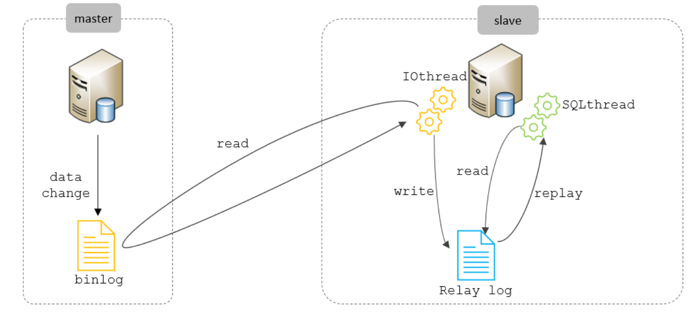

从上图来看，复制分成三步：

1. Master 主库在事务提交时，会把数据变更记录在二进制日志文件 Binlog 中。
2. 从库读取主库的二进制日志文件 Binlog ，写入到从库的中继日志 Relay Log 。
3. slave重做中继日志中的事件，将改变反映它自己的数据。

#### 搭建

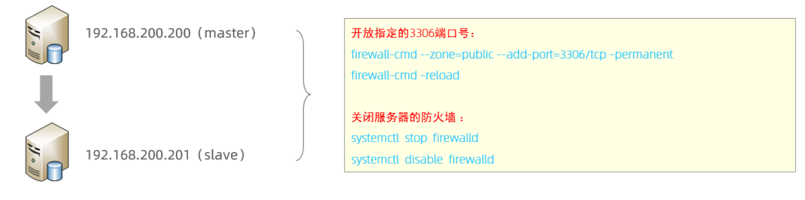

准备好两台服务器之后，在上述的两台服务器中分别安装好MySQL，并完成基础的初始化准备（安装、密码配置等操作）工作。 其中：

- 192.168.200.200 作为主服务器 master
- 192.168.200.201 作为从服务器 slave

##### 主库配置

1. 修改配置文件 /etc/my.cnf
    
    ```sql
    ## MySQL 服务ID，保证整个集群环境中唯一，取值范围：1 – 2^{32}-1，默认为1
    server-id=1
    ## 是否只读，1 代表只读，0 代表读写
    read-only=0
    ## 忽略的数据，指不需要同步的数据库
    ## binlog-ignore-db=MySQL
    ## 指定同步的数据库
    ## binlog-do-db=db01
    ```
    
2. 重启MySQL服务器：`systemctl restart MySQLd`
3. 登录MySQL，创建远程连接的账号，并授予主从复制权限
    
    ```sql
    ## 创建 Frank 用户，并设置密码，该用户可在任意主机连接该 MySQL 服务
    CREATE USER 'Frank'@'%' IDENTIFIED WITH MySQL_native_password BY '********';
    
    #为 'Frank'@'%' 用户分配主从复制权限
    GRANT REPLICATION SLAVE ON *.* TO 'Frank'@'%';
    ```
    
4. 通过指令，查看二进制日志坐标
    
    ```sql
    MySQL> show master status;
    +---------------+---------+--------------+------------------+-------------------+
    | File          | Position| Binlog_Do_DB | Binlog_Ignore_DB | Executed_Gtid_Set |
    +---------------+---------+--------------+------------------+-------------------+
    | binlog.000004 |     663 |              |                  |                   |
    +---------------+---------+--------------+------------------+-------------------+
    1 row in set (0.00 sec)
    ```
    
    > 字段含义说明：
    `file`：从哪个日志文件开始推送日志文件
    `position`：从哪个位置开始推送日志
    `binlog_ignore_db`：指定不需要同步的数据库
    > 

##### 从库配置

1. 修改配置文件 /etc/my.cnf
    
    ```sql
    ## MySQL 服务ID，保证整个集群环境中唯一，取值范围：1 – 2^{32}-1，和主库不一样即可
    server-id=2
    ## 是否只读，1 代表只读，0 代表读写
    read-only=1
    ```
    
2. 重启MySQL服务器：`systemctl restart MySQLd`
3. 登录MySQL，设置主库配置
    
    ```sql
    -- MySQL 8.0.23中的语法
    CHANGE REPLICATION SOURCE TO SOURCE_HOST='192.168.200.200', SOURCE_USER='Frank',
    SOURCE_PASSWORD='******', SOURCE_LOG_FILE='binlog.000004',
    SOURCE_LOG_POS=663;
    
    -- MySQL 8.0.23 之前版本中的语法
    CHANGE MASTER TO MASTER_HOST='192.168.200.200', MASTER_USER='Frank',
    MASTER_PASSWORD='******', MASTER_LOG_FILE='binlog.000004',
    MASTER_LOG_POS=663;
    ```
    
    | 8.0.23版本的参数名 | 含义 | 8.0.23之前版本的参数名 |
    | --- | --- | --- |
    | SOURCE_HOST | 主库IP地址 | MASTER_HOST |
    | SOURCE_USER | 连接主库的用户名  | MASTER_USER |
    | SOURCE_PASSWORD | 连接主库的密码 | MASTER_PASSWORD |
    | SOURCE_LOG_FILE | binlog日志文件名 | MASTER_LOG_FILE |
    | SOURCE_LOG_POS | binlog日志文件位置 | MASTER_LOG_POS |
4. 开启同步操作
    
    ```sql
    start replica; ## 8.0.22之后
    start slave; ## 8.0.22之前
    ```
    
5. 查看主从同步状态
    
    ```sql
    show replica status; ## 8.0.22之后
    show slave status \G; ## 8.0.22之前
    其中会打印下面两条语句
    Slave_IO_Running: Yes
    Slave_SQL_Running: Yes
    ```
    

### 分库分表

随着互联网及移动互联网的发展，应用系统的数据量也是成指数式增长，若采用单数据库进行数据存储，存在以下性能瓶颈：

1. IO瓶颈：热点数据太多，数据库缓存不足，产生大量磁盘IO，效率较低。 请求数据太多，带宽不够，网络IO瓶颈。
2. CPU瓶颈：排序、分组、连接查询、聚合统计等SQL会耗费大量的CPU资源，请求数太多，CPU出现瓶颈。

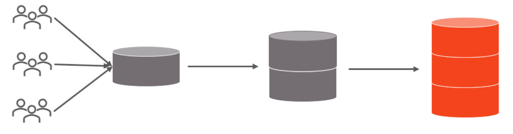

为了解决上述问题，我们需要对数据库进行分库分表处理。

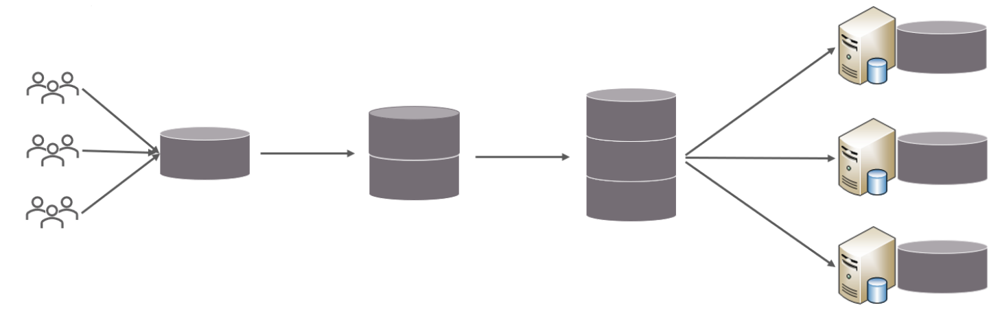

分库分表的核心思想都是将数据分散存储，使得单一数据库/表的数据量变小来缓解单一数据库的性能问题，从而达到提升数据库性能的目的。

#### 拆分策略

分库分表的形式，主要是两种：垂直拆分和水平拆分。而拆分的粒度，一般又分为分库和分表，所以组成的拆分策略最终如下：

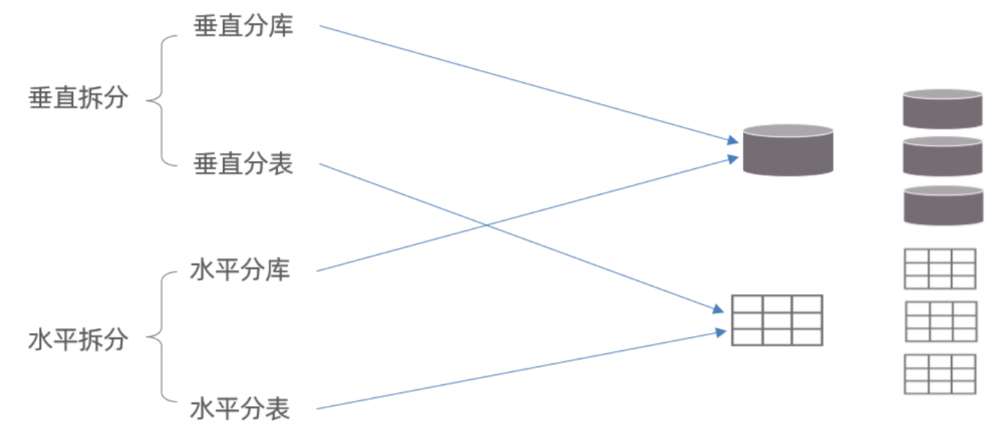

#### 垂直拆分

##### 垂直分库

垂直分库：**以表为依据，根据业务将不同表拆分到不同库中**。特点如下：

1. 每个库的表结构都不一样。
2. 每个库的数据也不一样。
3. 所有库的并集是全量数据。

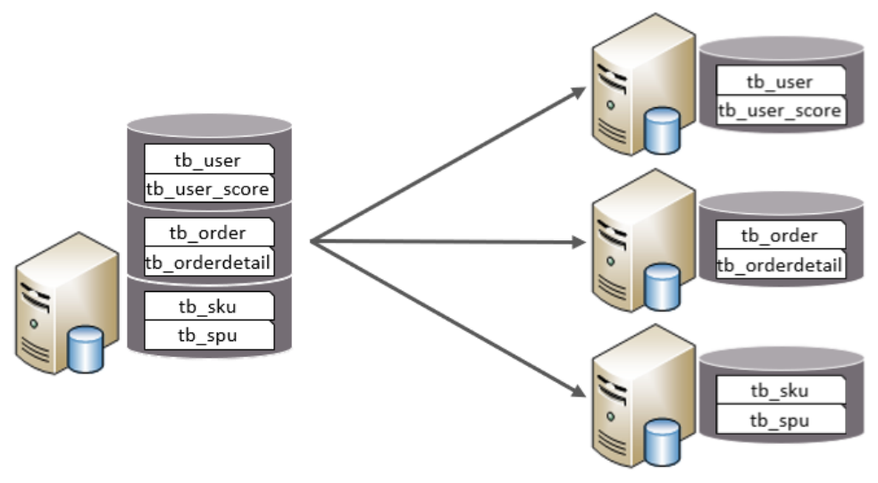

##### 垂直分表

垂直分表：**以字段为依据，根据字段属性将不同字段拆分到不同表中**。特点如下：

1. 每个表的结构都不一样。
2. 每个表的数据也不一样，一般通过一列（主键/外键）关联。
3. 所有表的并集是全量数据。

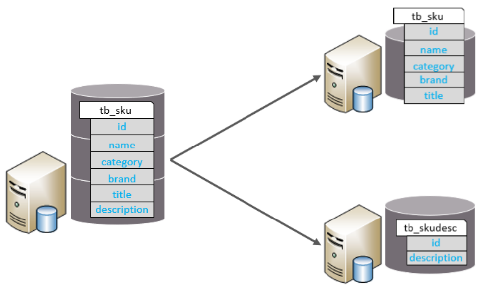

#### 水平拆分

##### 水平分库

水平分库：**以字段为依据，按照一定策略，将一个库的数据拆分到多个库中**。特点如下：

1. 每个库的表结构都一样。
2. 每个库的数据都不一样。
3. 所有库的并集是全量数据。

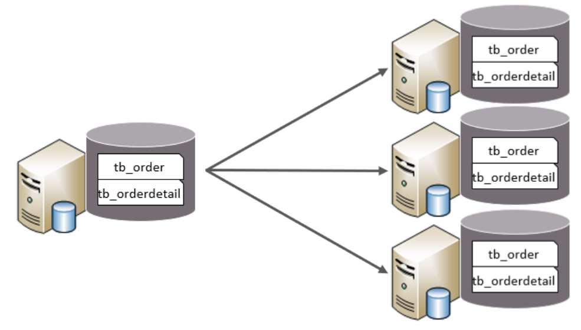

##### 水平分表

水平分表：**以字段为依据，按照一定策略，将一个表的数据拆分到多个表中**。特点如下：

1. 每个表的表结构都一样。
2. 每个表的数据都不一样。
3. 所有表的并集是全量数据。

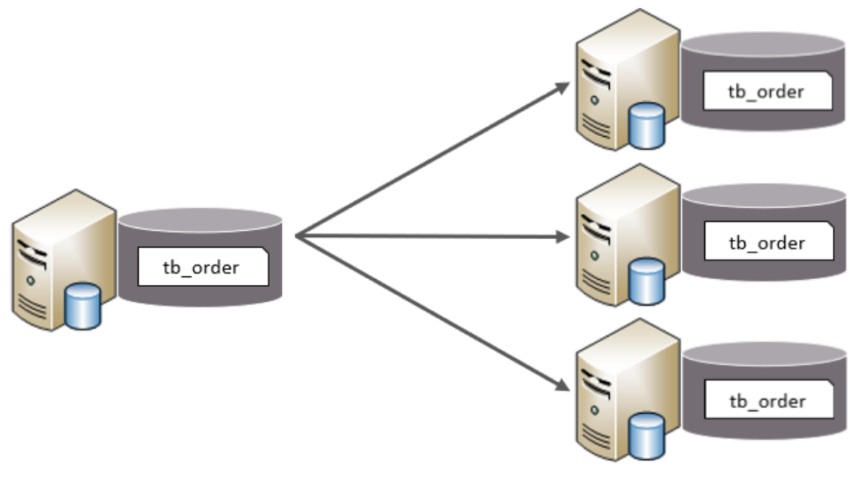

> 
> 
> 
> 在业务系统中，为了缓解磁盘IO及CPU的性能瓶颈，到底是垂直拆分，还是水平拆分；具体是分库，还是分表，都需要根据具体的业务需求具体分析。
> 

> 
> 
> 
> 实现技术：
> 
> 1. ShardingJDBC：基于AOP原理，在应用程序中对本地执行的SQL进行拦截，解析、改写、路由处理。需要自行编码配置实现，只支持java语言，性能较高。
> 2. MyCat：数据库分库分表中间件，不用调整代码即可实现分库分表，支持多种语言，性能不及前者。
> 
> 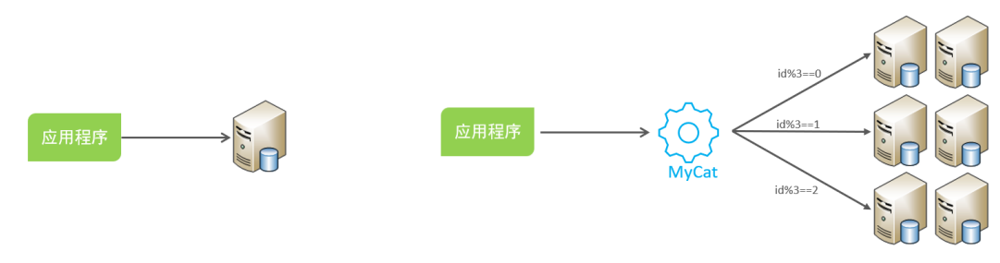
> 

### MyCat

#### 概述

MyCathttp://www.mycat.org.cn/downloads是开源的、活跃的、基于Java语言编写的MySQL数据库中间件。可以像使用MySQL一样来使用MyCat，对于开发人员来说根本感觉不到MyCat的存在。

开发人员只需要连接MyCat即可，而具体底层用到几台数据库，每一台数据库服务器里面存储了什么数据，都无需关心。 具体的分库分表的策略，只需要在MyCat中配置即可。

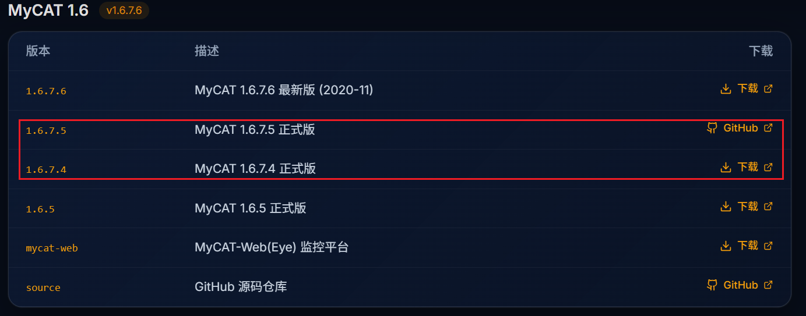

在MyCat的整体结构中，分为两个部分：上面的逻辑结构、下面的物理结构。

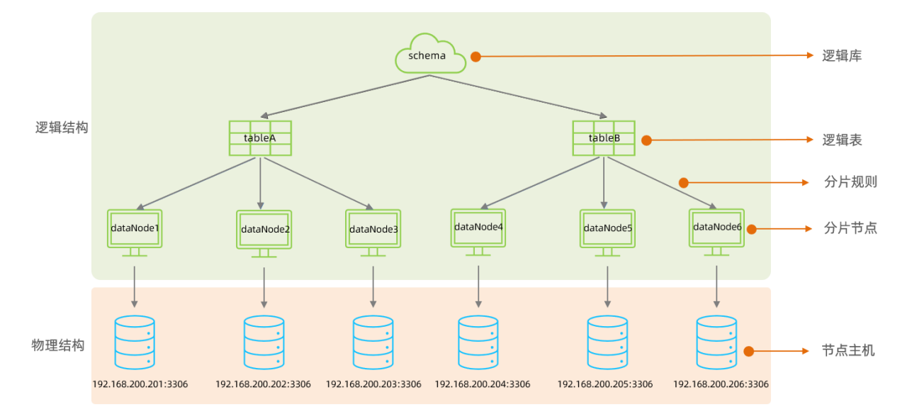

在MyCat的逻辑结构主要负责逻辑库、逻辑表、分片规则、分片节点等逻辑结构的处理，而具体的数据存储还是在物理结构，也就是数据库服务器中存储的。

MyCat是采用Java语言开发的开源的数据库中间件，支持Windows和Linux运行环境，下面介绍MyCat的Linux中的环境搭建。我们需要在准备好的服务器中安装MySQL，JDK和MyCat软件。

| 服务器 | 安装软件 | 说明 |
| --- | --- | --- |
| 192.168.200.210 | JDK、MyCat | MyCat中间件服务器 |
| 192.168.200.210 | MySQL | 分片服务器 |
| 192.168.200.213 | MySQL | 分片服务器 |
| 192.168.200.214 | MySQL | 分片服务器 |

#### 原理

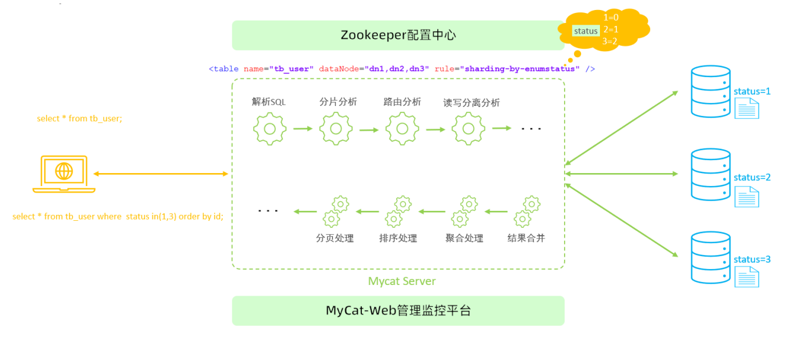

在MyCat中，当执行一条SQL语句时，MyCat需要进行SQL解析、分片分析、路由分析、读写分离分析等操作，最终经过一系列的分析决定将当前的SQL语句到底路由到那几个（或哪一个）节点数据库，数据库将数据执行完毕后，如果有返回的结果，则将结果返回给MyCat，最终还需要在MyCat中进行结果合并、聚合处理、排序处理、分页处理等操作，最终再将结果返回给客户端。

而在MyCat的使用过程中，MyCat官方也提供了一个管理监控平台MyCat-Web（MyCat-eye）。MyCat-web 是 MyCat 可视化运维的管理和监控平台，弥补了 MyCat 在监控上的空白。帮 MyCat分担统计任务和配置管理任务。MyCat-web 引入了 ZooKeeper 作为配置中心，可以管理多个节点。MyCat-web 主要管理和监控 MyCat 的流量、连接、活动线程和内存等，具备 IP 白名单、邮件告警等模块，还可以统计 SQL 并分析慢 SQL 和高频 SQL 等。为优化 SQL 提供依据。

MyCat默认开通2个端口，可以在`server.xml`中进行修改。

1. 8066 数据访问端口，即进行 DML 和 DDL 操作。
2. 9066 数据库管理端口，即 MyCat 服务管理控制功能，用于管理MyCat的整个集群状态

连接MyCat的管理控制台：`mysql -h 192.168.200.210 -p 9066 -u root -p ******`

| 命令 | 含义 |
| --- | --- |
| `show @@help` | 查看MyCat管理工具帮助文档 |
| `show @@version` | 查看MyCat的版本 |
| `reload @@config` | 重新加载MyCat的配置文件 |
| `show @@datasource` | 查看MyCat的数据源信息 |
| `show @@datanode` | 查看MyCat现有的分片节点信息 |
| `show @@threadpool` | 查看MyCat的线程池信息 |
| `show @@sql` | 查看执行的SQL |
| `show @@sql.sum` | 查看执行的SQL统计 |

#### 配置

##### schema.xml

`schema.xml`作为MyCat中最重要的配置文件之一 ，涵盖了MyCat的逻辑库 、 逻辑表 、 分片规则、分片节点及数据源的配置。主要包含以下三组标签：`schema`标签，`datanode`标签，`datahost`标签。

```xml
<?xml version="1.0"?>
<!DOCTYPE MyCat:schema SYSTEM "schema.dtd">
<MyCat:schema xmlns:MyCat="http://io.MyCat/">
    <schema name="DB01" checkSQLschema="true" sqlMaxLimit="100">
        <table name="TB_ORDER" dataNode="dn1,dn2,dn3" rule="auto-sharding-long"/>
    </schema>

    <dataNode name="dn1" dataHost="dhost1" database="db01" />
    <dataNode name="dn2" dataHost="dhost2" database="db01" />
    <dataNode name="dn3" dataHost="dhost3" database="db01" />

    <dataHost name="dhost1" maxCon="1000" minCon="10" balance="0" writeType="0" dbType="MySQL" dbDriver="jdbc" switchType="1" slaveThreshold="100">
        <heartbeat>select user()</heartbeat>
        <writeHost host="master" url="jdbc:MySQL://192.168.200.210:3306?useSSL=false&amp;serverTimezone=Asia/Shanghai&amp;characterEncoding=utf8" user="root" password="****" />
    </dataHost>

    <dataHost name="dhost2" maxCon="1000" minCon="10" balance="0" writeType="0" dbType="MySQL" dbDriver="jdbc" switchType="1" slaveThreshold="100">
        <heartbeat>select user()</heartbeat>
        <writeHost host="master" url="jdbc:MySQL://192.168.200.213:3306?useSSL=false&amp;serverTimezone=Asia/Shanghai&amp;characterEncoding=utf8" user="root" password="****" />
    </dataHost>
                
    <dataHost name="dhost3" maxCon="1000" minCon="10" balance="0" writeType="0" dbType="MySQL" dbDriver="jdbc" switchType="1" slaveThreshold="100">
        <heartbeat>select user()</heartbeat>
        <writeHost host="master" url="jdbc:MySQL://192.168.200.214:3306?useSSL=false&amp;serverTimezone=Asia/Shanghai&amp;characterEncoding=utf8" user="root" password="****" />
    </dataHost>
</MyCat:schema>
```

###### schema标签

```xml
<schema name="DB01" checkSQLschema="true" sqlMaxLimit="100">
    <table name="TB_ORDER" dataNode="dn1,dn2,dn3" rule="auto-sharding-long" />
</schema>
```

- **schema 定义逻辑库**
    
    `schema`标签用于定义 MyCat实例中的逻辑库，一个MyCat实例中，可以有多个逻辑库，可以通过 `schema` 标签来划分不同的逻辑库。MyCat中的逻辑库的概念，等同于MySQL中的`database`概念，需要操作某个逻辑库下的表时，也需要切换逻辑库（`use xxx`）。核心属性如下：
    
    - `name`：指定自定义的逻辑库库名。
    - `checkSQLschema`：在SQL语句操作时指定了数据库名称，执行时是否自动去除；`true`：自动去除，`false`：不自动去除。
    - `sqlMaxLimit`：如果未指定`limit`进行查询，列表查询模式查询多少条记录。
- **schema 定义逻辑表**
    
    `table` 标签定义了MyCat中逻辑库`schema`下的逻辑表 , 所有需要拆分的表都需要在`table`标签中定义 。核心属性如下：
    
    - `name`：定义逻辑表表名，在该逻辑库下唯一。
    - `dataNode`：定义逻辑表所属的`dataNode`，该属性需要与`dataNode`标签中`name`对应；多个`dataNode`逗号分隔。
    - `rule`：分片规则的名字，分片规则名字是在`rule.xml`中定义的。
    - `primaryKey`：逻辑表对应真实表的主键。
    - `type`：逻辑表的类型，目前逻辑表只有全局表和普通表，如果未配置，就是普通表；全局表，配置为 `global`。

###### datanode标签

```xml
<dataNode name="dn1" dataHost="dhost1" database="db01" />
<dataNode name="dn2" dataHost="dhost2" database="db01" />
<dataNode name="dn3" dataHost="dhost3" database="db01" />
```

核心属性如下：

- `name`：定义数据节点名称。
- `dataHost`：数据库实例主机名称，引用自 `dataHost` 标签中`name`属性。
- `database`：定义分片所属数据库。

###### datahost标签

```xml
<dataHost name="dhost1" maxCon="1000" minCon="10" balance="0" writeType="0" dbType="MySQL" dbDriver="jdbc" switchType="1" slaveThreshold="100">
    <heartbeat>select user()</heartbeat>
    <writeHost host="master" url="jdbc:MySQL://192.168.200.210:3306?useSSL=false&amp;serverTimezone=Asia/Shanghai&amp;characterEncoding=utf8" user="root" password="****" />
</dataHost>
```

该标签在MyCat逻辑库中作为底层标签存在, 直接定义了具体的数据库实例、读写分离、心跳语句。核心属性：

- `name`：唯一标识，供上层标签使用。
- `maxCon/minCon`：最大连接数/最小连接数。
- `balance`：负载均衡策略，取值 0,1,2,3。
- `writeType`：写操作分发方式（0：写操作转发到第一个`writeHost`，第一个挂了，切换到第二个；1：写操作随机分发到配置的`writeHost`）。
- `dbDriver`：数据库驱动，支持`native`、`jdbc`。

##### rule.xml

`rule.xml`中定义所有拆分表的规则，在使用过程中可以灵活的使用分片算法，或者对同一个分片算法使用不同的参数，它让分片过程可配置化。主要包含两类标签：`tableRule`、`Function`。

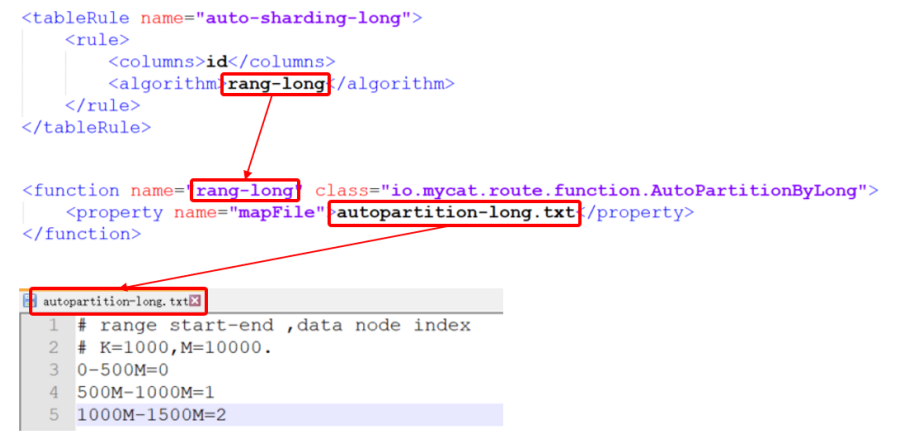

##### server.xml

`server.xml`配置文件包含了MyCat的系统配置信息，主要有两个重要的标签：`system`、`user`

- **system标签**
    
    主要配置MyCat中的系统配置信息，对应的系统配置项及其含义，如下：
    
    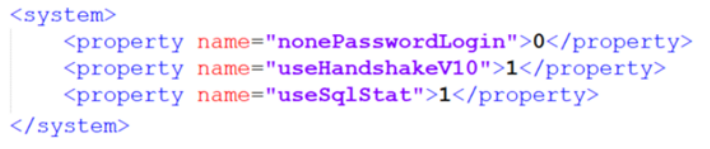
    
    | 属性 | 取值 | 含义 |
    | --- | --- | --- |
    | charset | utf8 | 设置MyCat的字符集，字符集需要与MySQL的字符集保持一致 |
    | nonePasswordLogin | 0,1 | 0：需要密码登陆；1：不需要密码登陆。默认为0，设置为1则需要指定默认账户。 |
    | useHandshakeV10 | 0,1 | 使用该选项主要的目的是为了能够兼容高版本的jdbc驱动, 是否采用HandshakeV10Packet来与client进行通信。1：是；0：否 |
    | useSqlStat | 0,1 | 开启SQL实时统计, 1：开启；0：关闭。
    开启之后，MyCat会自动统计SQL语句的执行情况；
    `MySQL -h 127.0.0.1 -p 9066 -u root -p` 
    `show @@sql;`查看MyCat执行的SQL。
     `show @@sql.slow;` 执行效率比较低的SQL。
    `show @@sql.sum;` SQL的整体执行情况、读写比例等。 |
    | useGlobleTableCheck | 0,1 | 是否开启全局表的一致性检测。1：开启；0：关闭。 |
    | sqlExecuteTimeout | 1000 | SQL语句执行的超时时间，单位为 s。如果SQL语句执行超时,
    将关闭连接，默认300s。 |
    | sequnceHandlerType | 0,1,2 | 用来指定MyCat全局序列类型，0：本地文件，1：数据库方式，2：时间戳列方式，默认使用本地文件方式，文件方式主要用于测试 |
    | sequnceHandlerPattern
     | 正则表达式 | 必须带有MyCatSEQ或者 MyCatseq进入序列匹配流程 注意MyCatSEQ_有空格的情况 |
    | subqueryRelationshipCheck
     |  true,false | 子查询中存在关联查询的情况下，检查关联字段中是否有分片字段。默认 false |
    | useCompression | 0,1 | 开启MySQL压缩协议，0：关闭，1：开启 |
    | fakeMySQLVersion | 5.5,5.6 | 设置模拟的MySQL版本号 |
    | defaultSqlParser
     |  | 由于MyCat的最初版本使用了FoundationDB的SQL解析器，在MyCat1.3后增加了Druid解析器，所以要设置defaultSqlParser属
    性来指定默认的解析器；解析器有两个：druidparser 和 fdbparser，**在MyCat1.4之后，默认是druidparser**，fdbparser已经废除了 |
    | processorBufferChunk |  | 指定每次分配Socket Direct Buffer默认值为4096字节，也会影响BufferPool长度，如果一次性获取字节过多而导致buffer不够用，则会出现警告，可以调大该值。 |
    | processorExecutor |  | 指定NIOProcessor上共享businessExecutor固定线程池的大小；
    MyCat把异步任务交给 businessExecutor线程池中，在新版本的MyCat中这个连接池使用频次不高，可以适当地把该值调小 |
    | packetHeaderSize |  | 指定MySQL协议中的报文头长度，默认4个字节 |
    | maxPacketSize |  | 指定MySQL协议可以携带的数据最大大小，默认值为16M |
    | idleTimeout | 30 | 指定连接的空闲时间的超时长度；如果超时，将关闭资源并回收，默认30分钟 |
    | txIsolation | 1,2,3,4 | 初始化前端连接的事务隔离级别，默认为REPEATED_READ=3
    READ_UNCOMMITED=1;
    READ_COMMITTED=2; 
    REPEATED_READ=3;
    SERIALIZABLE=4; |
    | serverPort | 8066 | 定义MyCat的使用端口，默认8066 |
    | managerPort | 9066 | 定义MyCat的管理端口，默认9066 |
- **user标签**
    
    配置MyCat中的用户、访问密码，以及用户针对于逻辑库、逻辑表的权限信息，具体的权限描述方式及配置说明如下：
    

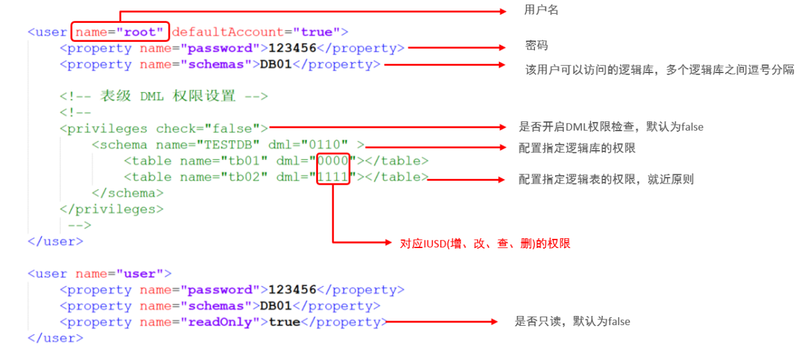

> 
> 
> 
> 在测试权限操作时，只需要将 `privileges` 标签的注释放开。 在 `privileges` 下的`schema`标签中配置的`dml`属性配置的是逻辑库的权限。 在`privileges`的`schema`下的`table`标签的`dml`属性中配置逻辑表的权限。
> 

```xml
<user name="root" defaultAccount="true">
    <property name="password">**********</property>
    <property name="schemas">DB01</property>
    <!-- 表级 DML 权限设置 -->
    <!--
    <privileges check="true">
        <schema name="DB01" dml="0110" >
            <table name="TB_ORDER" dml="1110"></table>
        </schema>
    </privileges>
    -->
</user>

<user name="user">
    <property name="password">**********</property>
    <property name="schemas">DB01</property>
    <property name="readOnly">true</property>
</user>
```

#### 分片规则

##### 范围分片

根据指定的字段及其配置的范围与数据节点的对应情况， 来决定该数据属于哪一个分片。

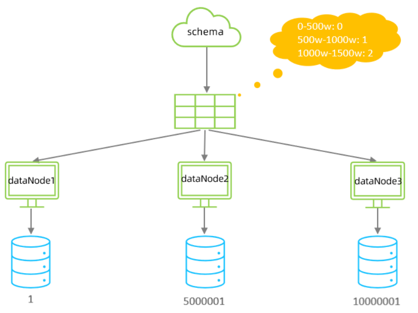

- **schema.xml配置**
    
    ```xml
    <!--逻辑表配置-->
    <table name="TB_ORDER" dataNode="dn1,dn2,dn3" rule="auto-sharding-long" />

    <!--数据节点配置-->
    <dataNode name="dn1" dataHost="dhost1" database="db01" />
    <dataNode name="dn2" dataHost="dhost2" database="db01" />
    <dataNode name="dn3" dataHost="dhost3" database="db01" />
    ```
    
- **rule.xml配置**
    
    ```xml
    <tableRule name="auto-sharding-long">
        <rule>
            <columns>id</columns>
            <algorithm>rang-long</algorithm>
        </rule>
    </tableRule>

    <function name="rang-long" class="io.MyCat.route.function.AutoPartitionByLong">
        <property name="mapFile">autopartition-long.txt</property>
        <property name="defaultNode">0</property>
    </function>
    ```
    
    分片规则配置属性含义：
    
    | 属性 | 描述 |
    | --- | --- |
    | `columns` | 标识将要分片的表字段 |
    | `algorithm` | 指定分片函数与function的对应关系 |
    | `class` | 指定该分片算法对应的类 |
    | `mapFile` | 对应的外部配置文件 |
    | `type` | 默认值为0；0：Integer；1：String |
    | `defaultNode` | 默认节点。默认节点的用法：枚举分片时，如果碰到不识别的枚举值，就让它路由到默认节点；如果没有默认值，碰到不识别的则报错。 |

在`rule.xml`中配置分片规则时，关联了一个映射配置文件 `autopartition-long.txt`，该配置文件的配置如下：

```yaml
## range start-end, data node index
## K=1000,M=10000.
0-500M=0
500M-1000M=1
1000M-1500M=2
```

含义：0-500万之间的值，存储在0号数据节点（数据节点的索引从0开始）； 500万-1000万之间的数据存储在1号数据节点 ； 1000万-1500万的数据节点存储在2号节点 ；

该分片规则，主要是针对于数字类型的字段适用。 

##### 取模分片

根据指定的字段值与节点数量进行求模运算，根据运算结果， 来决定该数据属于哪一个分片。

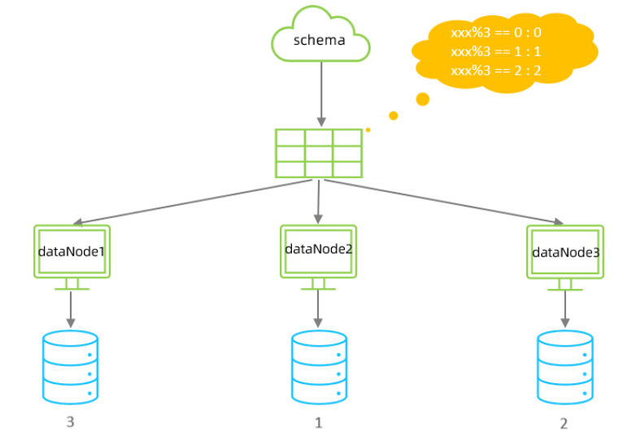

- **schema.xml配置**
    
    ```xml
    <!--逻辑表配置-->
    <table name="tb_log" dataNode="dn4,dn5,dn6" primaryKey="id" rule="mod-long" />

    <!--数据节点配置-->
    <dataNode name="dn4" dataHost="dhost1" database="db01" />
    <dataNode name="dn5" dataHost="dhost2" database="db02" />
    <dataNode name="dn6" dataHost="dhost3" database="db03" />
    ```
    
- **rule.xml配置**
    
    ```xml
    <tableRule name="mod-long">
        <rule>
            <columns>id</columns>
            <algorithm>mod-long</algorithm>
        </rule>
    </tableRule>

    <function name="mod-long" class="io.MyCat.route.function.PartitionByMod">
        <property name="count">3</property>
    </function>
    ```
    
    分片规则配置属性含义：
    
    | 属性 | 描述 |
    | --- | --- |
    | `columns` | 标识将要分片的表字段 |
    | `algorithm` | 指定分片函数与function的对应关系 |
    | `class` | 指定该分片算法对应的类 |
    | `count` | 数据节点的数量 |

> 该分片规则，主要是针对于数字类型的字段适用。
> 

##### 一致性hash分片

所谓一致性哈希，相同的哈希因子计算值总是被划分到相同的分区表中，不会因为分区节点的增加而改变原来数据的分区位置，有效的解决了分布式数据的拓容问题。

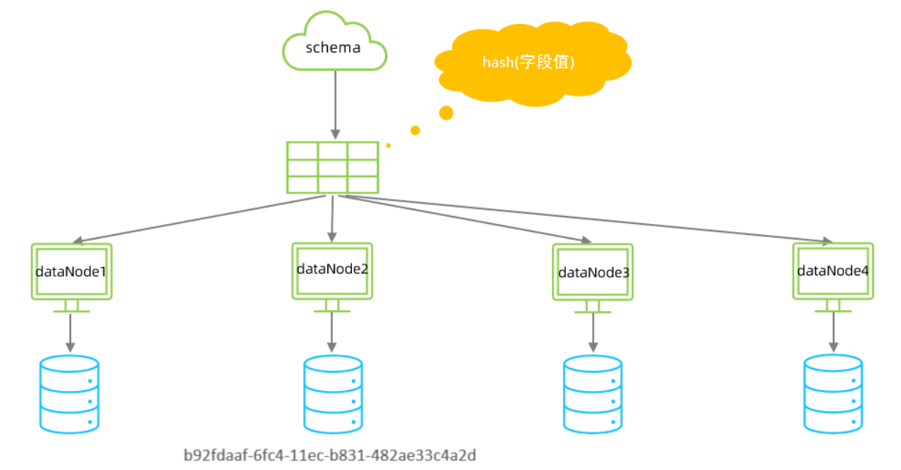

- **schema.xml配置**
    
    ```xml
    <!--逻辑表配置-->
    <table name="tb_order" dataNode="dn4,dn5,dn6" rule="sharding-by-murmur" />

    <!--数据节点配置-->
    <dataNode name="dn4" dataHost="dhost1" database="db01" />
    <dataNode name="dn5" dataHost="dhost2" database="db02" />
    <dataNode name="dn6" dataHost="dhost3" database="db03" />
    ```
    
- **rule.xml配置**
    
    ```xml
    <tableRule name="sharding-by-murmur">
        <rule>
            <columns>id</columns>
            <algorithm>murmur</algorithm>
        </rule>
    </tableRule>

    <function name="murmur" class="io.MyCat.route.function.PartitionByMurmurHash">
        <property name="seed">0</property><!-- 默认是0 -->
        <property name="count">3</property>
        <property name="virtualBucketTimes">160</property>
    </function>
    ```
    
    分片规则属性含义：
    
    | 属性 | 描述 |
    | --- | --- |
    | `columns` | 标识将要分片的表字段 |
    | `algorithm` | 指定分片函数与`function`的对应关系 |
    | `class` | 指定该分片算法对应的类 |
    | `seed` | 创建`murmur_hash`对象的种子，默认0 |
    | `count` | 要分片的数据库节点数量，必须指定，否则没法分片 |
    | `virtualBucketTimes` | 一个实际的数据库节点被映射为这么多虚拟节点，默认是160倍，也就是虚拟节点数是物理节点数的160倍；`virtualBucketTimes*count`就是虚拟结点数量 |
    | `weightMapFile` | 节点的权重，没有指定权重的节点默认是1。以properties文件的格式填写，以从0开始到count-1的整数值也就是节点索引为key，以节点权重值为值。所有权重值必须是正整数，否则以1代替 |
    | `bucketMapPath` | 用于测试时观察各物理节点与虚拟节点的分布情况，如果指定了这个属性，会把虚拟节点的murmur hash值与物理节点的映射按行输出到这个文件，没有默认值，如果不指定，就不会输出任何东西 |

##### 固定分片hash算法

该算法类似于十进制的求模运算，但是为二进制的操作。例如，取 id 的二进制低 10 位 与1111111111 进行位 & 运算，位与运算最小值为 0000000000，最大值为1111111111，转换为十
进制，也就是位于0-1023之间。

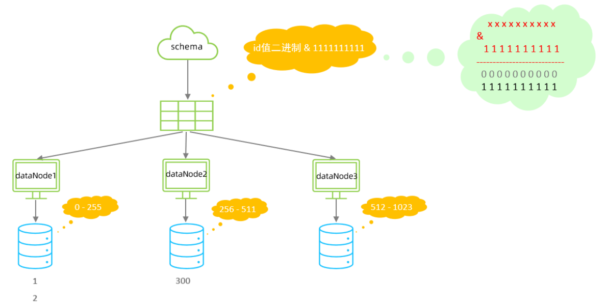

特点：

1. 如果是求模，连续的值，分别分配到各个不同的分片；但是此算法会将连续的值可能分配到相同的分片，降低事务处理的难度。
2. 可以均匀分配，也可以非均匀分配。
3. 分片字段必须为数字类型。
- **schema.xml配置**
    
    ```xml
    <!--逻辑表配置-->
    <!--固定分片hash算法-->
    <table name="tb_longhash" dataNode="dn4,dn5,dn6" rule="sharding-by-long-hash" />

    <!--数据节点配置-->
    <dataNode name="dn4" dataHost="dhost1" database="dn01" />
    <dataNode name="dn5" dataHost="dhost2" database="dn02" />
    <dataNode name="dn6" dataHost="dhost3" database="dn03" />
    ```
    
- **rule.xml配置**
    
    ```xml
    <tableRule name="sharding-by-long-hash">
        <rule>
            <columns>id</columns>
            <algorithm>sharding-by-long-hash</algorithm>
        </rule>
    </tableRule>

    <!-- 分片总长度为1024，count与length数组长度必须一致； -->
    <function name="sharding-by-long-hash" class="io.MyCat.route.function.PartitionByLong">
        <property name="partitionCount">2,1</property>
        <property name="partitionLength">256,512</property>
    </function>
    ```
    
    | 属性 | 描述 |
    | --- | --- |
    | `columns` | 标识将要分片的表字段 |
    | `algorithm` | 指定分片函数与`function`的对应关系 |
    | `class` | 指定该分片算法对应的类 |
    | `partitionCount` | 分片个数列表 |
    | `partitionLength` | 分片范围列表 |
    
    约束：
    
    1. 分片长度：默认最大为1024；
    2. count, length的数组长度必须是一致的；
    
    > 以上`rule.xml`配置分为三个分区：0-255，256-511，512-1023
    > 
    > 
    > 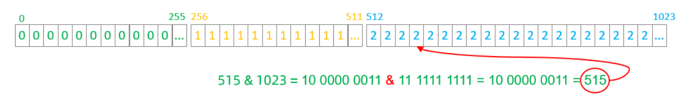
    > 

##### 字符串hash解析算法

截取字符串中的指定位置的子字符串，进行hash算法，算出分片。

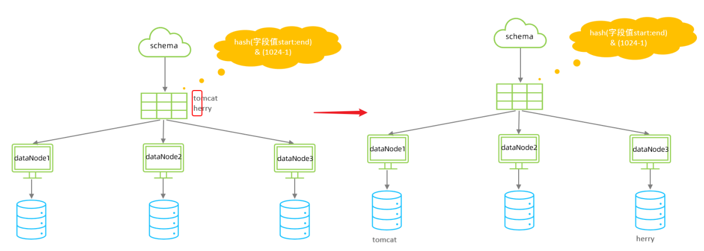

- **schema.xml配置**
    
    ```xml
    <!--逻辑表配置-->
    <!-- 字符串hash解析算法 -->
    <table name="tb_strhash" dataNode="dn4,dn5" rule="sharding-by-stringhash" />

    <!--数据节点配置-->
    <dataNode name="dn4" dataHost="dhost1" database="db04" />
    <dataNode name="dn5" dataHost="dhost2" database="db05" />
    ```
    
- **rule.xml配置**
    
    ```xml
    <tableRule name="sharding-by-stringhash">
        <rule>
            <columns>name</columns>
            <algorithm>sharding-by-stringhash</algorithm>
        </rule>
    </tableRule>

    <function name="sharding-by-stringhash" class="io.MyCat.route.function.PartitionByString">
        <property name="partitionLength">512</property> <!-- zero-based -->
        <property name="partitionCount">2</property>
        <property name="hashSlice">0:2</property>
    </function>
    ```
    
    分片规则属性含义：
    
    | 属性 | 描述 |
    | --- | --- |
    | `columns` | 标识将要分片的表字段 |
    | `algorithm` | 指定分片函数与`function`的对应关系 |
    | `class` | 指定该分片算法对应的类 |
    | `partitionCount` | 分片个数列表 |
    | `partitionLength` | 分片范围列表 |
    | `hashSlice` | hash运算位，根据子字符串的hash运算。0 代表 `str.length()`；-1 代表 `str.length() - 1`；大于0只代表数字自身。可以理解为`substring(start, end)`，start为0则只表示0 |
    
    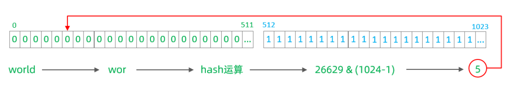
    

##### 枚举分片

通过在配置文件中配置可能的枚举值，指定数据分布到不同数据节点上，本规则适用于按照省份、性别、状态拆分数据等业务 。

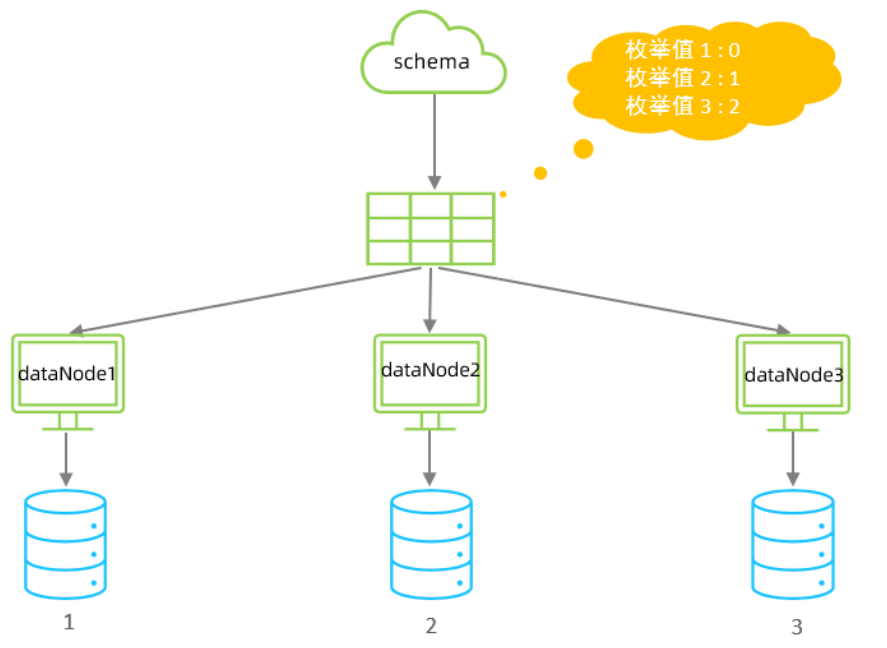

- **schema.xml配置**
    
    ```xml
    <!--逻辑表配置-->
    <!--枚举-->
    <table name="tb_user" dataNode="dn4,dn5,dn6" rule="sharding-by-intfile-enumstatus" />
    
    <!--数据节点配置-->
    <dataNode name="dn4" dataHost="dhost1" database="db01" />
    <dataNode name="dn5" dataHost="dhost2" database="db02" />
    <dataNode name="dn6" dataHost="dhost3" database="db03" />
    ```
    
- **rule.xml配置**
    
    ```xml
    <tableRule name="sharding-by-intfile">
        <rule>
            <columns>sharding_id</columns>
            <algorithm>hash-int</algorithm>
        </rule>
    </tableRule>

    <!-- 自己增加 tableRule -->
    <tableRule name="sharding-by-intfile-enumstatus">
        <rule>
            <columns>status</columns>
            <algorithm>hash-int</algorithm>
        </rule>
    </tableRule>

    <function name="hash-int" class="io.MyCat.route.function.PartitionByFileMap">
        <property name="defaultNode">2</property>
        <property name="mapFile">partition-hash-int.txt</property>
    </function>
    ```
    
    `partition-hash-int.txt` 的内容如下
    
    ```
    1=0
    2=1
    3=2
    ```
    
    分片规则属性含义：
    
    | 属性 | 描述 |
    | --- | --- |
    | `columns` | 标识将要分片的表字段 |
    | `algorithm` | 指定分片函数与function的对应关系 |
    | `class` | 指定该分片算法对应的类 |
    | `mapFile` | 对应的外部配置文件 |
    | `type` | 默认值为0；0：Integer；1：String |
    | `defaultNode` | 默认节点。默认节点的用法：枚举分片时，如果碰到不识别的枚举值，就让它路由到默认节点；如果没有默认值，碰到不识别的则报错。 |

##### 应用指定算法

运行阶段由应用自主决定路由到那个分片，直接根据字符子串（必须是数字）计算分片号。

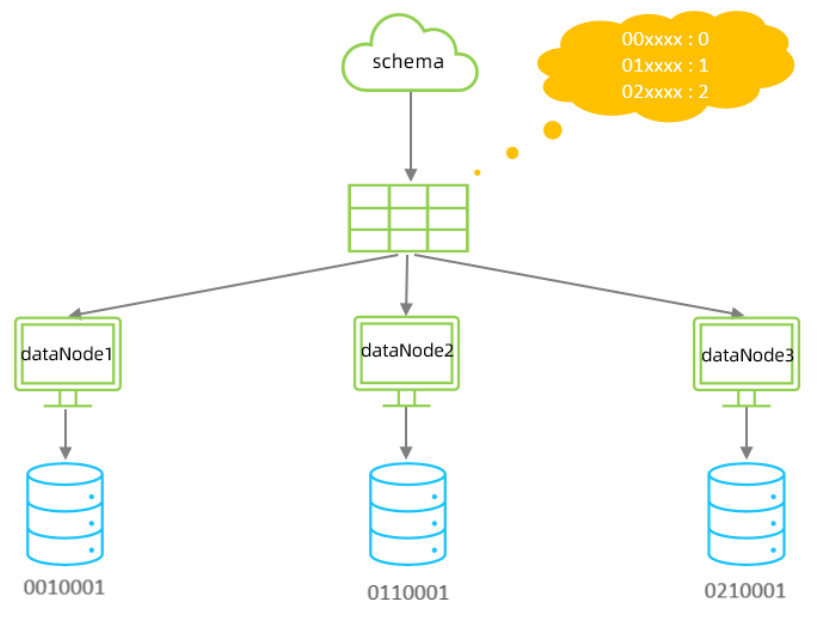

- **schema.xml配置**
    
    ```xml
    <!--逻辑表配置-->
    <!--应用指定算法-->
    <table name="tb_app" dataNode="dn4,dn5,dn6" rule="sharding-by-substring" />

    <!--数据节点配置-->
    <dataNode name="dn4" dataHost="dhost1" database="db01" />
    <dataNode name="dn5" dataHost="dhost2" database="db02" />
    <dataNode name="dn6" dataHost="dhost3" database="db03" />
    ```
    
- **rule.xml配置**
    
    ```xml
    <tableRule name="sharding-by-substring">
        <rule>
            <columns>id</columns>
            <algorithm>sharding-by-substring</algorithm>
        </rule>
    </tableRule>

    <function name="sharding-by-substring" class="io.MyCat.route.function.PartitionDirectBySubString">
        <property name="startIndex">0</property> <!-- zero-based -->
        <property name="size">2</property>
        <property name="partitionCount">3</property>
        <property name="defaultPartition">0</property>
    </function>
    ```
    
    分片规则属性含义：
    
    | 属性 | 描述 |
    | --- | --- |
    | `columns` | 标识将要分片的表字段 |
    | `algorithm` | 指定分片函数与function的对应关系 |
    | `class` | 指定该分片算法对应的类 |
    | `startIndex` | 字符子串起始索引 |
    | `size` | 字符长度 |
    | `partitionCount` | 分区（分片）数量 |
    | `defaultPartition` | 默认分片（在分片数量定义时，字符标示的分片编号不在分片数量内时，使用默认分片） |
    
    > 
    > 
    > 
    > 示例说明：id=05-100000002 ，在此配置中代表根据`id`中从 `startIndex=0`开始，截取`size=2`位数字即
    > 05，05就是获取的分区，如果没找到对应的分片则默认分配到`defaultPartition`。
    > 

##### 按天分片算法

按照日期及对应的时间周期来分片。

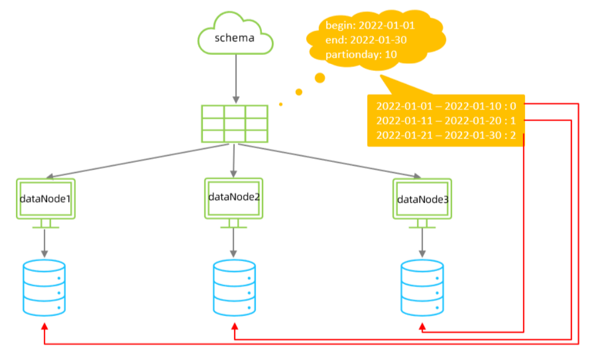

- **schema.xml配置**
    
    ```xml
    <!--逻辑表配置-->
    <!--按天分片-->
    <table name="tb_datepart" dataNode="dn4,dn5,dn6" rule="sharding-by-date" />

    <!--数据节点配置-->
    <dataNode name="dn4" dataHost="dhost1" database="db04" />
    <dataNode name="dn5" dataHost="dhost2" database="db05" />
    <dataNode name="dn6" dataHost="dhost3" database="db06" />
    ```
    
- **rule.xml配置**
    
    ```xml
    <tableRule name="sharding-by-date">
        <rule>
            <columns>create_time</columns>
            <algorithm>sharding-by-date</algorithm>
        </rule>
    </tableRule>

    <function name="sharding-by-date" class="io.MyCat.route.function.PartitionByDate">
        <property name="dateFormat">yyyy-MM-dd</property>
        <property name="sBeginDate">2022-01-01</property>
        <property name="sEndDate">2022-01-30</property>
        <property name="sPartionDay">10</property>
    </function>
    <!--
    从开始时间开始，每10天为一个分片，到达结束时间之后，会重复开始分片插入配置表的 dataNode 的分片，必须和分片规则数量一致，
    例如 2022-01-01 到 2022-12-31 ，每10天一个分片，一共需要37个分片。
    -->
    ```
    
    分片规则属性含义：
    
    | 属性 | 描述 |
    | --- | --- |
    | `columns` | 标识将要分片的表字段 |
    | `algorithm` | 指定分片函数与function的对应关系 |
    | `class` | 指定该分片算法对应的类 |
    | `dateFormat` | 日期格式 |
    | `sBeginDate` | 开始日期 |
    | `sEndDate` | 结束日期，如果配置了结束日期，则代码数据到达了这个日期的分片后，会重复从开始分片插入 |
    | `sPartionDay` | 分区天数，默认值 10 ，从开始日期算起，每个10天一个分区 |

##### 自然月分片

使用场景为按照月份来分片，每个自然月为一个分片。

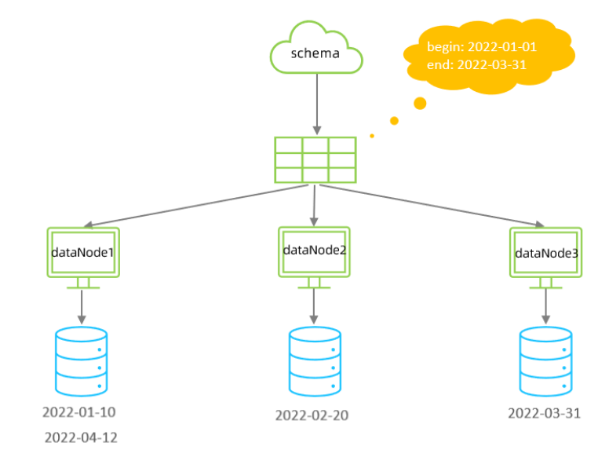

- **schema.xml配置**
    
    ```xml
    <!--逻辑表配置-->
    <!-- 按自然月分片 -->
    <table name="tb_monthpart" dataNode="dn4,dn5,dn6" rule="sharding-by-month" />

    <!--数据节点配置-->
    <dataNode name="dn4" dataHost="dhost1" database="db04" />
    <dataNode name="dn5" dataHost="dhost2" database="db05" />
    <dataNode name="dn6" dataHost="dhost3" database="db06" />
    ```
    
- **rule.xml配置**
    
    ```xml
    <tableRule name="sharding-by-month">
        <rule>
            <columns>create_time</columns>
            <algorithm>partbymonth</algorithm>
        </rule>
    </tableRule>

    <function name="partbymonth" class="io.MyCat.route.function.PartitionByMonth">
        <property name="dateFormat">yyyy-MM-dd</property>
        <property name="sBeginDate">2022-01-01</property>
        <property name="sEndDate">2022-03-31</property>
    </function>
    <!--
    从开始时间开始，一个月为一个分片，到达结束时间之后，会重复开始分片插入配置表的 dataNode 的分片，必须和分片规则数量一致，
    例如 2022-01-01 到 2022-12-31，一共需要12个分片。
    -->
    ```
    
    分片规则属性含义：
    
    | 属性 | 描述 |
    | --- | --- |
    | `columns` | 标识将要分片的表字段 |
    | `algorithm` | 指定分片函数与function的对应关系 |
    | `class` | 指定该分片算法对应的类 |
    | `dateFormat` | 日期格式 |
    | `sBeginDate` | 开始日期 |
    | `sEndDate` | 结束日期，如果配置了结束日期，则代码数据到达了这个日期的分片后，会重复从开始分片插入 |

### 读写分离

读写分离，简单地说是把对数据库的读和写操作分开,以对应不同的数据库服务器。主数据库提供写操作，从数据库提供读操作，这样能有效地减轻单台数据库的压力。

通过MyCat即可轻易实现上述功能，不仅可以支持MySQL，也可以支持Oracle和SQL Server。

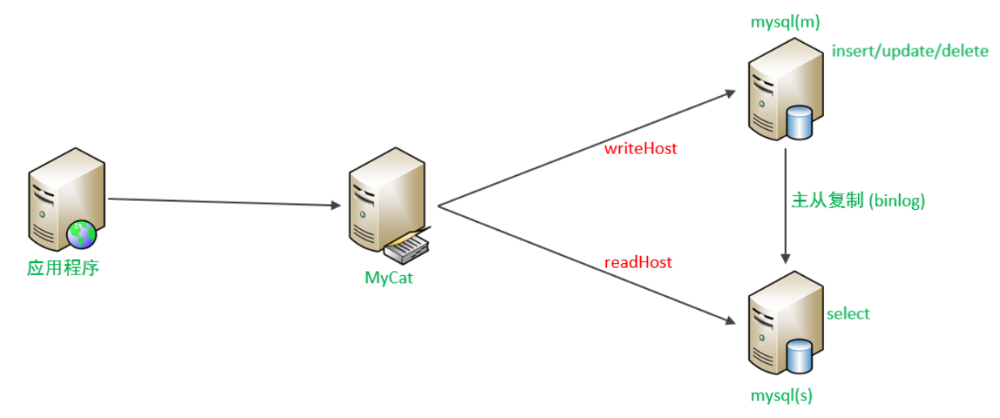

#### 一主一从

MySQL的主从复制，是基于二进制日志（binlog）实现的。

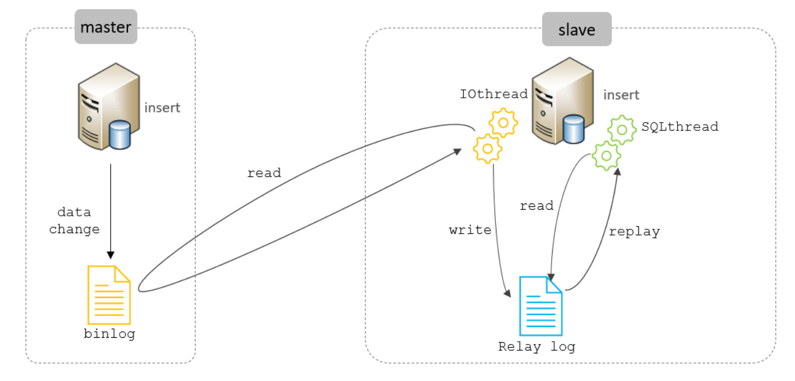

> 
> 
> 
> MyCat控制后台数据库的读写分离和负载均衡由`schema.xml`文件`datahost`标签的`balance`属性控制。
> 
- **schema.xml配置**
    
    ```xml
    <!-- 配置逻辑库 -->
    <schema name="ITCAST_RW" checkSQLschema="true" sqlMaxLimit="100" dataNode="dn7">
    </schema>

    <dataNode name="dn7" dataHost="dhost7" database="itcast" />
    <dataHost name="dhost7" maxCon="1000" minCon="10" balance="1" writeType="0" dbType="mysql" dbDriver="jdbc" switchType="1" slaveThreshold="100">
        <heartbeat>select user()</heartbeat>
        <writeHost host="master1" url="jdbc:mysql://192.168.200.211:3306?useSSL=false&amp;serverTimezone=Asia/Shanghai&amp;characterEncoding=utf8" user="root" password="******" >
            <readHost host="slave1" url="jdbc:mysql://192.168.200.212:3306?useSSL=false&amp;serverTimezone=Asia/Shanghai&amp;characterEncoding=utf8" user="root" password="******" />
        </writeHost>
    </dataHost>
    ```
    
    上述配置的具体关联对应情况如下：
    
    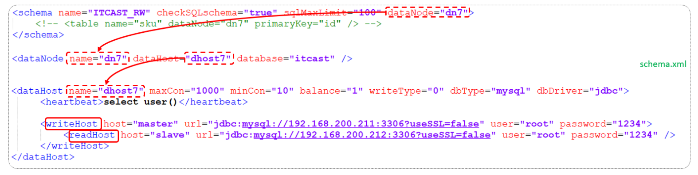
    
    `writeHost`代表的是写操作对应的数据库，`readHost`代表的是读操作对应的数据库。 所以要想实现读写分离，就得配置`writeHost`关联的是主库，`readHost`关联的是从库。
    而仅仅配置好了`writeHost`以及`readHost`还不能完成读写分离，还需要配置一个非常重要的负责均衡的参数 `balance`，取值有4种，具体含义如下：
    
    | 参数值 | 含义 |
    | --- | --- |
    | 0 | 不开启读写分离机制，所有读操作都发送到当前可用的`writeHost`上 |
    | 1 | 全部的`readHost`与备用的`writeHost` 都参与`select` 语句的负载均衡（主要针对于双主双从模式） |
    | 2 | 所有的读写操作都随机在`writeHost`，`readHost`上分发 |
    | 3 | 所有的读请求随机分发到`writeHost`对应的`readHost`上执行， `writeHost`不负担读压力 |
    
    所以，在一主一从模式的读写分离中，balance配置1或3都是可以完成读写分离的。
    
- **server.xml配置**
    
    ```xml
    <user name="root" defaultAccount="true">
        <property name="password">123456</property>
        <property name="schemas">SHOPPING,ITCAST,ITCAST_RW</property>
        <!-- 表级 DML 权限设置 -->
        <!--
        <privileges check="true">
            <schema name="DB01" dml="0110" >
                <table name="TB_ORDER" dml="1110"></table>
            </schema>
        </privileges>
        -->
    </user>
    ```
    

#### 双主双从

一个主机 Master1 用于处理所有写请求，它的从机 Slave1 和另一台主机 Master2 还有它的从机 Slave2 负责所有读请求。当 Master1 主机宕机后，Master2 主机负责写请求，Master1 、
Master2 互为备机。架构图如下：

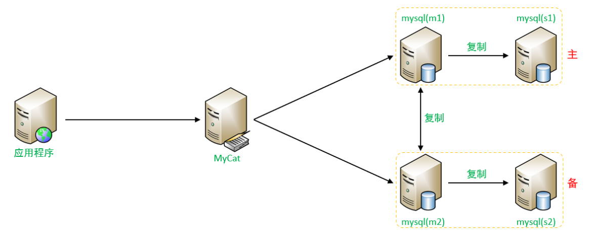

MyCat控制后台数据库的读写分离和负载均衡由`schema.xml`文件`datahost`标签的`balance`属性控制，通过`writeType`及`switchType`来完成失败自动切换的。

- **schema.xml配置**
    
    ```xml
    <!--配置逻辑库-->
    <schema name="ITCAST_RW2" checkSQLschema="true" sqlMaxLimit="100" dataNode="dn7">
    </schema>

    <!--配置数据节点-->
    <dataNode name="dn7" dataHost="dhost7" database="db01" />

    <!--配置节点主机-->
    <dataHost name="dhost7" maxCon="1000" minCon="10" balance="1" writeType="0" dbType="mysql" dbDriver="jdbc" switchType="1" slaveThreshold="100">
        <heartbeat>select user()</heartbeat>
        
        <writeHost host="master1" url="jdbc:mysql://192.168.200.211:3306?useSSL=false&amp;serverTimezone=Asia/Shanghai&amp;characterEncoding=utf8" user="root" password="****" >
            <readHost host="slave1" url="jdbc:mysql://192.168.200.212:3306?useSSL=false&amp;serverTimezone=Asia/Shanghai&amp;characterEncoding=utf8" user="root" password="****" />
        </writeHost>
        
        <writeHost host="master2" url="jdbc:mysql://192.168.200.213:3306?useSSL=false&amp;serverTimezone=Asia/Shanghai&amp;characterEncoding=utf8" user="root" password="****" >
            <readHost host="slave2" url="jdbc:mysql://192.168.200.214:3306?useSSL=false&amp;serverTimezone=Asia/Shanghai&amp;characterEncoding=utf8" user="root" password="****" />
        </writeHost>
    </dataHost>
    ```
    
    具体的对应情况如下：
    
    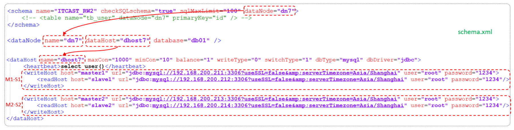
    
    | 属性名 | 含义 |
    | --- | --- |
    | `balance="1"` | 代表全部的 `readHost` 与 stand by writeHost 参与 select 语句的负载均衡。简单的说，当双主双从模式（M1→S1，M2→S2，并且 M1 与 M2 互为主备），正常情况下，M2，S1，S2 都参与 select 语句的负载均衡。 |
    | `writeType` | 0：写操作都转发到第1台`writeHost`，`writeHost1`挂了, 会切换到`writeHost2`上。
    1：所有的写操作都随机地发送到配置的`writeHost`上。 |
    | `switchType` | -1：不自动切换
    1：自动切换 |
- **user.xml配置**
    
    配置`root`用户也可以访问到逻辑库 ITCAST_RW2。
    
    ```xml
    <user name="root" defaultAccount="true">
        <property name="password">123456</property>
        <property name="schemas">SHOPPING,ITCAST,ITCAST_RW2</property>
        <!-- 表级 DML 权限设置 -->
        <!--
        <privileges check="true">
            <schema name="DB01" dml="0110" >
                <table name="TB_ORDER" dml="1110"></table>
            </schema>
        </privileges>
        -->
    </user>
    ```